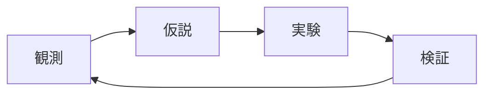

# Math and Visualization Implementation Plan

> **Status: Superseded (2026-06-24).** This plan records the original
> Mafs/Chart.js implementation. The 2D visualization standard later moved to
> build-time static SVG with D3; see
> [2026-06-24-visualization-stack-design.md](../specs/2026-06-24-visualization-stack-design.md).
> The Mafs/Chart.js plots and the `FunctionPlot`/`InteractivePlot`/`VectorFieldPlot`/`DataChart`
> components below have since been removed. The text is kept unchanged as history.

> **For agentic workers:** REQUIRED SUB-SKILL: Use superpowers:subagent-driven-development (recommended) or superpowers:executing-plans to implement this plan task-by-task. Steps use checkbox (`- [ ]`) syntax for tracking.

**Goal:** Add LaTeX math, Mermaid diagrams, interactive Mafs math plots, and Chart.js data charts to the Starlight site, with one showcase page that verifies every feature.

**Architecture:** Math renders at build time via remark-math + rehype-katex. Mermaid renders client-side via astro-mermaid. Interactive visualizations are React islands (Mafs, react-chartjs-2) hydrated in the browser, so they work on static GitHub Pages output. A `showcase.mdx` page exercises each feature and is the verification artifact.

**Tech Stack:** Astro 7, Starlight 0.40, @astrojs/react 6, React 19, Mafs 0.21, Chart.js 4 + react-chartjs-2 5, astro-mermaid 2 + mermaid 11, remark-math 6 + rehype-katex 7 + katex 0.17.

## Global Constraints

- Keep `astro@7.0.0` and `@astrojs/starlight@0.40.0` (already installed, built, and deployed). Do NOT downgrade to Astro 6.
- Package manager is pnpm. If `pnpm add` prints `ERR_PNPM_IGNORED_BUILDS` for a new dependency, add that package to `allowBuilds` in `pnpm-workspace.yaml` (set to `false` unless the build script is genuinely needed) and reinstall.
- Site config: `site: 'https://seijikohara.github.io'`, `base: '/physics-roadmap'`. The `dist/` layout is not nested under the base (e.g. `showcase` builds to `dist/showcase/index.html`).
- Documentation language: Japanese (Starlight root locale `lang: 'ja'`).
- Interactive components are React islands and receive ONLY JSON-serializable props (numbers, strings, arrays, plain objects). Functions cannot be passed as island props, so each Mafs component defines its plotted function internally.
- All deliverable code/comments are English; showcase prose may be Japanese.
- Verification is build + grep of `dist/` output, plus a manual `pnpm preview` check. There is no unit-test framework.

---

### Task 1: KaTeX math rendering + showcase page

**Files:**

- Modify: `package.json` (add deps via pnpm)
- Modify: `astro.config.mjs`
- Create: `src/styles/global.css`
- Create: `src/content/docs/showcase.mdx`

**Interfaces:**

- Consumes: nothing new.
- Produces: a `showcase.mdx` page (title "Showcase") that later tasks append to; a `src/styles/global.css` loaded via Starlight `customCss` that later tasks add more `@import`s to.

- [ ] **Step 1: Install math dependencies**

Run: `pnpm add remark-math@^6 rehype-katex@^7 katex@^0.17`
Expected: install succeeds, exit 0. If `ERR_PNPM_IGNORED_BUILDS` appears, follow the Global Constraints note.

- [ ] **Step 2: Create `src/styles/global.css`**

```css
/* KaTeX stylesheet for build-time math rendering. */
@import "katex/dist/katex.min.css";
```

- [ ] **Step 3: Update `astro.config.mjs` to enable math and load the stylesheet**

```js
// @ts-check
import { defineConfig } from "astro/config";
import starlight from "@astrojs/starlight";
import remarkMath from "remark-math";
import rehypeKatex from "rehype-katex";

// https://astro.build/config
export default defineConfig({
  site: "https://seijikohara.github.io",
  base: "/physics-roadmap",
  markdown: {
    remarkPlugins: [remarkMath],
    rehypePlugins: [rehypeKatex],
  },
  integrations: [
    starlight({
      title: "Physics Roadmap",
      customCss: ["./src/styles/global.css"],
      // Monolingual Japanese site: override the default English root locale.
      locales: {
        root: {
          label: "日本語",
          lang: "ja",
        },
      },
    }),
  ],
});
```

- [ ] **Step 4: Create `src/content/docs/showcase.mdx` with the math section**

```mdx
---
title: Showcase
description: 数式・図・グラフ表現の動作確認ページ
---

このページは導入した各種表現の動作確認を兼ねたサンプルです。

## 数式 (KaTeX)

インラインの数式: 質量とエネルギーの関係は $E = mc^2$ で表される。

ブロックの数式:

$$
\int_{-\infty}^{\infty} e^{-x^2} \, dx = \sqrt{\pi}
$$

行列:

$$
\begin{pmatrix} a & b \\ c & d \end{pmatrix}
$$
```

- [ ] **Step 5: Build and verify math renders**

Run: `pnpm build`
Expected: build completes with "Complete!", exit 0.

Run: `grep -c 'class="katex"' dist/showcase/index.html`
Expected: a number greater than 0 (KaTeX rendered the math at build time).

- [ ] **Step 6: Commit**

```bash
git add package.json pnpm-lock.yaml pnpm-workspace.yaml astro.config.mjs src/styles/global.css src/content/docs/showcase.mdx
git commit -m "feat: add KaTeX math rendering and showcase page"
```

---

### Task 2: Mermaid diagrams

**Files:**

- Modify: `package.json` (add deps via pnpm)
- Modify: `astro.config.mjs`
- Modify: `src/content/docs/showcase.mdx` (append diagram section)

**Interfaces:**

- Consumes: `showcase.mdx` and `astro.config.mjs` from Task 1.
- Produces: client-side Mermaid rendering for mermaid fenced code blocks site-wide.

- [ ] **Step 1: Install Mermaid dependencies**

Run: `pnpm add astro-mermaid@^2 mermaid@^11 @mermaid-js/layout-elk@^0.2`
Expected: install succeeds, exit 0. Apply the `ERR_PNPM_IGNORED_BUILDS` note if needed.

- [ ] **Step 2: Update `astro.config.mjs` to add the mermaid integration before starlight**

```js
// @ts-check
import { defineConfig } from "astro/config";
import starlight from "@astrojs/starlight";
import mermaid from "astro-mermaid";
import remarkMath from "remark-math";
import rehypeKatex from "rehype-katex";

// https://astro.build/config
export default defineConfig({
  site: "https://seijikohara.github.io",
  base: "/physics-roadmap",
  markdown: {
    remarkPlugins: [remarkMath],
    rehypePlugins: [rehypeKatex],
  },
  integrations: [
    // astro-mermaid must come BEFORE starlight so it can transform code blocks.
    mermaid({ autoTheme: true }),
    starlight({
      title: "Physics Roadmap",
      customCss: ["./src/styles/global.css"],
      locales: {
        root: {
          label: "日本語",
          lang: "ja",
        },
      },
    }),
  ],
});
```

- [ ] **Step 3: Append the diagram section to `src/content/docs/showcase.mdx`**

````mdx
## 概念図 (Mermaid)


````

- [ ] **Step 4: Build and verify the mermaid block is emitted**

Run: `pnpm build`
Expected: build completes with "Complete!", exit 0.

Run: `grep -ci 'mermaid' dist/showcase/index.html`
Expected: a number greater than 0 (astro-mermaid emitted a mermaid container and client script).

- [ ] **Step 5: Commit**

```bash
git add package.json pnpm-lock.yaml pnpm-workspace.yaml astro.config.mjs src/content/docs/showcase.mdx
git commit -m "feat: add client-side Mermaid diagram rendering"
```

---

### Task 3: React + Mafs setup and a static function plot

**Files:**

- Modify: `package.json` (add deps via pnpm)
- Modify: `astro.config.mjs`
- Modify: `tsconfig.json`
- Modify: `src/styles/global.css`
- Create: `src/components/FunctionPlot.tsx`
- Modify: `src/content/docs/showcase.mdx` (append function-plot section)

**Interfaces:**

- Consumes: `astro.config.mjs`, `global.css`, `showcase.mdx` from earlier tasks.
- Produces: a working React island toolchain and `FunctionPlot` (default export, no props) — a self-contained Mafs plot of `y = sin(x)` that authors copy/edit for new static plots.

- [ ] **Step 1: Install React and Mafs dependencies**

Run: `pnpm add @astrojs/react@^6 react@^19 react-dom@^19 mafs@^0.21 && pnpm add -D @types/react@^19 @types/react-dom@^19`
Expected: install succeeds, exit 0. Apply the `ERR_PNPM_IGNORED_BUILDS` note if needed.

- [ ] **Step 2: Update `tsconfig.json` for React JSX**

```json
{
  "extends": "astro/tsconfigs/strict",
  "include": [".astro/types.d.ts", "**/*"],
  "exclude": ["dist"],
  "compilerOptions": {
    "jsx": "react-jsx",
    "jsxImportSource": "react"
  }
}
```

- [ ] **Step 3: Add the React integration to `astro.config.mjs`**

```js
// @ts-check
import { defineConfig } from "astro/config";
import starlight from "@astrojs/starlight";
import react from "@astrojs/react";
import mermaid from "astro-mermaid";
import remarkMath from "remark-math";
import rehypeKatex from "rehype-katex";

// https://astro.build/config
export default defineConfig({
  site: "https://seijikohara.github.io",
  base: "/physics-roadmap",
  markdown: {
    remarkPlugins: [remarkMath],
    rehypePlugins: [rehypeKatex],
  },
  integrations: [
    react(),
    // astro-mermaid must come BEFORE starlight so it can transform code blocks.
    mermaid({ autoTheme: true }),
    starlight({
      title: "Physics Roadmap",
      customCss: ["./src/styles/global.css"],
      locales: {
        root: {
          label: "日本語",
          lang: "ja",
        },
      },
    }),
  ],
});
```

- [ ] **Step 4: Add Mafs styles to `src/styles/global.css`**

```css
/* KaTeX stylesheet for build-time math rendering. */
@import "katex/dist/katex.min.css";

/* Mafs styles for interactive math plots. */
@import "mafs/core.css";
@import "mafs/font.css";
```

- [ ] **Step 5: Create `src/components/FunctionPlot.tsx`**

```tsx
import { Mafs, Coordinates, Plot } from "mafs";

// Static function plot template. Island props cannot be functions, so the
// plotted function lives here. Copy this file and edit `f` for a new plot.
const f = (x: number): number => Math.sin(x);

export default function FunctionPlot(): React.JSX.Element {
  return (
    <Mafs height={400}>
      <Coordinates.Cartesian />
      <Plot.OfX y={f} />
    </Mafs>
  );
}
```

- [ ] **Step 6: Append the function-plot section to `src/content/docs/showcase.mdx`**

```mdx
import FunctionPlot from "../../components/FunctionPlot";

## 関数グラフ (Mafs)

静的な関数プロット ($y = \sin x$):

<FunctionPlot client:visible />
```

- [ ] **Step 7: Build and verify a React island is emitted**

Run: `pnpm build`
Expected: build completes with "Complete!", exit 0.

Run: `grep -c '<astro-island' dist/showcase/index.html`
Expected: a number greater than 0 (the React island was rendered for hydration).

- [ ] **Step 8: Commit**

```bash
git add package.json pnpm-lock.yaml pnpm-workspace.yaml astro.config.mjs tsconfig.json src/styles/global.css src/components/FunctionPlot.tsx src/content/docs/showcase.mdx
git commit -m "feat: add React islands and a Mafs function plot"
```

---

### Task 4: Interactive Mafs components (slider + vector field)

**Files:**

- Create: `src/components/InteractivePlot.tsx`
- Create: `src/components/VectorFieldPlot.tsx`
- Modify: `src/content/docs/showcase.mdx` (append interactive sections)

**Interfaces:**

- Consumes: the React + Mafs toolchain from Task 3.
- Produces: `InteractivePlot` (default export, no props) — a sine plot whose amplitude is driven by a range slider; `VectorFieldPlot` (default export, no props) — a vector field with a draggable point.

- [ ] **Step 1: Create `src/components/InteractivePlot.tsx`**

```tsx
import { useState } from "react";
import { Mafs, Coordinates, Plot } from "mafs";

// Mafs has no built-in slider, so use a plain range input + React state and
// feed the value into the plotted function.
export default function InteractivePlot(): React.JSX.Element {
  const [amplitude, setAmplitude] = useState(1);

  return (
    <div>
      <label>
        振幅: {amplitude.toFixed(1)}{" "}
        <input
          type="range"
          min={0}
          max={3}
          step={0.1}
          value={amplitude}
          onChange={(event) => setAmplitude(Number(event.target.value))}
        />
      </label>
      <Mafs height={400}>
        <Coordinates.Cartesian />
        <Plot.OfX y={(x) => amplitude * Math.sin(x)} />
      </Mafs>
    </div>
  );
}
```

- [ ] **Step 2: Create `src/components/VectorFieldPlot.tsx`**

```tsx
import { Mafs, Coordinates, Plot, Vector, useMovablePoint } from "mafs";

// Vector field with a draggable point. `useMovablePoint` returns the current
// position (`.point`) and the draggable handle element (`.element`).
export default function VectorFieldPlot(): React.JSX.Element {
  const point = useMovablePoint([2, 1]);

  return (
    <Mafs height={400}>
      <Coordinates.Cartesian />
      <Plot.VectorField xy={([x, y]) => [y, -x]} step={1} />
      <Vector tip={point.point} />
      {point.element}
    </Mafs>
  );
}
```

- [ ] **Step 3: Append the interactive sections to `src/content/docs/showcase.mdx`**

```mdx
import InteractivePlot from "../../components/InteractivePlot";
import VectorFieldPlot from "../../components/VectorFieldPlot";

### スライダーで操作する例

スライダーを動かすと振幅が変化します:

<InteractivePlot client:visible />

### ベクトル場とドラッグ可能な点

点をドラッグして動かせます:

<VectorFieldPlot client:visible />
```

- [ ] **Step 4: Build and verify multiple React islands are emitted**

Run: `pnpm build`
Expected: build completes with "Complete!", exit 0.

Run: `grep -c '<astro-island' dist/showcase/index.html`
Expected: a number of 3 or more (FunctionPlot, InteractivePlot, VectorFieldPlot).

- [ ] **Step 5: Commit**

```bash
git add src/components/InteractivePlot.tsx src/components/VectorFieldPlot.tsx src/content/docs/showcase.mdx
git commit -m "feat: add interactive Mafs slider and vector field plots"
```

---

### Task 5: Data charts (Chart.js)

**Files:**

- Modify: `package.json` (add deps via pnpm)
- Create: `src/components/DataChart.tsx`
- Modify: `src/content/docs/showcase.mdx` (append data-chart section)

**Interfaces:**

- Consumes: the React toolchain from Task 3.
- Produces: `DataChart` — a default-export React component with serializable props `type: 'line' | 'bar' | 'scatter'`, `data: object`, `options?: object`, rendering the matching react-chartjs-2 chart.

- [ ] **Step 1: Install Chart.js dependencies**

Run: `pnpm add chart.js@^4 react-chartjs-2@^5`
Expected: install succeeds, exit 0. Apply the `ERR_PNPM_IGNORED_BUILDS` note if needed.

- [ ] **Step 2: Create `src/components/DataChart.tsx`**

```tsx
import {
  Chart as ChartJS,
  CategoryScale,
  LinearScale,
  PointElement,
  LineElement,
  BarElement,
  Tooltip,
  Legend,
} from "chart.js";
import { Line, Bar, Scatter } from "react-chartjs-2";

// Register the Chart.js pieces used by line/bar/scatter charts once.
ChartJS.register(
  CategoryScale,
  LinearScale,
  PointElement,
  LineElement,
  BarElement,
  Tooltip,
  Legend,
);

interface DataChartProps {
  type: "line" | "bar" | "scatter";
  // Chart.js data/options are plain objects, so they cross the island boundary.
  data: object;
  options?: object;
}

export default function DataChart({ type, data, options }: DataChartProps): React.JSX.Element {
  if (type === "bar") {
    return <Bar data={data as never} options={options as never} />;
  }
  if (type === "scatter") {
    return <Scatter data={data as never} options={options as never} />;
  }
  return <Line data={data as never} options={options as never} />;
}
```

- [ ] **Step 3: Append the data-chart section to `src/content/docs/showcase.mdx`**

```mdx
import DataChart from "../../components/DataChart";

## データのグラフ (Chart.js)

export const chartData = {
  labels: ["1月", "2月", "3月", "4月", "5月"],
  datasets: [
    {
      label: "測定値",
      data: [12, 19, 3, 5, 14],
    },
  ],
};

<DataChart client:visible type="line" data={chartData} />
```

- [ ] **Step 4: Build and verify the chart island is emitted**

Run: `pnpm build`
Expected: build completes with "Complete!", exit 0.

Run: `grep -c '<astro-island' dist/showcase/index.html`
Expected: 4 or more (the three Mafs plots plus DataChart).

- [ ] **Step 5: Commit**

```bash
git add package.json pnpm-lock.yaml pnpm-workspace.yaml src/components/DataChart.tsx src/content/docs/showcase.mdx
git commit -m "feat: add Chart.js data charts"
```

---

### Task 6: Full verification

**Files:** none (verification only).

**Interfaces:**

- Consumes: everything from Tasks 1-5.
- Produces: confirmation that the full build emits every feature marker.

- [ ] **Step 1: Clean build**

Run: `pnpm build`
Expected: build completes with "Complete!", exit 0.

- [ ] **Step 2: Verify all feature markers**

Run:

```bash
f=dist/showcase/index.html
echo "katex: $(grep -c 'class=\"katex\"' "$f")"
echo "mermaid: $(grep -ci 'mermaid' "$f")"
echo "islands: $(grep -c '<astro-island' "$f")"
```

Expected: `katex` > 0, `mermaid` > 0, `islands` >= 4.

- [ ] **Step 3: Manual preview check**

Run: `pnpm preview`
Then open the showcase page at the printed local URL (path `/physics-roadmap/showcase/`) and confirm by eye: math is typeset, the Mermaid diagram renders, the sine plot shows, the slider changes the amplitude, the vector-field point drags, and the line chart renders. Stop the preview server when done (Ctrl+C).

> Pushing to `main` triggers the existing CI deploy. Push only with the user's
> explicit consent (handled outside this plan).

---

## Self-Review

**Spec coverage:**

- Math (KaTeX, remark-math + rehype-katex, global CSS) — Task 1.
- Diagrams (astro-mermaid before starlight, mermaid 11, layout-elk) — Task 2.
- React integration (@astrojs/react, react 19, tsconfig jsx) — Task 3.
- Mafs function plot — Task 3; interactive slider + vector field + draggable point — Task 4.
- Data charts (react-chartjs-2 + chart.js) — Task 5.
- Showcase page exercising every feature — built across Tasks 1-5, fully verified in Task 6.
- Island constraints honored: no function props across the boundary (Mafs components are self-contained; DataChart uses serializable props). Deviation from the spec's `fn` prop, required because island props must be serializable.

**Placeholder scan:** No TBD/TODO; every code/config step shows complete content.

**Type/name consistency:** Default exports `FunctionPlot`, `InteractivePlot`, `VectorFieldPlot`, `DataChart` are defined where created and imported with matching paths/names in `showcase.mdx`. Mafs APIs used (`Mafs`, `Coordinates.Cartesian`, `Plot.OfX`, `Plot.VectorField`, `Vector`, `useMovablePoint`) are consistent across tasks. `astro.config.mjs` is shown in full each time it changes, ending in its final form in Task 3.
