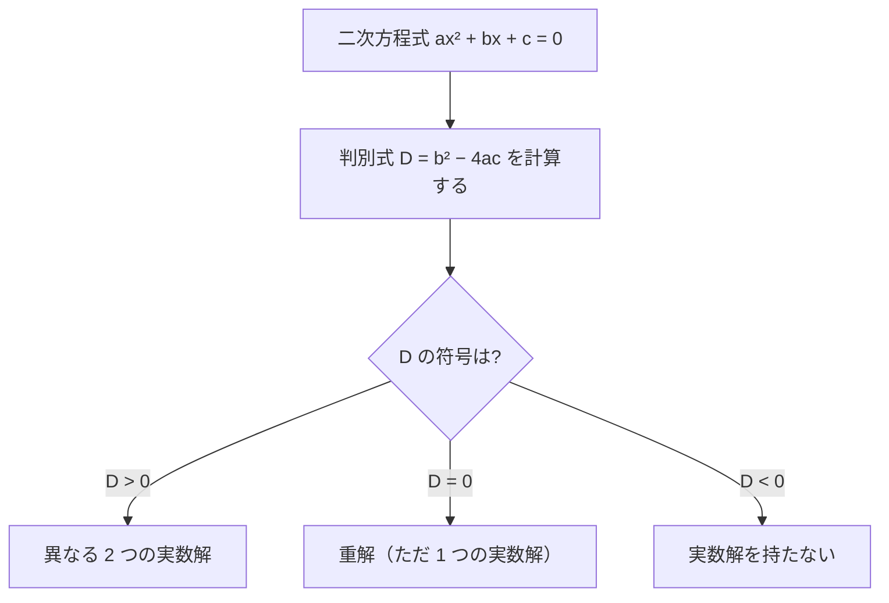

## 前提

本章の前提は、同じ代数カテゴリの章[二次方程式](../quadratic-equations/)である。二次方程式・解の公式・平方完成・解と係数の関係の知識を前提とする。

二次方程式を実際に解く前に、解が実数の範囲に何個あるかを知りたい場面は多い。物理では、放物運動の物体が地面に届くか、波の振幅が一定値に達するかなど、解の有無や個数が現象の成否を決める。本章は解の公式の根号の中身に注目し、解を最後まで求めずに実数解の個数を判定する道具を導入する。

## 学習目標

本章を読むと、次の記号と概念を使えるようになる。

- 判別式 $D = b^2 - 4ac$ の定義と、解の公式との関係
- 判別式の符号と実数解の個数の対応
- 重解の意味と、$D = 0$ のときの解 $x = -\dfrac{b}{2a}$
- 重解と因数分解 $a(x - \alpha)^2$ の対応
- 実数解を持つ条件を $D \ge 0$ で表す方法
- 係数に未知の文字を含む二次方程式の、実数解の個数の決定

## 判別式の定義

### 解の公式の復習

二次方程式は、文字 $x$ について次の形に整理できる方程式である。係数 $a$・$b$・$c$ は実数とし、最高次の係数は $a \neq 0$ とする。

$$
ax^2 + bx + c = 0 \quad (a \neq 0)
$$

前提章[二次方程式](../quadratic-equations/)で導いた解の公式は、次のとおりである。

$$
x = \frac{-b \pm \sqrt{b^2 - 4ac}}{2a}
$$

解の公式には根号 $\sqrt{\ }$ が含まれる。根号の中身 $b^2 - 4ac$ が、本章の主役である。

### 判別式とは

解の公式の根号の中身を、二次方程式の**判別式**と呼ぶ。判別式を文字 $D$ で表す。文字 $D$ は「ディー」と読む。

$$
D = b^2 - 4ac
$$

文字 $D$ は判別を意味する英語 discriminant の頭文字である。判別式 $D$ を使うと、解の公式は次のように書ける。

$$
x = \frac{-b \pm \sqrt{D}}{2a}
$$

判別式 $D$ は、二次方程式の解の個数を「判別する」式である。解そのものを求めなくても、$D$ の符号だけで実数解の個数が決まる。理由を次節で述べる。

## 判別式の符号と実数解の個数

### 根号の中身が個数を決める

解の公式 $x = \dfrac{-b \pm \sqrt{D}}{2a}$ を、$\pm$ の符号で 2 つに分けて書く。

$$
x = \frac{-b + \sqrt{D}}{2a}, \qquad x = \frac{-b - \sqrt{D}}{2a}
$$

2 つの解の違いは、$\sqrt{D}$ を足すか引くかだけである。$\sqrt{D}$ の値によって、2 つの解の関係が変わる。場合は判別式 $D$ の符号で 3 通りに分かれる。

実数の範囲では、負の数の平方根は存在しない。よって根号 $\sqrt{D}$ が実数の値を持つかどうかが、実数解の有無を決める。

### 場合分けの導出

判別式 $D$ の符号に応じて、実数解の個数を順に調べる。

**$D > 0$ のとき。** $D$ は正なので、平方根 $\sqrt{D}$ は正の実数の値を持つ。$\sqrt{D} \neq 0$ だから、$+\sqrt{D}$ と $-\sqrt{D}$ は異なる値である。よって 2 つの解は異なる。

$$
\frac{-b + \sqrt{D}}{2a} \neq \frac{-b - \sqrt{D}}{2a}
$$

二次方程式は、異なる 2 つの実数解を持つ。

**$D = 0$ のとき。** 平方根は $\sqrt{D} = \sqrt{0} = 0$ となる。$+\sqrt{D}$ と $-\sqrt{D}$ はどちらも $0$ である。2 つの式は一致する。

$$
x = \frac{-b + 0}{2a} = \frac{-b - 0}{2a} = -\frac{b}{2a}
$$

2 つに分かれていた解が 1 つの値に重なる。二次方程式は、ただ 1 つの実数解 $x = -\dfrac{b}{2a}$ を持つ。

**$D < 0$ のとき。** $D$ は負である。実数の範囲では負の数の平方根は存在しない。よって $\sqrt{D}$ は実数の値を持たず、解の公式は実数の解を与えない。二次方程式は、実数解を持たない。

### 対応表

判別式 $D$ の符号と実数解の個数の対応を、表にまとめる。

| 判別式の符号 | $\sqrt{D}$ の状態  | 実数解の個数        | 解の形                            |
| ------------ | ------------------ | ------------------- | --------------------------------- |
| $D > 0$      | 正の実数の値を持つ | 異なる 2 つの実数解 | $x = \dfrac{-b \pm \sqrt{D}}{2a}$ |
| $D = 0$      | $\sqrt{D} = 0$     | 重解（ただ 1 つ）   | $x = -\dfrac{b}{2a}$              |
| $D < 0$      | 実数の値を持たない | 実数解を持たない    | 実数の範囲に解は無い              |

判別式の符号から実数解の個数を判定する手順を、流れ図にまとめる。

## 重解の意味

### 重解とは何か

$D = 0$ のときに現れるただ 1 つの解を、**重解**と呼ぶ。重解は、$D > 0$ のときの 2 つの解が一致した場合に当たる。$D$ を正の側から $0$ へ近づけると、2 つの解 $\dfrac{-b \pm \sqrt{D}}{2a}$ は互いに限りなく近づき、$D = 0$ でちょうど重なる。

重解は値としては 1 つだが、「2 つの解が重なったもの」と数える。理由は次節の因数分解で明らかになる。

### 重解と因数分解

二次式 $ax^2 + bx + c$ は、解 $\alpha$・$\beta$ を使って因数分解できる。前提章[二次方程式](../quadratic-equations/)の解と係数の関係から、次が成り立つ。

$$
ax^2 + bx + c = a(x - \alpha)(x - \beta)
$$

$D = 0$ のとき、2 つの解は等しく $\alpha = \beta$ となる。因数分解の 2 つの因数が同じになり、二次式は完全平方の形になる。

$$
ax^2 + bx + c = a(x - \alpha)^2
$$

ここで重解は $\alpha = -\dfrac{b}{2a}$ である。因数 $(x - \alpha)$ が 2 個重なって現れる。重解を「2 つの解が重なったもの」と数えるのは、因数 $(x - \alpha)$ が 2 個現れる事実に対応する。

### 確認

$D = 0$ と完全平方が同値であることを、平方完成で確かめる。二次式を平方完成すると、次の形になる。

$$
ax^2 + bx + c = a\left(x + \frac{b}{2a}\right)^2 - \frac{b^2 - 4ac}{4a}
$$

右辺の最後の項に判別式 $D = b^2 - 4ac$ が現れる。

$$
ax^2 + bx + c = a\left(x + \frac{b}{2a}\right)^2 - \frac{D}{4a}
$$

$D = 0$ を代入すると、最後の項が消える。

$$
ax^2 + bx + c = a\left(x + \frac{b}{2a}\right)^2
$$

完全平方の形が現れる。$\alpha = -\dfrac{b}{2a}$ を使えば $a(x - \alpha)^2$ に一致する。$D = 0$ のとき、二次式は完全平方になる。

## 応用

### 実数解を持つ条件

実数解を持つ場合は、$D > 0$ と $D = 0$ の 2 通りである。2 通りをまとめると、実数解を持つ条件は次のように書ける。

$$
D \ge 0
$$

不等号 $\ge$ は「以上」を表す。$D \ge 0$ は $D > 0$ または $D = 0$ を意味する。

| 条件      | 実数解の状態                        |
| --------- | ----------------------------------- |
| $D > 0$   | 異なる 2 つの実数解を持つ           |
| $D \ge 0$ | 実数解を持つ（重解の場合を含む）    |
| $D = 0$   | 重解を持つ（ちょうど 1 つの実数解） |
| $D < 0$   | 実数解を持たない                    |

物理で「物体が到達するか」「条件を満たす実数の値があるか」を問うとき、$D \ge 0$ が解の存在条件になる。

### 係数に文字を含む場合

二次方程式の係数に未知の文字を含むとき、判別式は文字を含む式になる。判別式の符号を文字で場合分けすると、実数解の個数を文字の値ごとに決められる。具体例は次の例題で扱う。

## 例題

### 例題 1

次の二次方程式の実数解の個数を、判別式で判定せよ。

$$
2x^2 - 5x + 1 = 0
$$

**解法.** 係数を読み取る。$a = 2$・$b = -5$・$c = 1$ である。判別式 $D = b^2 - 4ac$ を計算する。

$$
D = (-5)^2 - 4 \cdot 2 \cdot 1 = 25 - 8 = 17
$$

$D = 17 > 0$ である。よって二次方程式は、異なる 2 つの実数解を持つ。

### 例題 2

次の二次方程式が重解を持つことを確かめ、重解の値を求めよ。

$$
x^2 - 6x + 9 = 0
$$

**解法.** 係数は $a = 1$・$b = -6$・$c = 9$ である。判別式を計算する。

$$
D = (-6)^2 - 4 \cdot 1 \cdot 9 = 36 - 36 = 0
$$

$D = 0$ なので、二次方程式は重解を持つ。重解の値は $x = -\dfrac{b}{2a}$ である。

$$
x = -\frac{-6}{2 \cdot 1} = \frac{6}{2} = 3
$$

重解は $x = 3$ である。因数分解で確かめる。左辺は $x^2 - 6x + 9 = (x - 3)^2$ となり、因数 $(x - 3)$ が 2 個現れる。重解 $x = 3$ と一致する。

### 例題 3

次の二次方程式が実数解を持たないことを、判別式で示せ。

$$
3x^2 + 2x + 1 = 0
$$

**解法.** 係数は $a = 3$・$b = 2$・$c = 1$ である。判別式を計算する。

$$
D = 2^2 - 4 \cdot 3 \cdot 1 = 4 - 12 = -8
$$

$D = -8 < 0$ である。よって二次方程式は、実数解を持たない。

### 例題 4

$x$ についての二次方程式 $x^2 + 4x + k = 0$ が、異なる 2 つの実数解を持つような定数 $k$ の範囲を求めよ。

**解法.** 係数は $a = 1$・$b = 4$・$c = k$ である。判別式を $k$ を使って表す。

$$
D = 4^2 - 4 \cdot 1 \cdot k = 16 - 4k
$$

異なる 2 つの実数解を持つ条件は $D > 0$ である。

$$
16 - 4k > 0
$$

不等式を $k$ について解く。両辺から $16$ を引くと $-4k > -16$ となる。両辺を負の数 $-4$ で割ると不等号の向きが変わり、$k < 4$ を得る。

$$
k < 4
$$

定数 $k$ の範囲は $k < 4$ である。

## 演習問題

問題ごとに解答を畳んである。「解答を表示」を開くと確認できる。

### 問題 1

次の二次方程式の実数解の個数を、判別式で判定せよ。

$$
x^2 + 3x - 4 = 0
$$

解答を表示

係数は $a = 1$・$b = 3$・$c = -4$ である。判別式を計算する。

$$
D = 3^2 - 4 \cdot 1 \cdot (-4) = 9 + 16 = 25
$$

$D = 25 > 0$ なので、異なる 2 つの実数解を持つ。

### 問題 2

次の二次方程式が重解を持つことを確かめ、重解の値を求めよ。

$$
4x^2 + 12x + 9 = 0
$$

解答を表示

係数は $a = 4$・$b = 12$・$c = 9$ である。判別式を計算する。

$$
D = 12^2 - 4 \cdot 4 \cdot 9 = 144 - 144 = 0
$$

$D = 0$ なので重解を持つ。重解の値は $x = -\dfrac{b}{2a}$ である。

$$
x = -\frac{12}{2 \cdot 4} = -\frac{12}{8} = -\frac{3}{2}
$$

重解は $x = -\dfrac{3}{2}$ である。

### 問題 3

次の二次方程式の実数解の個数を、判別式で判定せよ。

$$
2x^2 - 3x + 5 = 0
$$

解答を表示

係数は $a = 2$・$b = -3$・$c = 5$ である。判別式を計算する。

$$
D = (-3)^2 - 4 \cdot 2 \cdot 5 = 9 - 40 = -31
$$

$D = -31 < 0$ なので、実数解を持たない。

### 問題 4

$x$ についての二次方程式 $x^2 - 2x + k = 0$ が重解を持つような定数 $k$ の値を求めよ。

解答を表示

係数は $a = 1$・$b = -2$・$c = k$ である。判別式を $k$ で表す。

$$
D = (-2)^2 - 4 \cdot 1 \cdot k = 4 - 4k
$$

重解を持つ条件は $D = 0$ である。

$$
4 - 4k = 0
$$

$k$ について解くと、$k = 1$ を得る。

$$
k = 1
$$

### 問題 5

$x$ についての二次方程式 $x^2 + 2x + k = 0$ が実数解を持つような定数 $k$ の範囲を求めよ。

解答を表示

係数は $a = 1$・$b = 2$・$c = k$ である。判別式を $k$ で表す。

$$
D = 2^2 - 4 \cdot 1 \cdot k = 4 - 4k
$$

実数解を持つ条件は $D \ge 0$ である。重解の場合も実数解に含めるため、等号を含む。

$$
4 - 4k \ge 0
$$

$k$ について解く。両辺から $4$ を引くと $-4k \ge -4$ となる。両辺を負の数 $-4$ で割ると不等号の向きが変わり、$k \le 1$ を得る。

$$
k \le 1
$$

定数 $k$ の範囲は $k \le 1$ である。

## まとめ

本章は、二次方程式の解の個数を判別する判別式を導入した。要点を振り返る。

- 判別式は、解の公式の根号の中身 $D = b^2 - 4ac$ である。解の公式は $x = \dfrac{-b \pm \sqrt{D}}{2a}$ と書ける。
- 判別式 $D$ の符号で、実数解の個数が決まる。$D > 0$ なら異なる 2 つの実数解、$D = 0$ なら重解、$D < 0$ なら実数解を持たない。
- 場合分けの根拠は、解の公式の $\pm \sqrt{D}$ の項にある。$\sqrt{D}$ が正なら 2 解は異なり、$0$ なら一致し、$D < 0$ なら実数の平方根が取れない。
- $D = 0$ のとき、二次式は完全平方 $a(x - \alpha)^2$ になる。重解 $\alpha = -\dfrac{b}{2a}$ は、因数 $(x - \alpha)$ が 2 個重なった解である。
- 実数解を持つ条件は $D \ge 0$ である。係数に文字を含むときは、判別式を文字で表し、符号を場合分けして解の個数を決める。

本章は、代数カテゴリの最終章である。判別式は、後続のカテゴリで二次関数のグラフと $x$ 軸の交点の個数や、二次不等式の解法に直結する。判別式の符号を扱う一次資料を脚注で挙げる[^takagi][^kodaira]。

[^takagi]: 高木貞治『新式算術講義』筑摩書房、2008 年（原著 1904 年）。初等代数を厳密に展開した古典的な日本語の教科書である。二次方程式と判別式を含む代数の基礎を体系的に扱う。

[^kodaira]: 小平邦彦『解析入門 I』岩波書店、2003 年。実数の連続性から微積分までを厳密に展開する。実数の範囲での平方根の存在と、判別式の符号が解の存在を決める論理の土台を与える。
