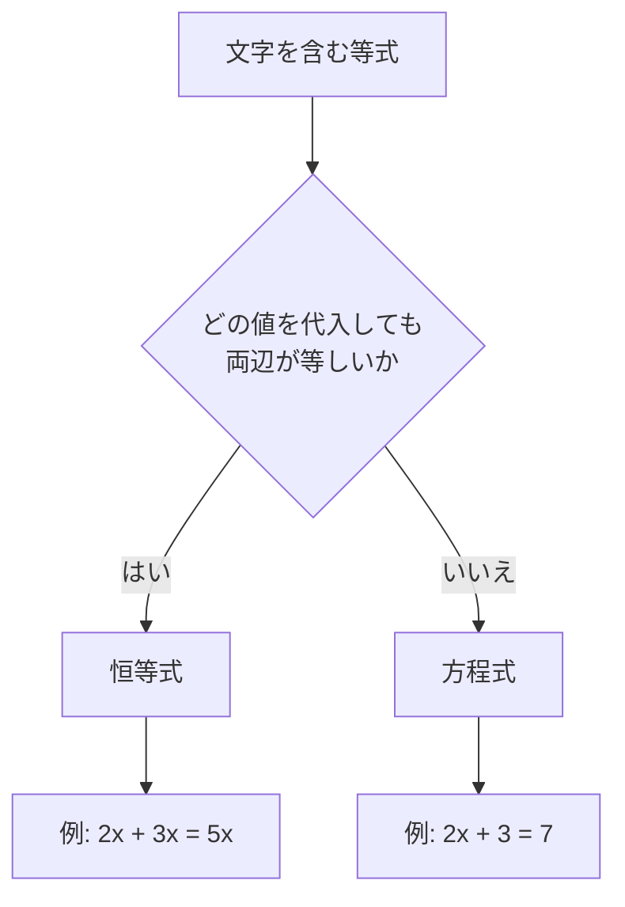

## 前提

本章の前提は、前の章[多項式の展開](../polynomial-expansion/)である。単項式・多項式・項・係数・定数項・次数の用語を使う。分配法則 $a(b + c) = ab + ac$ と乗法公式も使う。

物理学では、変数にどの値を入れても両辺が等しい等式を、しばしば道具として使う。両辺が常に等しい等式を**恒等式**と呼ぶ。本章は恒等式の扱い方を、分配法則だけから自己完結で導く。

## 学習目標

本章を読むと、次の概念と操作を使えるようになる。

- 恒等式の定義と、方程式との区別
- 多項式の恒等式の基本定理、すなわち「2 つの多項式が恒等式として等しい $\iff$ 各次数の係数がすべて等しい」
- 係数比較法による未定係数の決定
- 数値代入法による未定係数の決定と、必要な代入回数の根拠
- 両手法の比較と使い分け
- 部分分数分解の入口

本章では、論理を表す 2 つの記号を使う。読み方と意味を先に確かめる。

- **同値の記号 $\iff$**:「左は右と同値である」と読む。左の主張と右の主張が互いの言い換えであることを表す。前の章[集合と要素](../../set/sets-and-elements/)で導入済みである。本章でも同じ意味で使う。
- **ならばの記号 $\Longrightarrow$**:「左ならば右」と読む。左の式が成り立てば右の式が導かれることを表す。本章では、式変形の結果を導く向きを示すために使う。

## 恒等式と方程式

### 等式の 2 つの種類

文字を含む等式は、成り立つ範囲によって 2 種類に分かれる。次の 2 つの等式を比べる。

| 等式           | 成り立つ範囲                     |
| -------------- | -------------------------------- |
| $2x + 3x = 5x$ | $x$ にどの値を代入しても成り立つ |
| $2x + 3 = 7$   | $x = 2$ のときだけ成り立つ       |

2 つの等式は、見た目こそ似ているが、性質が大きく異なる。

- 等式 $2x + 3x = 5x$ は、$x$ にどの値を代入しても両辺が等しい。例えば $x = 1$ なら両辺は $5$、$x = 10$ なら両辺は $50$ になる。
- 等式 $2x + 3 = 7$ は、$x = 2$ のときだけ両辺が等しい。$x = 1$ では左辺が $5$、右辺が $7$ で等しくない。

### 定義

成り立つ範囲の違いを、用語で区別する。

- **恒等式**とは、含まれる文字にどの値を代入しても両辺が等しい等式である。
- **方程式**とは、含まれる文字の特定の値でのみ成り立つ等式である。方程式を成り立たせる値を、方程式の**解**と呼ぶ。

前の章[多項式の展開](../polynomial-expansion/)で扱った展開の式は、すべて恒等式である。例えば乗法公式 $(a + b)^2 = a^2 + 2ab + b^2$ は、$a$ と $b$ にどの値を代入しても成り立つ。

下の図は、等式を恒等式と方程式に分類する流れである。

  <em>図 1. 等式を恒等式と方程式に分類する流れ。</em>

### 恒等式の記号

本章では、等式 $A = B$ が恒等式であることを、特に断る場合に記号 $A \equiv B$ で表す。記号 $\equiv$ は「恒等的に等しい」と読む。ただし文脈から恒等式と分かる場合は、普通の等号 $=$ を使う。

恒等式かどうかは、等式の形だけでは決まらない。等式が成り立つ範囲を問題にして初めて、恒等式か方程式かが定まる。本章では「$x$ についての恒等式」のように、どの文字についての恒等式かを明示する。

## 多項式の恒等式の基本定理

### 定理の主張

恒等式を道具として使うには、土台となる定理が要る。多項式の恒等式について、次の基本定理が成り立つ。

> **多項式の恒等式の基本定理**
>
> 2 つの多項式 $P(x)$ と $Q(x)$ が $x$ についての恒等式 $P(x) = Q(x)$ を満たす $\iff$ 両多項式の各次数の係数がすべて等しい。

ここで $P(x)$ は「$x$ を含む多項式」を表す記号である。$P(x)$ は「ピー エックス」と読む。$P$ は多項式に付けた名前であり、$P(x)$ は $x$ を変数とする多項式を意味する。例えば $P(x) = 2x^2 - 3x + 1$ のように使う。本章では $P(x)$ を、$x$ の式に名前を付ける便宜的な記法として使う。

### 具体例で読む

定理の主張を、具体例で確かめる。次の 2 つの多項式を考える。

$$
P(x) = 2x^2 + 5x + 3, \qquad Q(x) = ax^2 + bx + c
$$

$P(x) = Q(x)$ が $x$ についての恒等式であるとする。基本定理によると、各次数の係数が等しい。

| 次数   | $P(x)$ の係数 | $Q(x)$ の係数 | 等式    |
| ------ | ------------- | ------------- | ------- |
| 2 次   | $2$           | $a$           | $a = 2$ |
| 1 次   | $5$           | $b$           | $b = 5$ |
| 定数項 | $3$           | $c$           | $c = 3$ |

恒等式 $P(x) = Q(x)$ から、$a = 2$・$b = 5$・$c = 3$ が一度に決まる。

### 直観的な説明

基本定理の右から左、すなわち「各次数の係数が等しいならば恒等式」は明らかである。係数が同じ多項式は、同じ式そのものだからである。

問題は左から右、すなわち「恒等式ならば各次数の係数が等しい」である。直観的な理由を、2 次式の場合で述べる。差の多項式 $D(x)$ を次のように置く。

$$
D(x) = P(x) - Q(x) = (2 - a)x^2 + (5 - b)x + (3 - c)
$$

恒等式 $P(x) = Q(x)$ は、$x$ にどの値を代入しても $D(x) = 0$ になることと同じである。各次数の係数を $p = 2 - a$・$q = 5 - b$・$r = 3 - c$ と置く。

$$
D(x) = px^2 + qx + r
$$

3 つの値 $x = 0, 1, -1$ を順に代入する。どの代入でも $D(x) = 0$ になる。

| 代入     | $D(x) = 0$ の式 |
| -------- | --------------- |
| $x = 0$  | $r = 0$         |
| $x = 1$  | $p + q + r = 0$ |
| $x = -1$ | $p - q + r = 0$ |

$x = 0$ から $r = 0$ が決まる。残る 2 式に $r = 0$ を入れる。

$$
p + q = 0, \qquad p - q = 0
$$

2 式を足すと $2p = 0$ となり $p = 0$ を得る。2 式を引くと $2q = 0$ となり $q = 0$ を得る。よって $p = q = r = 0$ となる。各係数の差が $0$ なので、$P(x)$ と $Q(x)$ の係数は等しい。

一般の $n$ 次式でも、適切な $n + 1$ 個の値を代入すると、すべての係数の差が $0$ に定まる。代入回数の根拠は、後の節[数値代入法](#数値代入法)で改めて述べる。本章は基本定理を、以上の直観的な説明で承認して使う。厳密な証明は本章の射程外とする。

## 係数比較法

### 方法

基本定理を使って未定係数を決める方法を、**係数比較法**と呼ぶ。未定係数とは、値がまだ決まっていない係数を表す文字である。係数比較法の手順は次のとおりである。

1. 恒等式の両辺を、同じ文字について展開し整理する。
2. 両辺を降べきの順にそろえる。
3. 基本定理により、各次数の係数を等号で結ぶ。
4. 得られた等式を解いて、未定係数を求める。

### 例: 右辺を展開して比較する

次の等式が $x$ についての恒等式になるように、定数 $p$ と $q$ を定める。

$$
x^2 + px + q = (x + 1)(x + 2)
$$

右辺を展開する。乗法公式 $(x + a)(x + b) = x^2 + (a + b)x + ab$ に $a = 1$・$b = 2$ を当てはめる。

$$
(x + 1)(x + 2) = x^2 + 3x + 2
$$

恒等式は次の形になる。

$$
x^2 + px + q = x^2 + 3x + 2
$$

両辺の各次数の係数を比較する。

| 次数   | 左辺の係数 | 右辺の係数 | 等式     |
| ------ | ---------- | ---------- | -------- |
| 2 次   | $1$        | $1$        | 成り立つ |
| 1 次   | $p$        | $3$        | $p = 3$  |
| 定数項 | $q$        | $2$        | $q = 2$  |

よって $p = 3$・$q = 2$ と定まる。

### 例: 左辺に未定係数があるとき

係数比較法は、左辺に未定係数がある場合にも使える。次の等式が $x$ についての恒等式になるように、定数 $a$・$b$・$c$ を定める。

$$
a(x - 1)^2 + b(x - 1) + c = x^2
$$

左辺を展開する。$(x - 1)^2 = x^2 - 2x + 1$ である。

$$
a(x^2 - 2x + 1) + b(x - 1) + c = ax^2 - 2ax + a + bx - b + c
$$

降べきの順に整理する。$x$ について同類項をまとめる。

$$
= ax^2 + (-2a + b)x + (a - b + c)
$$

恒等式 $ax^2 + (-2a + b)x + (a - b + c) = x^2$ の両辺で係数を比較する。右辺は $x^2 = 1 \cdot x^2 + 0 \cdot x + 0$ と見る。

| 次数   | 左辺の係数  | 右辺の係数 | 等式            |
| ------ | ----------- | ---------- | --------------- |
| 2 次   | $a$         | $1$        | $a = 1$         |
| 1 次   | $-2a + b$   | $0$        | $-2a + b = 0$   |
| 定数項 | $a - b + c$ | $0$        | $a - b + c = 0$ |

順に解く。2 次の式から $a = 1$ を得る。1 次の式 $-2a + b = 0$ に $a = 1$ を入れると $b = 2$ を得る。定数項の式 $a - b + c = 0$ に $a = 1$・$b = 2$ を入れる。

$$
1 - 2 + c = 0 \quad \Longrightarrow \quad c = 1
$$

よって $a = 1$・$b = 2$・$c = 1$ と定まる。

## 数値代入法

### 方法

恒等式は、どの値を代入しても成り立つ。性質を利用して未定係数を決める方法を、**数値代入法**と呼ぶ。数値代入法の手順は次のとおりである。

1. 計算が簡単になる値を、変数に代入する。
2. 代入で得た等式を、未定係数についての等式と見る。
3. 必要な個数の代入を行い、得た複数の等式を組にして未定係数を求める。

複数の等式を同時に満たす値を求める操作を、**連立**と呼ぶ。連立では、ある等式から 1 つの文字の値を求め、結果を別の等式へ入れて残りの文字を求める。連立の一般的な扱いは、後の章[一次方程式と連立一次方程式](../linear-equations-and-systems/)で展開する。本章では、文字が 2 個か 3 個の簡単な連立だけを使う。

代入する値は自由に選べる。左辺や右辺の一部が $0$ になる値を選ぶと、計算が簡単になる。

### 例

係数比較法で扱った次の恒等式を、数値代入法で解く。

$$
a(x - 1)^2 + b(x - 1) + c = x^2
$$

計算が簡単になる値を順に代入する。

- **$x = 1$ を代入**: 左辺の $(x - 1)$ を含む項が $0$ になる。

$$
a \cdot 0 + b \cdot 0 + c = 1^2 \quad \Longrightarrow \quad c = 1
$$

- **$x = 0$ を代入**: $(x - 1) = -1$ である。

$$
a \cdot (-1)^2 + b \cdot (-1) + c = 0^2 \quad \Longrightarrow \quad a - b + c = 0
$$

- **$x = 2$ を代入**: $(x - 1) = 1$ である。

$$
a \cdot 1^2 + b \cdot 1 + c = 2^2 \quad \Longrightarrow \quad a + b + c = 4
$$

3 つの等式を連立する。$c = 1$ を残る 2 式に入れる。

$$
a - b = -1, \qquad a + b = 3
$$

2 式を足すと $2a = 2$ となり $a = 1$ を得る。$a = 1$ を $a + b = 3$ に入れると $b = 2$ を得る。よって $a = 1$・$b = 2$・$c = 1$ と定まる。係数比較法の結果と一致する。

### 十分な個数の代入が必要な理由

数値代入法には注意点がある。代入の個数が足りないと、未定係数が一意に定まらない。理由は、多項式が何点を通るかで決まる性質にある。

> **$n$ 次以下の多項式は、相異なる $n + 1$ 個の点で一意に定まる。**

主張の理由は、係数の個数と代入で得る等式の個数を比べると分かる。$n$ 次以下の多項式は係数を $n + 1$ 個持つ。1 点の代入は、係数についての等式を 1 本与える。相異なる $n + 1$ 個の点を代入すると、係数についての等式が $n + 1$ 本そろう。等式の本数が未知の係数の個数と一致するので、係数が一意に決まる。

主張を、低い次数で確かめる。

- **1 次以下の多項式**: 形は $f(x) = px + q$ である。係数は $p$ と $q$ の 2 個である。相異なる 2 点の値を代入すると、$p$ と $q$ についての等式が 2 本そろい、両者が一意に決まる。
- **2 次以下の多項式**: 形は $f(x) = px^2 + qx + r$ である。係数は $p$・$q$・$r$ の 3 個である。相異なる 3 点の値を代入すると、3 本の等式がそろい、3 個の係数が一意に決まる。

逆に、代入する点が $n$ 個以下だと、$n$ 次の多項式は一意に定まらない。例として、2 次式を 2 点だけで決めようとする場合を考える。点 $(0, 0)$ と $(1, 1)$ の 2 点を通る 2 次式は、次のように無数にある。

$$
f(x) = x^2, \qquad f(x) = 2x^2 - x, \qquad f(x) = -x^2 + 2x
$$

3 つの式は係数が異なるが、いずれも $x = 0$ と $x = 1$ で同じ値を取る。下の表で確かめる。

| 式                 | $f(0)$ | $f(1)$       |
| ------------------ | ------ | ------------ |
| $f(x) = x^2$       | $0$    | $1$          |
| $f(x) = 2x^2 - x$  | $0$    | $2 - 1 = 1$  |
| $f(x) = -x^2 + 2x$ | $0$    | $-1 + 2 = 1$ |

3 つの式はいずれも $f(0) = 0$・$f(1) = 1$ を満たす。2 点では係数についての等式が 2 本しかそろわず、3 個の係数を決めきれない。代入が 2 点では足りず、係数が定まらない。

数値代入法で $n$ 次の恒等式を扱うときは、相異なる $n + 1$ 個の値を代入する。先の例題は 2 次の恒等式なので、$x = 0, 1, 2$ の 3 個を代入した。

### 代入で出た値が恒等式を保証するか

数値代入法には、もう 1 つの注意点がある。有限個の代入で係数を求めただけでは、等式が恒等式である保証はまだ得られない。求めた係数で本当に恒等式になるかは、最後に確かめる必要がある。

ただし基本定理を使うと、確かめは省ける。$n$ 次以下の多項式どうしの等式について、相異なる $n + 1$ 個の値で両辺が一致すれば、両辺は恒等式として等しい。理由は、差の多項式 $D(x)$ が $n + 1$ 個の相異なる値で $0$ になるからである。$n$ 次以下の多項式が $n + 1$ 個の点で $0$ になれば、$D(x)$ は恒等的に $0$ になる。本章は性質を承認して使う。

## 両手法の比較と使い分け

係数比較法と数値代入法は、どちらも基本定理に支えられた同じ目的の手法である。両者の特徴を比べる。

| 観点           | 係数比較法                     | 数値代入法                  |
| -------------- | ------------------------------ | --------------------------- |
| 主な操作       | 展開と整理                     | 値の代入                    |
| 向いている場面 | 展開が簡単な式                 | 代入で項が消える式          |
| 連立方程式     | 各次数で 1 本ずつ得る          | 代入ごとに 1 本ずつ得る     |
| 恒等式の確認   | 不要（係数が一致すれば恒等式） | 代入が $n + 1$ 個あれば不要 |

使い分けの目安は次のとおりである。

- 右辺や左辺の展開が簡単なときは、係数比較法が見通しよい。
- $(x - 1)$ や $(x + 2)$ のような因数を含み、特定の値で項が消えるときは、数値代入法が速い。
- 両手法を併用してもよい。まず数値代入法で一部の係数を求め、残りを係数比較法で求める進め方もある。

## 応用: 部分分数分解の入口

恒等式の典型的な応用に、**部分分数分解**がある。部分分数分解とは、1 つの分数式を、分母がより簡単な分数式の和へ書き直す操作である。

ここで分数式とは、多項式を多項式で割った形の式を指す。分数式の分母が $0$ になる値では、式の値は定まらない。以下の等式は、分母が $0$ にならない $x$ の範囲で考える。

次の分数式を、2 つの分数の和へ分解する。

$$
\frac{1}{x(x + 1)}
$$

分解の形を、未定係数 $A$・$B$ を使って次のように置く。$A$ と $B$ は、まだ値の決まっていない定数である。

$$
\frac{1}{x(x + 1)} = \frac{A}{x} + \frac{B}{x + 1}
$$

右辺を通分する。分母を $x(x + 1)$ にそろえる。

$$
\frac{A}{x} + \frac{B}{x + 1} = \frac{A(x + 1) + Bx}{x(x + 1)}
$$

両辺の分母が等しいので、分子どうしが恒等式になる。

$$
1 = A(x + 1) + Bx
$$

右辺を $x$ について整理する。

$$
A(x + 1) + Bx = (A + B)x + A
$$

恒等式は次の形になる。左辺の $1$ は $0 \cdot x + 1$ と見る。

$$
0 \cdot x + 1 = (A + B)x + A
$$

ここからは係数比較法と数値代入法のどちらでも解ける。両方を示す。

### 係数比較法で解く

両辺の各次数の係数を比較する。

| 次数   | 左辺の係数 | 右辺の係数 | 等式        |
| ------ | ---------- | ---------- | ----------- |
| 1 次   | $0$        | $A + B$    | $A + B = 0$ |
| 定数項 | $1$        | $A$        | $A = 1$     |

$A = 1$ を $A + B = 0$ に入れると $B = -1$ を得る。

### 数値代入法で解く

恒等式 $1 = A(x + 1) + Bx$ に、計算が簡単になる値を代入する。

- **$x = 0$ を代入**: $Bx$ の項が $0$ になる。

$$
1 = A(0 + 1) + B \cdot 0 \quad \Longrightarrow \quad A = 1
$$

- **$x = -1$ を代入**: $A(x + 1)$ の項が $0$ になる。

$$
1 = A(-1 + 1) + B \cdot (-1) \quad \Longrightarrow \quad 1 = -B \quad \Longrightarrow \quad B = -1
$$

どちらの手法でも $A = 1$・$B = -1$ を得る。部分分数分解は次の形になる。

$$
\frac{1}{x(x + 1)} = \frac{1}{x} - \frac{1}{x + 1}
$$

部分分数分解は、積分や数列の和の計算で活躍する。後続の章で微分積分や数列を扱うとき、恒等式の道具として再び使う。

## 例題

### 例題 1

次の等式が $x$ についての恒等式になるように、定数 $a$・$b$ を定めよ。

$$
(x + 3)(x - 2) = x^2 + ax + b
$$

**解法.** 左辺を展開する。乗法公式 $(x + a)(x + b) = x^2 + (a + b)x + ab$ に当たる。公式の文字との混同を避けるため、$x + 3$ と $x - 2$ を直接掛ける。

$$
(x + 3)(x - 2) = x^2 - 2x + 3x - 6 = x^2 + x - 6
$$

恒等式 $x^2 + x - 6 = x^2 + ax + b$ の両辺で係数を比較する。

- 1 次の係数より $a = 1$ を得る。
- 定数項より $b = -6$ を得る。

よって $a = 1$・$b = -6$ である。

### 例題 2

次の等式が $x$ についての恒等式になるように、定数 $a$・$b$・$c$ を定めよ。

$$
x^2 + 1 = a(x - 1)(x - 2) + b(x - 1) + c
$$

**解法.** 数値代入法を使う。右辺の項が消える値 $x = 1, 2$ と、計算が簡単な $x = 0$ を代入する。

- **$x = 1$ を代入**: $(x - 1)$ を含む項が $0$ になる。

$$
1^2 + 1 = c \quad \Longrightarrow \quad c = 2
$$

- **$x = 2$ を代入**: $(x - 2)$ を含む項が $0$ になり、$(x - 1) = 1$ である。

$$
2^2 + 1 = b \cdot 1 + c \quad \Longrightarrow \quad 5 = b + 2 \quad \Longrightarrow \quad b = 3
$$

- **$x = 0$ を代入**: $(x - 1) = -1$・$(x - 2) = -2$ である。

$$
0^2 + 1 = a \cdot (-1)(-2) + b \cdot (-1) + c
$$

$$
1 = 2a - b + c
$$

$b = 3$・$c = 2$ を入れる。

$$
1 = 2a - 3 + 2 \quad \Longrightarrow \quad 2a = 2 \quad \Longrightarrow \quad a = 1
$$

よって $a = 1$・$b = 3$・$c = 2$ である。

### 例題 3

次の分数式を部分分数に分解せよ。分母が $0$ にならない $x$ の範囲で考える。

$$
\frac{1}{(x + 1)(x + 3)}
$$

**解法.** 未定係数 $A$・$B$ を使って分解の形を置く。

$$
\frac{1}{(x + 1)(x + 3)} = \frac{A}{x + 1} + \frac{B}{x + 3}
$$

右辺を通分し、分子どうしを比べる。

$$
1 = A(x + 3) + B(x + 1)
$$

数値代入法を使う。項が消える値を代入する。

- **$x = -1$ を代入**: $A(-1 + 3) + B \cdot 0 = 1$ より $2A = 1$、$A = \dfrac{1}{2}$ である。
- **$x = -3$ を代入**: $A \cdot 0 + B(-3 + 1) = 1$ より $-2B = 1$、$B = -\dfrac{1}{2}$ である。

よって部分分数分解は次の形になる。

$$
\frac{1}{(x + 1)(x + 3)} = \frac{1}{2} \cdot \frac{1}{x + 1} - \frac{1}{2} \cdot \frac{1}{x + 3}
$$

## 演習問題

問題ごとに解答を畳んである。「解答を表示」を開くと確認できる。

### 問題 1

次の 2 つの等式について、恒等式か方程式かを答えよ。

$$
\text{(i)}\quad (x - 1)(x + 1) = x^2 - 1, \qquad \text{(ii)}\quad 3x - 6 = 0
$$

解答を表示

(i) は恒等式である。左辺を展開すると $x^2 - 1$ となり、$x$ にどの値を代入しても両辺が等しい。

(ii) は方程式である。$3x - 6 = 0$ は $x = 2$ のときだけ成り立つ。

### 問題 2

次の等式が $x$ についての恒等式になるように、定数 $a$・$b$ を定めよ。

$$
(2x - 1)(x + 4) = 2x^2 + ax + b
$$

解答を表示

左辺を展開する。

$$
(2x - 1)(x + 4) = 2x^2 + 8x - x - 4 = 2x^2 + 7x - 4
$$

恒等式 $2x^2 + 7x - 4 = 2x^2 + ax + b$ の両辺で係数を比較する。

- 1 次の係数より $a = 7$ を得る。
- 定数項より $b = -4$ を得る。

よって $a = 7$・$b = -4$ である。

### 問題 3

次の等式が $x$ についての恒等式になるように、定数 $a$・$b$・$c$ を定めよ。係数比較法で解け。

$$
a(x + 1)^2 + b(x + 1) + c = x^2 + 3x
$$

解答を表示

左辺を展開する。$(x + 1)^2 = x^2 + 2x + 1$ である。

$$
a(x^2 + 2x + 1) + b(x + 1) + c = ax^2 + (2a + b)x + (a + b + c)
$$

恒等式 $ax^2 + (2a + b)x + (a + b + c) = x^2 + 3x$ の両辺で係数を比較する。右辺は $x^2 + 3x + 0$ と見る。

| 次数   | 左辺の係数  | 右辺の係数 | 等式            |
| ------ | ----------- | ---------- | --------------- |
| 2 次   | $a$         | $1$        | $a = 1$         |
| 1 次   | $2a + b$    | $3$        | $2a + b = 3$    |
| 定数項 | $a + b + c$ | $0$        | $a + b + c = 0$ |

2 次の式から $a = 1$ を得る。1 次の式に $a = 1$ を入れると $2 + b = 3$ となり $b = 1$ を得る。定数項の式に $a = 1$・$b = 1$ を入れる。

$$
1 + 1 + c = 0 \quad \Longrightarrow \quad c = -2
$$

よって $a = 1$・$b = 1$・$c = -2$ である。

### 問題 4

問題 3 と同じ恒等式を、今度は数値代入法で解け。

$$
a(x + 1)^2 + b(x + 1) + c = x^2 + 3x
$$

解答を表示

項が消える値 $x = -1$ と、計算が簡単な $x = 0, 1$ を代入する。

- **$x = -1$ を代入**: $(x + 1) = 0$ である。

$$
c = (-1)^2 + 3 \cdot (-1) = 1 - 3 = -2 \quad \Longrightarrow \quad c = -2
$$

- **$x = 0$ を代入**: $(x + 1) = 1$ である。

$$
a + b + c = 0 \quad \Longrightarrow \quad a + b = 2
$$

- **$x = 1$ を代入**: $(x + 1) = 2$ である。

$$
a \cdot 2^2 + b \cdot 2 + c = 1 + 3 \quad \Longrightarrow \quad 4a + 2b + c = 4
$$

$c = -2$ を入れると $4a + 2b = 6$、すなわち $2a + b = 3$ を得る。$a + b = 2$ と連立する。2 式を引くと $a = 1$ を得る。$a = 1$ を $a + b = 2$ に入れると $b = 1$ を得る。

よって $a = 1$・$b = 1$・$c = -2$ である。問題 3 の結果と一致する。

### 問題 5

次の分数式を部分分数に分解せよ。分母が $0$ にならない $x$ の範囲で考える。

$$
\frac{1}{x(x - 2)}
$$

解答を表示

未定係数 $A$・$B$ を使って分解の形を置く。

$$
\frac{1}{x(x - 2)} = \frac{A}{x} + \frac{B}{x - 2}
$$

右辺を通分し、分子どうしを比べる。

$$
1 = A(x - 2) + Bx
$$

数値代入法を使う。

- **$x = 0$ を代入**: $1 = A(0 - 2) + B \cdot 0$ より $-2A = 1$、$A = -\dfrac{1}{2}$ である。
- **$x = 2$ を代入**: $1 = A \cdot 0 + B \cdot 2$ より $2B = 1$、$B = \dfrac{1}{2}$ である。

よって部分分数分解は次の形になる。

$$
\frac{1}{x(x - 2)} = -\frac{1}{2} \cdot \frac{1}{x} + \frac{1}{2} \cdot \frac{1}{x - 2}
$$

### 問題 6

次の主張の真偽を判定せよ。「2 次式 $f(x) = px^2 + qx + r$ について、$f(0) = 1$ と $f(1) = 0$ の 2 つの条件だけで、係数 $p$・$q$・$r$ が一意に定まる。」

解答を表示

主張は偽である。2 次式の係数を一意に定めるには、相異なる 3 点での値が必要である。2 つの条件だけでは点が足りず、係数は一意に定まらない。

例として、$f(0) = 1$ と $f(1) = 0$ を満たす 2 次式を 2 つ挙げる。

$$
f(x) = x^2 - 2x + 1, \qquad f(x) = -x^2 + 1
$$

前者は $f(0) = 1$・$f(1) = 1 - 2 + 1 = 0$ を満たす。後者は $f(0) = 1$・$f(1) = -1 + 1 = 0$ を満たす。2 式は係数が異なる。よって係数は一意に定まらない。

## まとめ

本章は、恒等式の扱い方を基本定理から自己完結で導いた。要点を振り返る。

- 恒等式は、文字にどの値を代入しても両辺が等しい等式である。方程式は、特定の値でのみ成り立つ等式である。
- 多項式の恒等式の基本定理によると、2 つの多項式の恒等式としての相等は、各次数の係数がすべて等しいことと同値である。
- 係数比較法は、両辺を展開して各次数の係数を等号で結び、未定係数を求める方法である。
- 数値代入法は、計算が簡単になる値を代入し、得た等式を連立して未定係数を求める方法である。$n$ 次の恒等式には相異なる $n + 1$ 個の代入が要る。
- 両手法は使い分けられる。展開の容易な式には係数比較法、特定の値で項が消える式には数値代入法を選ぶと速い。
- 部分分数分解は、恒等式の典型的な応用である。分子どうしの恒等式から未定係数を求める。

次の章では、恒等式の道具をさらに広い場面で使う。部分分数分解は、後続の微分積分と数列の章で再び登場する。

恒等式と多項式をさらに学びたい読者に向けて、一次資料を脚注で挙げる[^takagi][^kodaira]。

[^takagi]: 高木貞治『代数学講義（改訂新版）』共立出版、1965 年。多項式と恒等式の理論を厳密に展開した、日本語の古典的な書物である。多項式の相等と係数比較を基礎から扱う。

[^kodaira]: 小平邦彦『解析入門 I』岩波書店、2003 年。数と式の扱いを基礎から丁寧に述べた入門書である。部分分数分解の基礎にも触れる。
