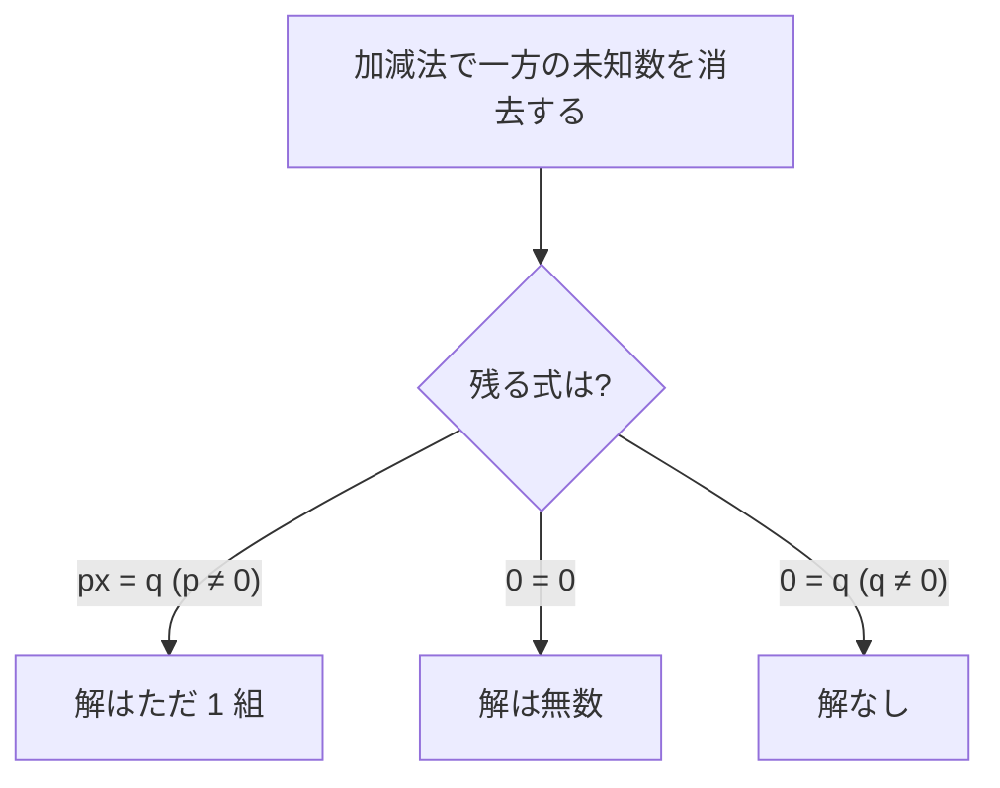

## 前提

本章の前提は、同じ代数カテゴリの章[多項式の展開](../polynomial-expansion/)である。文字式の足し算・引き算・掛け算、係数、分配法則 $a(b + c) = ab + ac$ を使う。

物理学では、未知の量を文字で表し、量どうしの関係を等式で書く。等式から未知の量を求める操作が、本章で扱う方程式を解く操作である。本章は方程式を解く規則を、等式の基本性質だけから自己完結で導く。

## 学習目標

本章を読むと、次の概念と操作を使えるようになる。

- 等式・方程式・解の定義、方程式を解くことの意味
- 等式の基本性質（両辺に同じ数を加減乗除しても等号が保たれる）
- 移項の規則と、一次方程式 $ax + b = 0$（$a \neq 0$）の解 $x = -\dfrac{b}{a}$
- 係数 $a$ が $0$ の場合の扱い（解なし・不定）
- 連立一次方程式の定義と、両式を同時に満たす解の組
- 代入法と加減法による連立一次方程式の解き方
- 解がただ 1 組・無数・なしの 3 つの場合と、係数の比との関係

## 等式と方程式

### 等式

2 つの式を等号 $=$ で結んだ式を**等式**と呼ぶ。等号の左側の式を**左辺**、右側の式を**右辺**と呼ぶ。左辺と右辺を合わせて**両辺**と呼ぶ。

例えば次は等式である。

$$
2x + 3 = 7
$$

左辺は $2x + 3$、右辺は $7$ である。

### 方程式と解

等式の中には、含まれる文字に特定の値を入れたときだけ成り立つものがある。文字に値を入れる操作を**代入**と呼ぶ。代入する値によって成り立ったり成り立たなかったりする等式を**方程式**と呼ぶ。方程式に含まれる、値の定まっていない文字を**未知数**と呼ぶ。

等式 $2x + 3 = 7$ を方程式と見る。未知数は $x$ である。$x$ にいくつかの値を代入して、等式が成り立つかを調べる。

| 代入する値 | 左辺 $2x + 3$ の値 | 右辺の値 | 等式の成立   |
| ---------- | ------------------ | -------- | ------------ |
| $x = 1$    | $5$                | $7$      | 成り立たない |
| $x = 2$    | $7$                | $7$      | 成り立つ     |
| $x = 3$    | $9$                | $7$      | 成り立たない |

$x = 2$ のときだけ等式が成り立つ。方程式を成り立たせる未知数の値を、方程式の**解**と呼ぶ。方程式の解をすべて求める操作を、方程式を**解く**と呼ぶ。

### 一次方程式

未知数について 1 次式である方程式を**一次方程式**と呼ぶ。1 次式とは、未知数の次数が最も高い項で $1$ である式を指す。次数の定義は前提の章[多項式の展開](../polynomial-expansion/)で述べた。

次はいずれも未知数 $x$ の一次方程式である。

$$
2x + 3 = 7, \qquad 5x = 2x - 6, \qquad 3(x - 1) = x + 1
$$

本章では、未知数が 1 つの一次方程式と、未知数が 2 つの連立一次方程式を扱う。

## 等式の基本性質

方程式を解く操作は、等式の形を変えながら、最後に「$x = (\text{数})$」の形へ導く操作である。形を変える間も等号を保つ必要がある。等号を保つ変形の根拠が、次の**等式の基本性質**である。

等式 $A = B$ が成り立つとき、次の 4 つが成り立つ。$C$ は任意の数を表す。

| 番号 | 操作                 | 性質                          | 条件       |
| ---- | -------------------- | ----------------------------- | ---------- |
| (1)  | 両辺に同じ数を足す   | $A + C = B + C$               | なし       |
| (2)  | 両辺から同じ数を引く | $A - C = B - C$               | なし       |
| (3)  | 両辺に同じ数を掛ける | $A \times C = B \times C$     | なし       |
| (4)  | 両辺を同じ数で割る   | $\dfrac{A}{C} = \dfrac{B}{C}$ | $C \neq 0$ |

性質 (1) から (4) は、いずれも「同じ量を両辺に等しく作用させても、釣り合いは崩れない」ことを表す。天秤の左右に同じ重さを足し引きしても釣り合いが保たれる様子と同じである。

性質 (4) には $C \neq 0$ の条件が付く。記号 $\neq$ は「等しくない」を表し、「ノットイコール」と読む。$C \neq 0$ は「$C$ は $0$ と等しくない」を表す。性質 (4) に条件が付くのは、$0$ で割る操作を定義しないためである。$0$ で割る操作を許すと、$\dfrac{A}{0}$ のような式が現れ、値を定められない。本章では $0$ による除算を一切行わない。

## 一次方程式を解く

### 移項

等式の基本性質 (1) と (2) から、便利な変形が導ける。等式の一方の辺にある項を、符号を変えて他方の辺へ移す操作である。移す操作を**移項**と呼ぶ。

方程式 $x + 3 = 7$ を例に、移項が等式の基本性質から導けることを示す。両辺から $3$ を引く。性質 (2) を使う。

$$
x + 3 - 3 = 7 - 3
$$

左辺の $+3$ と $-3$ は打ち消し合う。

$$
x = 7 - 3 = 4
$$

結果を見ると、左辺にあった $+3$ が、符号を $-3$ に変えて右辺へ移っている。両辺から同じ数を引く操作は、項を符号を変えて反対の辺へ移す操作と同じ結果になる。同様に、両辺に同じ数を足す操作（性質 (1)）は、$-$ の項を $+$ に変えて移す操作に当たる。

> 移項とは、等式の一方の辺の項を、符号を変えて他方の辺へ移す操作である。移項の根拠は等式の基本性質 (1) と (2) である。

### 一般形 $ax + b = 0$ の解

一次方程式は、移項によってすべての項を左辺に集めると、次の形に書き直せる。形を一次方程式の**一般形**と呼ぶ。$a$ と $b$ は**定数**で、$a \neq 0$ とする。定数とは、値が定まっていて変化しない数を指す。未知数 $x$ と区別するために文字 $a$・$b$ で表す。

$$
ax + b = 0 \quad (a \neq 0)
$$

一般形を解く。まず定数項 $b$ を右辺へ移項する。性質 (2) で両辺から $b$ を引く操作に当たる。

$$
ax = -b
$$

次に両辺を $a$ で割る。$a \neq 0$ なので、性質 (4) を使える。

$$
\frac{ax}{a} = \frac{-b}{a}
$$

左辺の $\dfrac{ax}{a}$ は $x$ になる。よって解が定まる。

$$
x = -\frac{b}{a}
$$

$a \neq 0$ である一次方程式 $ax + b = 0$ は、ただ 1 つの解 $x = -\dfrac{b}{a}$ を持つ。

### 解く手順

一般の一次方程式は、次の手順で一般形へ整理してから解く。

1. 両辺に分配法則を使い、括弧を外す。
2. 未知数 $x$ を含む項を左辺へ、定数項を右辺へ移項する。
3. 同類項を整理し、$ax = c$ の形にする。
4. 両辺を $x$ の係数 $a$ で割り、$x = \dfrac{c}{a}$ を得る（$a \neq 0$）。

例として $3(x - 1) = x + 1$ を解く。

**手順 1.** 左辺の括弧を分配法則で外す。

$$
3x - 3 = x + 1
$$

**手順 2.** $x$ の項を左辺へ、定数項を右辺へ移項する。$x$ を左辺へ移すと $-x$、$-3$ を右辺へ移すと $+3$ になる。

$$
3x - x = 1 + 3
$$

**手順 3.** 同類項を整理する。

$$
2x = 4
$$

**手順 4.** 両辺を $2$ で割る。

$$
x = 2
$$

### 係数 $a$ が $0$ の場合

一般形 $ax + b = 0$ で $a = 0$ の場合は、未知数 $x$ が消えて等式 $b = 0$ だけが残る。$x$ で割れないため、解の様子は $b$ の値で 2 通りに分かれる。

| $a$ の値   | $b$ の値   | 残る等式 | 解の様子                          |
| ---------- | ---------- | -------- | --------------------------------- |
| $a \neq 0$ | 任意       | —        | ただ 1 つの解 $x = -\dfrac{b}{a}$ |
| $a = 0$    | $b \neq 0$ | $b = 0$  | 解なし（成り立たない等式が残る）  |
| $a = 0$    | $b = 0$    | $0 = 0$  | 不定（どんな $x$ でも成り立つ）   |

$a = 0$ で起きる 2 つの場合を、具体例で確かめる。

- $0 \cdot x + 5 = 0$ は $5 = 0$ となる。$5 = 0$ は成り立たない。どんな $x$ を代入しても成り立たず、解なしである。
- $0 \cdot x + 0 = 0$ は $0 = 0$ となる。$0 = 0$ はつねに成り立つ。どんな $x$ を代入しても成り立ち、解は無数にある。解が無数にある状態を**不定**と呼ぶ。

本章で「一次方程式」と呼ぶときは、特に断らない限り $a \neq 0$ の場合を指す。

## 連立一次方程式

### 定義

未知数を 2 つ含む一次方程式を、**2 元 1 次方程式**と呼ぶ。「元」は未知数の個数を表す。次は未知数 $x$ と $y$ の 2 元 1 次方程式である。

$$
x + y = 5
$$

2 元 1 次方程式 $x + y = 5$ は、$x$ だけでは解が定まらない。例えば $(x, y) = (1, 4)$ と $(2, 3)$ は、ともに等式を成り立たせる。$x$ と $y$ の組は無数にある。

未知数の値を定めるには、複数の方程式を組にして同時に考える。2 つ以上の方程式を組にしたものを**連立方程式**と呼ぶ。すべてが一次方程式である連立方程式を**連立一次方程式**と呼ぶ。本章では未知数 2 つ・式 2 つの連立一次方程式を扱う。波括弧で 2 つの式をまとめて書く。

$$
\begin{cases}
x + y = 5 \\
x - y = 1
\end{cases}
$$

### 連立方程式の解

連立方程式の**解**とは、組にしたすべての方程式を同時に成り立たせる未知数の値の組である。上の例で $(x, y) = (3, 2)$ を調べる。

- 第 1 式 $x + y = 5$ に代入すると $3 + 2 = 5$ となり、成り立つ。
- 第 2 式 $x - y = 1$ に代入すると $3 - 2 = 1$ となり、成り立つ。

$(x, y) = (3, 2)$ は両式を同時に成り立たせる。よって連立方程式の解である。連立方程式を解くとは、すべての式を同時に成り立たせる組をすべて求める操作である。

連立一次方程式の解き方には、**代入法**と**加減法**の 2 つがある。次の節で順に述べる。

## 代入法

**代入法**は、一方の式を 1 つの未知数について解き、得られた式をもう一方の式へ代入する解き方である。代入により未知数が 1 つ消え、1 元の一次方程式に帰着する。

次の連立方程式を代入法で解く。

$$
\begin{cases}
y = 2x - 1 & \text{(第 1 式)} \\
3x + y = 9 & \text{(第 2 式)}
\end{cases}
$$

第 1 式は、すでに $y$ について解けた形である。第 1 式の右辺 $2x - 1$ を、第 2 式の $y$ へ代入する。第 2 式の $y$ が $2x - 1$ に置き換わる。

$$
3x + (2x - 1) = 9
$$

未知数が $x$ だけになった。1 元の一次方程式として解く。同類項を整理する。

$$
5x - 1 = 9
$$

$-1$ を右辺へ移項する。

$$
5x = 10
$$

両辺を $5$ で割る。

$$
x = 2
$$

求めた $x = 2$ を第 1 式 $y = 2x - 1$ へ代入し、$y$ を求める。

$$
y = 2 \cdot 2 - 1 = 3
$$

解は $(x, y) = (2, 3)$ である。検算のため第 2 式へ代入すると $3 \cdot 2 + 3 = 9$ となり、成り立つ。

代入法の手順をまとめる。

1. 一方の式を、1 つの未知数について解く。
2. 解いた式を、もう一方の式へ代入し、未知数を 1 つに減らす。
3. 残った 1 元の一次方程式を解く。
4. 求めた値を元の式へ代入し、もう一方の未知数を求める。

## 加減法

**加減法**は、2 つの式を辺どうし足すか引いて、一方の未知数を消去する解き方である。消去する未知数の係数をそろえてから足し引きする。

次の連立方程式を加減法で解く。

$$
\begin{cases}
3x + 2y = 12 & \text{(第 1 式)} \\
x - 2y = 4 & \text{(第 2 式)}
\end{cases}
$$

第 1 式の $y$ の係数は $2$、第 2 式の $y$ の係数は $-2$ である。**絶対値**で見ると、係数はすでに等しい。絶対値とは、数から符号を除いた大きさを指す。例えば $2$ の絶対値も $-2$ の絶対値も $2$ である。係数の絶対値が等しく符号は逆になる。2 つの式を辺どうし足すと、$2y$ と $-2y$ が打ち消し合う。

辺どうしの足し算は、等式の基本性質に基づく。第 2 式 $x - 2y = 4$ は等式である。第 1 式の両辺に、それぞれ等しい量 $x - 2y$ と $4$ を足してよい（性質 (1)）。左辺には $x - 2y$、右辺には $4$ を足す。

$$
(3x + 2y) + (x - 2y) = 12 + 4
$$

左辺を整理する。$2y$ と $-2y$ が消える。

$$
4x = 16
$$

両辺を $4$ で割る。

$$
x = 4
$$

求めた $x = 4$ を第 2 式 $x - 2y = 4$ へ代入し、$y$ を求める。

$$
4 - 2y = 4
$$

$4$ を右辺へ移項する。

$$
-2y = 0
$$

両辺を $-2$ で割る。

$$
y = 0
$$

解は $(x, y) = (4, 0)$ である。検算のため第 1 式へ代入すると $3 \cdot 4 + 2 \cdot 0 = 12$ となり、成り立つ。

### 係数がそろわない場合

消去したい未知数の係数の絶対値が等しくないときは、各式を定数倍して係数をそろえる。定数倍は等式の基本性質 (3) に基づく。

次の連立方程式を考える。

$$
\begin{cases}
2x + 3y = 7 & \text{(第 1 式)} \\
3x + 2y = 8 & \text{(第 2 式)}
\end{cases}
$$

$x$ を消去する。$x$ の係数は第 1 式が $2$、第 2 式が $3$ である。$2$ と $3$ の最小公倍数 $6$ にそろえる。第 1 式を $3$ 倍、第 2 式を $2$ 倍する。

$$
\begin{cases}
6x + 9y = 21 & \text{(第 1 式を 3 倍)} \\
6x + 4y = 16 & \text{(第 2 式を 2 倍)}
\end{cases}
$$

$x$ の係数がともに $6$ でそろった。辺どうし引くと $x$ が消える。

$$
(6x + 9y) - (6x + 4y) = 21 - 16
$$

左辺を整理する。

$$
5y = 5
$$

両辺を $5$ で割る。

$$
y = 1
$$

求めた $y = 1$ を第 1 式 $2x + 3y = 7$ へ代入する。

$$
2x + 3 \cdot 1 = 7
$$

$3$ を右辺へ移項し、両辺を $2$ で割る。

$$
2x = 4, \qquad x = 2
$$

解は $(x, y) = (2, 1)$ である。

加減法の手順をまとめる。

1. 消去する未知数を 1 つ選ぶ。
2. 選んだ未知数の係数の絶対値が等しくなるよう、各式を定数倍する。
3. 係数の符号が同じなら辺どうし引き、異なるなら辺どうし足して、未知数を消去する。
4. 残った 1 元の一次方程式を解く。
5. 求めた値を元の式へ代入し、もう一方の未知数を求める。

## 解の 3 つの場合

これまでの例では、連立一次方程式の解はただ 1 組だった。しかし連立一次方程式の解は、係数の組み合わせによって 3 つの場合に分かれる。一般形を次のように置く。

$$
\begin{cases}
a_1 x + b_1 y = c_1 \\
a_2 x + b_2 y = c_2
\end{cases}
$$

ここで下付きの番号は式の番号を表す。$a_1$・$b_1$・$c_1$ は第 1 式の係数と定数項、$a_2$・$b_2$・$c_2$ は第 2 式の係数と定数項である。例えば $a_1$ は第 1 式の $x$ の係数、$a_2$ は第 2 式の $x$ の係数を表す。$a_1$ は「エー 1」と読む。

解の 3 つの場合は、加減法で未知数を 1 つ消去したときに残る式の形で判定できる。次の表にまとめる。最後の列は、後続の関数の章で扱う 2 直線の位置関係との対応を先に示したものである。

| 場合      | 残る式の形             | 解             | 係数の関係                                                  | 2 直線の位置関係 |
| --------- | ---------------------- | -------------- | ----------------------------------------------------------- | ---------------- |
| ただ 1 組 | $px = q$（$p \neq 0$） | $1$ 組に定まる | $\dfrac{a_1}{a_2} \neq \dfrac{b_1}{b_2}$                    | 交わる           |
| 無数      | $0 = 0$                | 無数にある     | $\dfrac{a_1}{a_2} = \dfrac{b_1}{b_2} = \dfrac{c_1}{c_2}$    | 一致             |
| 解なし    | $0 = q$（$q \neq 0$）  | 解なし         | $\dfrac{a_1}{a_2} = \dfrac{b_1}{b_2} \neq \dfrac{c_1}{c_2}$ | 平行             |

以下、3 つの場合を具体例で確かめる。係数の比は、$a_2$・$b_2$・$c_2$ が $0$ でない場合に書ける。

### ただ 1 組に定まる場合

係数の比が $\dfrac{a_1}{a_2} \neq \dfrac{b_1}{b_2}$ のとき、解はただ 1 組に定まる。前節の例 $2x + 3y = 7$ と $3x + 2y = 8$ がその場合である。比は $\dfrac{a_1}{a_2} = \dfrac{2}{3}$、$\dfrac{b_1}{b_2} = \dfrac{3}{2}$ で、等しくない。解は $(x, y) = (2, 1)$ の 1 組だけである。

### 無数にある場合

2 つの式が実質的に同じ関係を表すとき、解は無数にある。次の連立方程式を考える。

$$
\begin{cases}
x + y = 2 & \text{(第 1 式)} \\
2x + 2y = 4 & \text{(第 2 式)}
\end{cases}
$$

第 2 式は第 1 式の両辺を $2$ 倍した式である。2 つの式は同じ関係を表す。加減法で確かめる。第 1 式を $2$ 倍すると $2x + 2y = 4$ になり、第 2 式と一致する。両式を辺どうし引く。

$$
(2x + 2y) - (2x + 2y) = 4 - 4
$$

両辺とも $0$ になり、$0 = 0$ が残る。$0 = 0$ はつねに成り立つ。未知数を定める条件は第 1 式 $x + y = 2$ だけになる。$x + y = 2$ を満たす組は無数にある。例えば $(0, 2)$・$(1, 1)$・$(2, 0)$ がいずれも解である。

係数の比は $\dfrac{1}{2} = \dfrac{1}{2} = \dfrac{2}{4}$ で、3 つすべてが等しい。

### 解なしの場合

未知数の係数の比は等しいが、定数項の比だけが異なるとき、解はない。次の連立方程式を考える。

$$
\begin{cases}
x + y = 2 & \text{(第 1 式)} \\
2x + 2y = 5 & \text{(第 2 式)}
\end{cases}
$$

第 1 式を $2$ 倍すると $2x + 2y = 4$ になる。第 2 式は $2x + 2y = 5$ である。左辺が同じ $2x + 2y$ なのに、右辺が $4$ と $5$ で異なる。辺どうし引く。

$$
(2x + 2y) - (2x + 2y) = 5 - 4
$$

左辺は $0$、右辺は $1$ になり、$0 = 1$ が残る。$0 = 1$ は成り立たない。どんな組 $(x, y)$ を代入しても両式は同時に成り立たず、解はない。

係数の比は $\dfrac{1}{2} = \dfrac{1}{2}$ で未知数の係数の比は等しいが、定数項の比 $\dfrac{2}{5}$ だけが異なる。

### 3 つの場合の判定の流れ

3 つの場合を見分ける流れを図にまとめる。加減法で一方の未知数を消去した結果の式で判定する。

  <em>図 1. 連立一次方程式の解の 3 つの場合を、加減法で消去した後に残る式で判定する流れ。</em>

本章は代数の操作だけで 3 つの場合を判定した。判定表の最後の列に示した 2 直線の位置関係は、後続の関数の章で図とともに詳しく扱う。

## 例題

### 例題 1

一次方程式 $5x - 4 = 2x + 8$ を解け。

**解法.** $x$ の項を左辺へ、定数項を右辺へ移項する。$2x$ を左辺へ移すと $-2x$、$-4$ を右辺へ移すと $+4$ になる。

$$
5x - 2x = 8 + 4
$$

同類項を整理する。

$$
3x = 12
$$

両辺を $3$ で割る。

$$
x = 4
$$

### 例題 2

次の連立方程式を代入法で解け。

$$
\begin{cases}
y = x + 2 \\
2x + 3y = 16
\end{cases}
$$

**解法.** 第 1 式は $y$ について解けている。第 1 式の右辺 $x + 2$ を第 2 式の $y$ へ代入する。

$$
2x + 3(x + 2) = 16
$$

括弧を分配法則で外し、同類項を整理する。

$$
2x + 3x + 6 = 16, \qquad 5x + 6 = 16
$$

$6$ を右辺へ移項し、両辺を $5$ で割る。

$$
5x = 10, \qquad x = 2
$$

$x = 2$ を第 1 式 $y = x + 2$ へ代入する。

$$
y = 2 + 2 = 4
$$

解は $(x, y) = (2, 4)$ である。

### 例題 3

次の連立方程式を加減法で解け。

$$
\begin{cases}
4x + 3y = 10 \\
2x - 3y = 8
\end{cases}
$$

**解法.** $y$ の係数は $3$ と $-3$ である。絶対値が等しく符号は逆になる。辺どうし足すと $y$ が消える。

$$
(4x + 3y) + (2x - 3y) = 10 + 8
$$

左辺を整理する。

$$
6x = 18, \qquad x = 3
$$

$x = 3$ を第 2 式 $2x - 3y = 8$ へ代入する。

$$
2 \cdot 3 - 3y = 8, \qquad 6 - 3y = 8
$$

$6$ を右辺へ移項し、両辺を $-3$ で割る。

$$
-3y = 2, \qquad y = -\frac{2}{3}
$$

解は $(x, y) = \left(3, -\dfrac{2}{3}\right)$ である。

## 演習問題

問題ごとに解答を畳んである。「解答を表示」を開くと確認できる。

### 問題 1

一次方程式 $7x + 5 = 3x - 7$ を解け。

解答を表示

$x$ の項を左辺へ、定数項を右辺へ移項する。

$$
7x - 3x = -7 - 5
$$

同類項を整理する。

$$
4x = -12
$$

両辺を $4$ で割る。

$$
x = -3
$$

### 問題 2

一次方程式 $2(x + 3) = 5x - 3$ を解け。

解答を表示

左辺の括弧を分配法則で外す。

$$
2x + 6 = 5x - 3
$$

$x$ の項を左辺へ、定数項を右辺へ移項する。$5x$ を左辺へ移すと $-5x$、$6$ を右辺へ移すと $-6$ になる。

$$
2x - 5x = -3 - 6
$$

同類項を整理する。

$$
-3x = -9
$$

両辺を $-3$ で割る。

$$
x = 3
$$

### 問題 3

次の連立方程式を代入法で解け。

$$
\begin{cases}
x = 2y + 1 \\
3x - y = 8
\end{cases}
$$

解答を表示

第 1 式は $x$ について解けている。第 1 式の右辺 $2y + 1$ を第 2 式の $x$ へ代入する。

$$
3(2y + 1) - y = 8
$$

括弧を外し、同類項を整理する。

$$
6y + 3 - y = 8, \qquad 5y + 3 = 8
$$

$3$ を右辺へ移項し、両辺を $5$ で割る。

$$
5y = 5, \qquad y = 1
$$

$y = 1$ を第 1 式 $x = 2y + 1$ へ代入する。

$$
x = 2 \cdot 1 + 1 = 3
$$

解は $(x, y) = (3, 1)$ である。

### 問題 4

次の連立方程式を加減法で解け。

$$
\begin{cases}
3x + 2y = 7 \\
5x - 2y = 1
\end{cases}
$$

解答を表示

$y$ の係数は $2$ と $-2$ である。絶対値が等しく符号は逆になる。辺どうし足すと $y$ が消える。

$$
(3x + 2y) + (5x - 2y) = 7 + 1
$$

左辺を整理する。

$$
8x = 8, \qquad x = 1
$$

$x = 1$ を第 1 式 $3x + 2y = 7$ へ代入する。

$$
3 + 2y = 7, \qquad 2y = 4, \qquad y = 2
$$

解は $(x, y) = (1, 2)$ である。

### 問題 5

次の連立方程式を加減法で解け。係数をそろえる必要がある。

$$
\begin{cases}
2x + 3y = 4 \\
3x + 4y = 7
\end{cases}
$$

解答を表示

$x$ を消去する。$x$ の係数 $2$ と $3$ を最小公倍数 $6$ にそろえる。第 1 式を $3$ 倍、第 2 式を $2$ 倍する。

$$
\begin{cases}
6x + 9y = 12 \\
6x + 8y = 14
\end{cases}
$$

辺どうし引く。

$$
(6x + 9y) - (6x + 8y) = 12 - 14
$$

左辺を整理する。

$$
y = -2
$$

$y = -2$ を第 1 式 $2x + 3y = 4$ へ代入する。

$$
2x + 3 \cdot (-2) = 4, \qquad 2x - 6 = 4, \qquad 2x = 10, \qquad x = 5
$$

解は $(x, y) = (5, -2)$ である。

### 問題 6

次の連立方程式の解の様子を調べよ。解があれば求め、無いか無数なら理由を述べよ。

$$
\begin{cases}
x - 2y = 3 \\
2x - 4y = 6
\end{cases}
$$

解答を表示

第 1 式を $2$ 倍すると $2x - 4y = 6$ になり、第 2 式と一致する。2 つの式は同じ関係を表す。

第 1 式を $2$ 倍した式から第 2 式を辺どうし引く。

$$
(2x - 4y) - (2x - 4y) = 6 - 6, \qquad 0 = 0
$$

$0 = 0$ はつねに成り立つ。未知数を定める条件は第 1 式 $x - 2y = 3$ だけになる。$x - 2y = 3$ を満たす組は無数にある。よって解は無数にある。

係数の比は $\dfrac{1}{2} = \dfrac{-2}{-4} = \dfrac{3}{6}$ で、3 つすべてが等しい。

### 問題 7

次の連立方程式の解の様子を調べよ。解があれば求め、無いか無数なら理由を述べよ。

$$
\begin{cases}
x + 3y = 1 \\
2x + 6y = 5
\end{cases}
$$

解答を表示

第 1 式を $2$ 倍すると $2x + 6y = 2$ になる。第 2 式は $2x + 6y = 5$ である。左辺が同じ $2x + 6y$ なのに、右辺が $2$ と $5$ で異なる。

第 1 式を $2$ 倍した式から第 2 式を辺どうし引く。

$$
(2x + 6y) - (2x + 6y) = 2 - 5, \qquad 0 = -3
$$

$0 = -3$ は成り立たない。どんな組 $(x, y)$ を代入しても両式は同時に成り立たない。よって解はない。

係数の比は $\dfrac{1}{2} = \dfrac{3}{6}$ で未知数の係数の比は等しいが、定数項の比 $\dfrac{1}{5}$ だけが異なる。

## まとめ

本章は、一次方程式と連立一次方程式の解き方を、等式の基本性質から自己完結で扱った。要点を振り返る。

- 等式を成り立たせる未知数の値が解であり、解をすべて求める操作が方程式を解く操作である。
- 等式の基本性質は、両辺に同じ数を加減乗除しても等号が保たれることを述べる。除算では $0$ で割らない。
- 移項は等式の基本性質から導ける。$ax + b = 0$（$a \neq 0$）の解は $x = -\dfrac{b}{a}$ である。
- 連立一次方程式の解は、すべての式を同時に成り立たせる未知数の組である。代入法と加減法で 1 元に帰着して解く。
- 連立一次方程式の解は、ただ 1 組・無数・なしの 3 つに分かれる。係数の比で判定できる。

次の章[一次不等式](../linear-inequalities/)では、等号 $=$ の代わりに不等号を使った一次不等式を扱う。等式の基本性質と同様に、不等式にも基本性質がある。ただし負の数を掛けたり割ったりすると、不等号の向きが変わる。向きが変わる点だけが等式と異なる。本章の移項と整理の手順は、一次不等式でもそのまま使える。

一次方程式と連立一次方程式をさらに学びたい読者に向けて、一次資料を脚注で挙げる[^kodaira][^takagi]。

[^kodaira]: 小平邦彦『解析入門 I』岩波書店、2003 年。数と式の扱いを基礎から丁寧に述べた入門書である。方程式の変形の根拠を厳密に扱う。

[^takagi]: 高木貞治『初等整数論講義（第 2 版）』共立出版、1971 年。整数係数の方程式を基礎から扱う、日本語の古典的な書物である。
