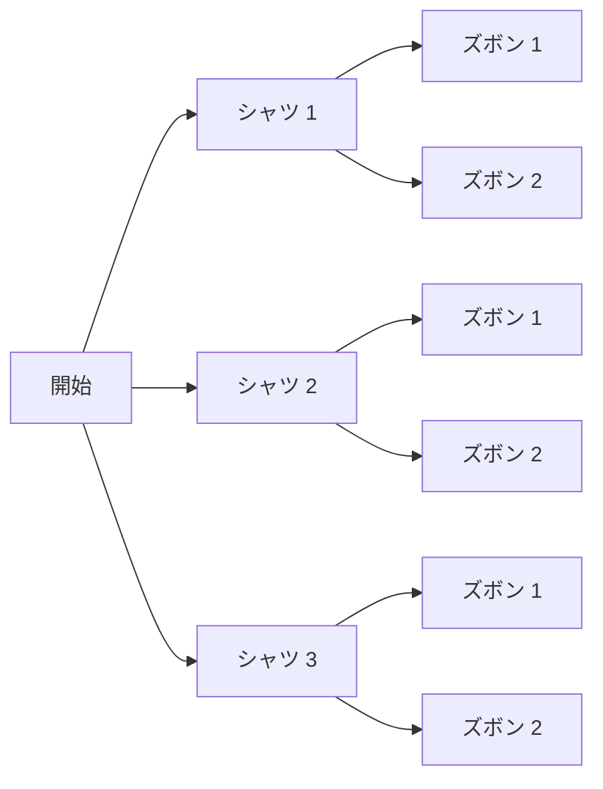

## 前提

本章の前提は、前の章[因数分解](../factorization/)と[恒等式](../identities/)である。多項式・項・係数・定数項・次数の用語と、分配法則 $a(b + c) = ab + ac$、および $(a + b)^2 = a^2 + 2ab + b^2$ のような乗法公式を使う。累乗の記法 $a^n$ は[指数法則](../laws-of-exponents/)で導入済みとする。

物理学では、場合の数を数える操作が頻繁に現れる。状態の数を数える操作や、式 $(a + b)^n$ を展開する操作が代表例である。本章は、数え上げの基本から二項定理までを自己完結で導く。

## 学習目標

本章を読むと、次の概念と記号を使えるようになる。

- 数え上げの基本である積の法則と和の法則
- 階乗 $n!$ の定義と、$0! = 1$ と定める理由
- 順列 ${}_n\mathrm{P}_r$、すなわち順序を区別する並べ方の総数
- 組合せ ${}_n\mathrm{C}_r = \dbinom{n}{r}$、すなわち順序を区別しない選び方の総数
- 二項係数の性質、すなわち対称性とパスカルの関係式
- パスカルの三角形と二項係数の対応
- 二項定理 $(a + b)^n = \displaystyle\sum_{r=0}^{n} \binom{n}{r} a^{n-r} b^r$

本章では、総和を表す記号 $\sum$（シグマ）を後の節で使う。記号 $\sum$ の意味は、二項定理を述べる直前の節で導入する。

## 数え上げの基本

場合の数を数えるには、2 つの基本法則を使う。積の法則と和の法則である。

### 積の法則

**積の法則**とは、続けて起こる操作の場合の数を、各操作の場合の数の積で求める法則である。

例として、3 種類のシャツと 2 種類のズボンから、上下 1 着ずつを選ぶ場合を数える。

- シャツの選び方は $3$ 通りである。
- どのシャツを選んでも、ズボンの選び方は $2$ 通りである。

シャツ 1 通りごとにズボンが $2$ 通りある。シャツは $3$ 通りなので、組合せの総数は次のとおりである。

$$
3 \times 2 = 6 \text{ 通り}
$$

下の図は、シャツの選択ごとにズボンの選択が枝分かれする様子を表す。

  <em>図 1. シャツ 3 通りの各々から、ズボンが 2 通りに枝分かれする。末端は全部で 6 通りある。</em>

積の法則を一般の形で述べる。

> ある操作 $A$ に $m$ 通りの結果があり、操作 $A$ のどの結果に対しても、続く操作 $B$ に $n$ 通りの結果があるとする。操作 $A$ と操作 $B$ を続けて行う場合の数は、$m \times n$ 通りである。

操作が 3 つ以上続く場合も、各操作の場合の数を順に掛ければよい。

### 和の法則

**和の法則**とは、同時には起こらない複数の場合の総数を、各場合の数の和で求める法則である。

例として、3 種類の紅茶と 2 種類のコーヒーから、飲み物 1 杯を選ぶ場合を数える。紅茶とコーヒーは同時に選べない。

- 紅茶の選び方は $3$ 通りである。
- コーヒーの選び方は $2$ 通りである。

2 つの選び方は重ならない。よって飲み物の選び方の総数は次のとおりである。

$$
3 + 2 = 5 \text{ 通り}
$$

和の法則を一般の形で述べる。

> 場合が 2 つの種類に分かれ、両者が同時には起こらないとする。一方に $m$ 通り、他方に $n$ 通りの場合があるとき、全体の場合の数は $m + n$ 通りである。

積の法則と和の法則の使い分けは、場合のつながり方で判断する。下の表に対応をまとめる。

| 場合のつながり方 | 対応する接続語 | 使う法則 |
| ---------------- | -------------- | -------- |
| 操作を続けて行う | そして         | 積の法則 |
| 重ならず分かれる | または         | 和の法則 |

## 階乗

順列と組合せを述べる前に、階乗を定義する。

### 階乗の定義

**階乗**とは、$1$ から $n$ までの整数をすべて掛けた積である。記号 $n!$ で表し、「$n$ の階乗」と読む。

$$
n! = n \times (n - 1) \times (n - 2) \times \cdots \times 2 \times 1
$$

ここで $n$ は $1$ 以上の整数とする。小さい $n$ について、値を表に示す。

| $n$ | $n!$ の計算                             | $n!$ の値 |
| --- | --------------------------------------- | --------- |
| $1$ | $1$                                     | $1$       |
| $2$ | $2 \times 1$                            | $2$       |
| $3$ | $3 \times 2 \times 1$                   | $6$       |
| $4$ | $4 \times 3 \times 2 \times 1$          | $24$      |
| $5$ | $5 \times 4 \times 3 \times 2 \times 1$ | $120$     |

階乗には、次の関係が成り立つ。

$$
n! = n \times (n - 1)!
$$

例えば $5! = 5 \times 4!= 5 \times 24 = 120$ である。階乗は、1 つ小さい階乗に $n$ を掛けて得られる。

### $0!$ の定義

階乗の定義は $1$ 以上の整数についてのものである。$0!$ は、定義 $n! = n \times (n-1) \times \cdots \times 1$ に当てはめられない。そこで $0!$ を次のように定める。

$$
0! = 1
$$

$0! = 1$ と定める理由は、関係式 $n! = n \times (n - 1)!$ を $n = 1$ でも成り立たせるためである。$n = 1$ を代入する。

$$
1! = 1 \times 0!
$$

左辺は $1! = 1$ である。等式が成り立つには、右辺も $1$ でなければならない。よって $0! = 1$ と定めると、関係式が $n = 1$ でも矛盾なく成り立つ。後の節で見るように、$0! = 1$ は順列や組合せの公式を境目の場合まで自然に拡張する。

## 順列

### 順列の定義

**順列**とは、いくつかのものを順序を区別して 1 列に並べたものである。$n$ 個の異なるものから $r$ 個を取り出して並べる順列の総数を、記号 ${}_n\mathrm{P}_r$ で表す。記号 ${}_n\mathrm{P}_r$ は「エヌ ピー アール」と読む。

ここで「順序を区別する」とは、並べる位置の違いを別の並べ方として数えることを指す。例えば 3 個の文字 $a$・$b$・$c$ から 2 個を並べるとき、$ab$ と $ba$ は別の順列として数える。

### 順列の総数の導出

$n$ 個の異なるものから $r$ 個を取り出して 1 列に並べる場合を考える。並べる位置を、左端を第 $1$ 位として第 $r$ 位まで番号付けする。各位置に入れるものを、左から順に決める。

- 第 $1$ 位に入れるものは、$n$ 個の中から選ぶ。選び方は $n$ 通りである。
- 第 $2$ 位に入れるものは、残りの $n - 1$ 個から選ぶ。選び方は $n - 1$ 通りである。
- 第 $3$ 位に入れるものは、残りの $n - 2$ 個から選ぶ。選び方は $n - 2$ 通りである。
- 以下同様に、1 つ進むごとに選べる個数が $1$ ずつ減る。
- 第 $r$ 位に入れるものは、残りの $n - r + 1$ 個から選ぶ。選び方は $n - r + 1$ 通りである。

各位置の選択は続けて行う操作である。積の法則により、総数は各位置の選び方の積になる。

$$
{}_n\mathrm{P}_r = n \times (n - 1) \times (n - 2) \times \cdots \times (n - r + 1)
$$

右辺は $n$ から始めて、$1$ ずつ小さくしながら $r$ 個の整数を掛けた積である。最後の因数が $n - r + 1$ になる理由を確かめる。第 $1$ 位の因数は $n = n - 1 + 1$、第 $2$ 位の因数は $n - 1 = n - 2 + 1$ である。第 $k$ 位の因数は $n - k + 1$ になる。$k = r$ を代入すると、最後の因数は $n - r + 1$ である。

### 階乗による表現

順列 ${}_n\mathrm{P}_r$ は、階乗を使って簡潔に書ける。${}_n\mathrm{P}_r$ の積に、$(n - r)!$ を掛けて割る。

$$
{}_n\mathrm{P}_r = n (n-1) \cdots (n - r + 1) = \frac{n (n-1) \cdots (n - r + 1) \times (n - r)!}{(n - r)!}
$$

分子は、$n$ から $1$ まで連続する整数の積になる。分子は $n!$ に等しい。

$$
{}_n\mathrm{P}_r = \frac{n!}{(n - r)!}
$$

公式を、具体例で確かめる。5 個の異なるものから 3 個を取り出して並べる順列の総数を求める。$n = 5$・$r = 3$ である。

$$
{}_5\mathrm{P}_3 = 5 \times 4 \times 3 = 60
$$

階乗の式でも同じ値になる。

$$
{}_5\mathrm{P}_3 = \frac{5!}{(5 - 3)!} = \frac{5!}{2!} = \frac{120}{2} = 60
$$

$r = n$ の場合、すなわち $n$ 個すべてを並べる順列を考える。階乗の式に $r = n$ を代入する。

$$
{}_n\mathrm{P}_n = \frac{n!}{(n - n)!} = \frac{n!}{0!} = \frac{n!}{1} = n!
$$

ここで $0! = 1$ の定義が効く。$n$ 個すべてを並べる順列の総数は $n!$ であり、定義どおりの値になる。$0! = 1$ と定めたことで、公式が $r = n$ の境目でも自然に成り立つ。

## 組合せ

### 組合せの定義

**組合せ**とは、いくつかのものを順序を区別せずに取り出した、ひとまとまりの選び方である。$n$ 個の異なるものから $r$ 個を取り出す組合せの総数を、記号 ${}_n\mathrm{C}_r$ または $\dbinom{n}{r}$ で表す。記号 ${}_n\mathrm{C}_r$ は「エヌ シー アール」と読む。記号 $\dbinom{n}{r}$ も同じ総数を表し、「エヌからアールを選ぶ」と読む。記号 $\dbinom{n}{r}$ は、後の二項定理で主に使う。

順列との違いは、順序を区別するかどうかである。

- **順列** ${}_n\mathrm{P}_r$ は、取り出した $r$ 個を**並べる**。$ab$ と $ba$ を別と数える。
- **組合せ** ${}_n\mathrm{C}_r$ は、取り出した $r$ 個を**選ぶだけ**である。$ab$ と $ba$ を同じと数える。

### 組合せの総数の導出

組合せの総数 ${}_n\mathrm{C}_r$ を、順列の総数 ${}_n\mathrm{P}_r$ から導く。

$n$ 個から $r$ 個を取り出して並べる順列は、次の 2 段階の操作に分けられる。

1. $n$ 個から $r$ 個を選ぶ。選び方は ${}_n\mathrm{C}_r$ 通りである。
2. 選んだ $r$ 個を 1 列に並べる。並べ方は $r$ 個すべての順列なので ${}_r\mathrm{P}_r = r!$ 通りである。

2 段階の対応を、具体例で見る。3 個の文字 $a$・$b$・$c$ から 3 個を選ぶ組合せ $\{a, b, c\}$ は、選び方としては 1 通りである。同じ 1 つの組合せを並べ替えると、$3! = 6$ 通りの順列が生まれる。下の表は、1 つの組合せが $r!$ 通りの順列に対応する様子を表す。

| 組合せ（選ぶだけ） | 並べ替えで生まれる順列                   | 順列の個数 |
| ------------------ | ---------------------------------------- | ---------- |
| $\{a, b, c\}$      | $abc$・$acb$・$bac$・$bca$・$cab$・$cba$ | $3! = 6$   |

1 つの組合せが $r!$ 個の順列に対応する。逆向きに見ると、順列の総数を $r!$ で割れば、組合せの総数に戻る。

2 段階は続けて行う操作である。積の法則により、順列の総数は 2 段階の積になる。

$$
{}_n\mathrm{P}_r = {}_n\mathrm{C}_r \times r!
$$

両辺を $r!$ で割ると、組合せの総数が求まる。

$$
{}_n\mathrm{C}_r = \frac{{}_n\mathrm{P}_r}{r!}
$$

${}_n\mathrm{P}_r = \dfrac{n!}{(n - r)!}$ を代入する。

$$
{}_n\mathrm{C}_r = \frac{n!}{r! \, (n - r)!}
$$

公式を、具体例で確かめる。5 個の異なるものから 3 個を選ぶ組合せの総数を求める。$n = 5$・$r = 3$ である。

$$
{}_5\mathrm{C}_3 = \frac{5!}{3! \, (5 - 3)!} = \frac{120}{6 \times 2} = \frac{120}{12} = 10
$$

順列 ${}_5\mathrm{P}_3 = 60$ を $3! = 6$ で割っても、同じ値 $10$ になる。

### 境目の場合

組合せの公式は、$r = 0$ と $r = n$ の境目でも値を持つ。$0! = 1$ の定義により、両者は次の値になる。

$$
{}_n\mathrm{C}_0 = \frac{n!}{0! \, n!} = \frac{n!}{1 \times n!} = 1
$$

$$
{}_n\mathrm{C}_n = \frac{n!}{n! \, 0!} = \frac{n!}{n! \times 1} = 1
$$

意味も整合する。$n$ 個から $0$ 個を選ぶ選び方は「1 つも選ばない」の $1$ 通りである。$n$ 個から $n$ 個を選ぶ選び方は「全部選ぶ」の $1$ 通りである。どちらも公式の値 $1$ と一致する。

## 二項係数の性質

組合せの総数 ${}_n\mathrm{C}_r = \dbinom{n}{r}$ を、**二項係数**と呼ぶ。二項係数の呼び名は、後の節の二項定理で展開式の係数として現れることに由来する。二項係数には、便利な 2 つの性質がある。

### 対称性

二項係数には、次の対称性が成り立つ。

$$
\binom{n}{r} = \binom{n}{n - r}
$$

**式による確認.** 公式に当てはめる。左辺と右辺を並べて比べる。

$$
\binom{n}{r} = \frac{n!}{r! \, (n - r)!}, \qquad \binom{n}{n - r} = \frac{n!}{(n - r)! \, r!}
$$

右辺の分母は $(n - r)! \, r!$ であり、掛ける順序が違うだけで左辺の分母 $r! \, (n - r)!$ と同じである。よって両者は等しい。

**意味による確認.** $n$ 個から $r$ 個を選ぶことは、選ばずに残す $n - r$ 個を決めることと同じである。選ぶ $r$ 個を決めれば残す $n - r$ 個が定まり、逆も成り立つ。選び方どうしが 1 対 1 に対応するので、両者の総数は等しい。

### パスカルの関係式

二項係数には、次の関係式が成り立つ。**パスカルの関係式**と呼ぶ。

$$
\binom{n}{r} = \binom{n - 1}{r - 1} + \binom{n - 1}{r}
$$

ここで $n \ge 1$・$1 \le r \le n - 1$ とする。

**組合せの考え方による導出.** $n$ 個のものから $r$ 個を選ぶ場合を数える。$n$ 個のうち特定の 1 個に着目し、印として $x$ と名付ける。$r$ 個の選び方は、$x$ を選ぶか選ばないかで、重ならない 2 つの場合に分かれる。

- **$x$ を選ぶ場合**: $x$ は確定し、残り $r - 1$ 個を、$x$ 以外の $n - 1$ 個から選ぶ。選び方は $\dbinom{n - 1}{r - 1}$ 通りである。
- **$x$ を選ばない場合**: $r$ 個すべてを、$x$ 以外の $n - 1$ 個から選ぶ。選び方は $\dbinom{n - 1}{r}$ 通りである。

2 つの場合は同時に起こらない。和の法則により、総数は 2 つの和になる。

$$
\binom{n}{r} = \binom{n - 1}{r - 1} + \binom{n - 1}{r}
$$

パスカルの関係式は、$n$ の二項係数を、1 つ小さい $n - 1$ の二項係数 2 つの和で表す。次の節のパスカルの三角形は、関係式を図にしたものである。

## パスカルの三角形

二項係数 $\dbinom{n}{r}$ を、$n$ を行・$r$ を列として三角形に並べた表を、**パスカルの三角形**と呼ぶ。第 $n$ 行に $\dbinom{n}{0}, \dbinom{n}{1}, \ldots, \dbinom{n}{n}$ を左から並べる。

下の表は、$n = 0$ から $n = 5$ までの二項係数の値である。空欄は値が無い位置を表す。

| $n$ | $r=0$ | $r=1$ | $r=2$ | $r=3$ | $r=4$ | $r=5$ |
| --- | ----- | ----- | ----- | ----- | ----- | ----- |
| $0$ | $1$   |       |       |       |       |       |
| $1$ | $1$   | $1$   |       |       |       |       |
| $2$ | $1$   | $2$   | $1$   |       |       |       |
| $3$ | $1$   | $3$   | $3$   | $1$   |       |       |
| $4$ | $1$   | $4$   | $6$   | $4$   | $1$   |       |
| $5$ | $1$   | $5$   | $10$  | $10$  | $5$   | $1$   |

パスカルの三角形には、前節の 2 つの性質がそのまま現れる。

- **両端は $1$**: 各行の左端は $\dbinom{n}{0} = 1$、右端は $\dbinom{n}{n} = 1$ である。
- **左右対称**: 対称性 $\dbinom{n}{r} = \dbinom{n}{n - r}$ により、各行は左右対称である。例えば第 $5$ 行は、左右を反転しても同じ並びに戻る。
- **上の 2 数の和**: パスカルの関係式により、内部の各数は、すぐ上の行の左隣と右隣の和に等しい。

「上の 2 数の和」の例を確かめる。第 $5$ 行の $\dbinom{5}{2} = 10$ は、第 $4$ 行の $\dbinom{4}{1} = 4$ と $\dbinom{4}{2} = 6$ の和である。

$$
\binom{5}{2} = \binom{4}{1} + \binom{4}{2} = 4 + 6 = 10
$$

パスカルの三角形を使うと、上の行から順に足し算だけで二項係数を求められる。階乗の計算を経ずに値を得られる点が便利である。

## 二項定理

### 総和の記号

二項定理を述べる前に、総和の記号を導入する。多くの項の和は、記号 $\sum$（シグマ）で簡潔に書ける。

$$
\sum_{r=0}^{n} a_r = a_0 + a_1 + a_2 + \cdots + a_n
$$

記号 $\sum$ の各部分の意味は次のとおりである。

- $\sum$ の下の $r = 0$ は、和を取る文字 $r$ と、$r$ の最初の値を表す。
- $\sum$ の上の $n$ は、$r$ の最後の値を表す。
- $\sum$ の右の $a_r$ は、足し合わせる項の式である。$a_r$ は $r$ 番目に足す項を表す。$r$ を $0$ から $n$ まで $1$ ずつ増やしながら、各項を足す。

例として、$\sum_{r=0}^{3} r^2$ を計算する。$r$ を $0, 1, 2, 3$ と動かし、$r^2$ を足す。

$$
\sum_{r=0}^{3} r^2 = 0^2 + 1^2 + 2^2 + 3^2 = 0 + 1 + 4 + 9 = 14
$$

### 二項定理の主張

**二項定理**とは、$(a + b)^n$ の展開を二項係数で表す定理である。

> **二項定理**
>
> $n$ を $0$ 以上の整数とする。次の等式が成り立つ。
>
> $$
> (a + b)^n = \sum_{r=0}^{n} \binom{n}{r} a^{n - r} b^r
> $$

総和を展開して書くと、次の形になる。

$$
(a + b)^n = \binom{n}{0} a^n + \binom{n}{1} a^{n-1} b + \binom{n}{2} a^{n-2} b^2 + \cdots + \binom{n}{n} b^n
$$

各項は、$a$ の指数と $b$ の指数を足すと必ず $n$ になる。$a^{n-r} b^r$ の指数の和は $(n - r) + r = n$ である。

### 組合せによる導出

二項定理を、組合せの考え方から導く。$(a + b)^n$ は、$(a + b)$ を $n$ 個掛けた積である。

$$
(a + b)^n = \underbrace{(a + b)(a + b) \cdots (a + b)}_{n \text{ 個}}
$$

積を展開すると、各因子 $(a + b)$ から $a$ か $b$ のどちらか一方を選び、選んだ $n$ 個を掛けた項が、すべての選び方について足し合わさる。前の章[因数分解](../factorization/)の前提である分配法則を、$n$ 個の因子へ繰り返し使った結果である。

1 つの項に着目する。$n$ 個の因子のうち、$r$ 個の因子から $b$ を選び、残り $n - r$ 個の因子から $a$ を選ぶとする。選んだ $n$ 個を掛けると、項は $a^{n - r} b^r$ になる。

同じ項 $a^{n - r} b^r$ は、何通りの選び方から現れるかを数える。項 $a^{n - r} b^r$ が現れるのは、$n$ 個の因子のうち $b$ を選ぶ $r$ 個を決めたときである。$b$ を選ぶ因子の決め方は、$n$ 個から $r$ 個を選ぶ組合せの総数 $\dbinom{n}{r}$ に等しい。よって項 $a^{n - r} b^r$ は、ちょうど $\dbinom{n}{r}$ 回現れる。

各 $r$ について、項 $a^{n - r} b^r$ の係数は $\dbinom{n}{r}$ になる。$r$ を $0$ から $n$ まで動かして足し合わせる。

$$
(a + b)^n = \sum_{r=0}^{n} \binom{n}{r} a^{n - r} b^r
$$

展開式の係数が二項係数になる事実から、二項係数の呼び名が生まれた。

### 展開の例

二項定理を使い、$(a + b)^3$ を展開する。$n = 3$ である。第 $3$ 行の二項係数は $1, 3, 3, 1$ である。

$$
(a + b)^3 = \binom{3}{0} a^3 + \binom{3}{1} a^2 b + \binom{3}{2} a b^2 + \binom{3}{3} b^3
$$

二項係数の値を入れる。

$$
(a + b)^3 = a^3 + 3 a^2 b + 3 a b^2 + b^3
$$

係数 $1, 3, 3, 1$ は、パスカルの三角形の第 $3$ 行と一致する。

数値を含む例も扱う。$(x + 2)^4$ を展開する。二項定理に $a = x$・$b = 2$・$n = 4$ を当てはめる。第 $4$ 行の二項係数を使う。値は $\dbinom{4}{0}$ から順に $1$・$4$・$6$・$4$・$1$ である。

$$
(x + 2)^4 = \binom{4}{0} x^4 + \binom{4}{1} x^3 \cdot 2 + \binom{4}{2} x^2 \cdot 2^2 + \binom{4}{3} x \cdot 2^3 + \binom{4}{4} \cdot 2^4
$$

二項係数と $2$ の累乗を計算する。

$$
(x + 2)^4 = x^4 + 4 x^3 \cdot 2 + 6 x^2 \cdot 4 + 4 x \cdot 8 + 16 = x^4 + 8 x^3 + 24 x^2 + 32 x + 16
$$

## 例題

### 例題 1

$6$ 人から $3$ 人を選んで 1 列に並べる方法は何通りあるか。

**解法.** 順序を区別する並べ方なので、順列を使う。$n = 6$・$r = 3$ である。

$$
{}_6\mathrm{P}_3 = 6 \times 5 \times 4 = 120
$$

並べ方は $120$ 通りである。

### 例題 2

$6$ 人から $3$ 人の委員を選ぶ方法は何通りあるか。

**解法.** 委員に順序の区別は無く、選ぶだけである。組合せを使う。$n = 6$・$r = 3$ である。

$$
{}_6\mathrm{C}_3 = \frac{6!}{3! \, (6 - 3)!} = \frac{720}{6 \times 6} = \frac{720}{36} = 20
$$

選び方は $20$ 通りである。

### 例題 3

二項係数 $\dbinom{7}{5}$ の値を、対称性を使って求めよ。

**解法.** 対称性 $\dbinom{n}{r} = \dbinom{n}{n - r}$ を使う。$n = 7$・$r = 5$ なので、$n - r = 2$ である。

$$
\binom{7}{5} = \binom{7}{2} = \frac{7!}{2! \, 5!} = \frac{7 \times 6}{2 \times 1} = \frac{42}{2} = 21
$$

$r = 5$ のまま計算するより、$r = 2$ に直すと分子の因数が減り、計算が軽い。値は $21$ である。

### 例題 4

二項定理を使い、$(2x - 1)^3$ を展開せよ。

**解法.** 二項定理に $a = 2x$・$b = -1$・$n = 3$ を当てはめる。第 $3$ 行の二項係数は $1, 3, 3, 1$ である。

$$
(2x - 1)^3 = \binom{3}{0} (2x)^3 + \binom{3}{1} (2x)^2 (-1) + \binom{3}{2} (2x) (-1)^2 + \binom{3}{3} (-1)^3
$$

各項を計算する。$(2x)^3 = 8x^3$・$(2x)^2 = 4x^2$ である。$(-1)$ の累乗は符号が交互に変わる。

$$
(2x - 1)^3 = 8x^3 + 3 \cdot 4x^2 \cdot (-1) + 3 \cdot 2x \cdot 1 + (-1) = 8x^3 - 12x^2 + 6x - 1
$$

## 演習問題

問題ごとに解答を畳んである。「解答を表示」を開くと確認できる。

### 問題 1

$5$ 種類の前菜と $4$ 種類の主菜から、前菜 1 品と主菜 1 品を選ぶ方法は何通りあるか。

解答を表示

前菜を選び、続けて主菜を選ぶ。続けて行う操作なので、積の法則を使う。

$$
5 \times 4 = 20 \text{ 通り}
$$

### 問題 2

$0!$ を $1$ と定める理由を、関係式 $n! = n \times (n - 1)!$ を使って説明せよ。

解答を表示

関係式 $n! = n \times (n - 1)!$ に $n = 1$ を代入する。

$$
1! = 1 \times 0!
$$

左辺は $1! = 1$ である。等式が成り立つには右辺も $1$ でなければならない。

$$
1 = 1 \times 0! \quad \Longrightarrow \quad 0! = 1
$$

$0! = 1$ と定めると、関係式が $n = 1$ でも矛盾なく成り立つ。

### 問題 3

$7$ 人から $4$ 人を選んで 1 列に並べる順列 ${}_7\mathrm{P}_4$ の値を求めよ。

解答を表示

$n = 7$・$r = 4$ である。$7$ から始めて $1$ ずつ小さくし、$4$ 個の整数を掛ける。

$$
{}_7\mathrm{P}_4 = 7 \times 6 \times 5 \times 4 = 840
$$

### 問題 4

$8$ 人から $2$ 人を選ぶ組合せ ${}_8\mathrm{C}_2$ の値を求めよ。

解答を表示

$n = 8$・$r = 2$ である。組合せの公式に当てはめる。

$$
{}_8\mathrm{C}_2 = \frac{8!}{2! \, (8 - 2)!} = \frac{8 \times 7}{2 \times 1} = \frac{56}{2} = 28
$$

選び方は $28$ 通りである。

### 問題 5

パスカルの関係式 $\dbinom{n}{r} = \dbinom{n - 1}{r - 1} + \dbinom{n - 1}{r}$ を使い、$\dbinom{6}{3}$ を $n = 5$ の二項係数 2 つの和で表し、値を求めよ。第 $5$ 行の二項係数の値 $\dbinom{5}{2} = 10$・$\dbinom{5}{3} = 10$ を使ってよい。

解答を表示

パスカルの関係式に $n = 6$・$r = 3$ を当てはめる。

$$
\binom{6}{3} = \binom{5}{2} + \binom{5}{3}
$$

第 $5$ 行より $\dbinom{5}{2} = 10$・$\dbinom{5}{3} = 10$ である。

$$
\binom{6}{3} = 10 + 10 = 20
$$

### 問題 6

二項定理を使い、$(x + 3)^3$ を展開せよ。

解答を表示

二項定理に $a = x$・$b = 3$・$n = 3$ を当てはめる。第 $3$ 行の二項係数は $1, 3, 3, 1$ である。

$$
(x + 3)^3 = \binom{3}{0} x^3 + \binom{3}{1} x^2 \cdot 3 + \binom{3}{2} x \cdot 3^2 + \binom{3}{3} \cdot 3^3
$$

各項を計算する。

$$
(x + 3)^3 = x^3 + 3 x^2 \cdot 3 + 3 x \cdot 9 + 27 = x^3 + 9 x^2 + 27 x + 27
$$

### 問題 7

二項定理を使い、$(a - b)^4$ を展開せよ。

解答を表示

二項定理に $b$ を $-b$ と見て当てはめる。$n = 4$ とし、第 $4$ 行の二項係数を使う。値は $\dbinom{4}{0}$ から順に $1$・$4$・$6$・$4$・$1$ である。

$$
(a - b)^4 = \binom{4}{0} a^4 + \binom{4}{1} a^3 (-b) + \binom{4}{2} a^2 (-b)^2 + \binom{4}{3} a (-b)^3 + \binom{4}{4} (-b)^4
$$

$(-b)$ の累乗は、指数が奇数のとき負、偶数のとき正になる。

$$
(a - b)^4 = a^4 - 4 a^3 b + 6 a^2 b^2 - 4 a b^3 + b^4
$$

符号が項ごとに変わる点を確かめる。

## まとめ

本章は、数え上げの基本から二項定理までを自己完結で導いた。要点を振り返る。

- 数え上げの基本は積の法則と和の法則である。続けて行う操作には積、重ならず分かれる場合には和を使う。
- 階乗 $n!$ は $1$ から $n$ までの整数の積である。関係式 $n! = n \times (n - 1)!$ を境目で成り立たせるため、$0! = 1$ と定める。
- 順列 ${}_n\mathrm{P}_r = \dfrac{n!}{(n - r)!}$ は、順序を区別する並べ方の総数である。
- 組合せ ${}_n\mathrm{C}_r = \dbinom{n}{r} = \dfrac{n!}{r! \, (n - r)!}$ は、順序を区別しない選び方の総数である。順列を $r!$ で割って得られる。
- 二項係数には対称性 $\dbinom{n}{r} = \dbinom{n}{n - r}$ と、パスカルの関係式 $\dbinom{n}{r} = \dbinom{n - 1}{r - 1} + \dbinom{n - 1}{r}$ が成り立つ。パスカルの三角形は、2 つの性質を図にしたものである。
- 二項定理 $(a + b)^n = \displaystyle\sum_{r=0}^{n} \binom{n}{r} a^{n - r} b^r$ は、各因子から $a$ か $b$ を選ぶ組合せの考え方から導ける。

順列・組合せは、確率の計算で場合の数を数える基礎になる。二項定理は、後続の章で数列や微分積分を扱うときに再び使う。二項係数は、確率や統計の分布にも現れる。

順列・組合せと二項定理をさらに学びたい読者に向けて、一次資料を脚注で挙げる[^takagi][^knuth]。

[^takagi]: 高木貞治『代数学講義（改訂新版）』共立出版、1965 年。順列・組合せと二項定理を含む初等代数を、厳密に展開した日本語の古典的な書物である。

[^knuth]: D. E. Knuth『The Art of Computer Programming 第 1 巻』第 3 版（Addison-Wesley、1997 年）。二項係数の性質と恒等式を体系的にまとめた基本文献である。
