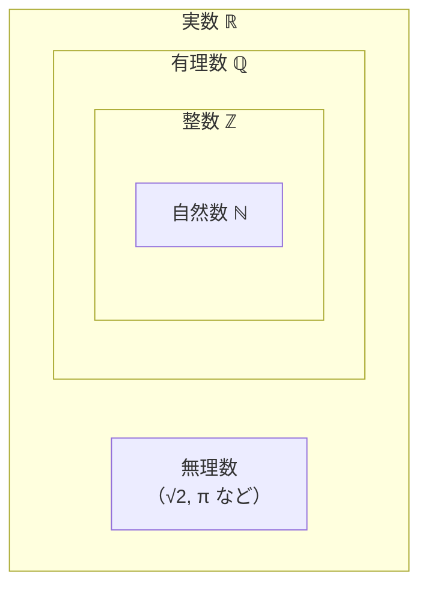

import NumberLine from "../../../../components/NumberLine";

## 前提

本章の前提は、最初の章[前提とする知識](../../../prerequisites/knowledge/)である。代数カテゴリの最初の章であり、先行して学ぶ代数の章は無い。

物理量は数で測る。長さ・時間・質量・電荷は、いずれも基準と比べた倍率を数で表す。数の体系を整理しておくと、後の章で式を扱うときに足場が固まる。本章は、自然数から実数までの数の世界を順に組み立てる。

## 学習目標

本章を読むと、次の記号と概念を使えるようになる。

- 自然数 $\mathbb{N}$・整数 $\mathbb{Z}$・有理数 $\mathbb{Q}$・実数 $\mathbb{R}$ の各記号と定義
- 包含関係 $\mathbb{N} \subset \mathbb{Z} \subset \mathbb{Q} \subset \mathbb{R}$
- 有理数が整数比 $\dfrac{p}{q}$（$q \neq 0$）で表せること
- 有理数が有限小数または循環小数で表せること
- 無理数の存在と、$\sqrt{2}$ が無理数であること
- 実数と数直線の一対一対応
- 大小関係を表す記号 $<$・$\le$・$>$・$\ge$
- 大小関係の基本性質（推移律と順序保存）

## 数の体系の全体像

数の世界は、狭い範囲から広い範囲へ段階的に広がる。各段階で記号を 1 つ割り当てる。記号と、各段階で新しく加わる数を表にまとめる。

| 記号         | 名称   | 含まれる数の例                        | 段階で新しく加わる数       |
| ------------ | ------ | ------------------------------------- | -------------------------- |
| $\mathbb{N}$ | 自然数 | $1,\ 2,\ 3,\ \dots$                   | ものを数える数             |
| $\mathbb{Z}$ | 整数   | $\dots,\ -2,\ -1,\ 0,\ 1,\ 2,\ \dots$ | $0$ と負の数               |
| $\mathbb{Q}$ | 有理数 | $\dfrac{1}{2},\ -\dfrac{3}{4},\ 5$    | 整数の比で表せる分数       |
| $\mathbb{R}$ | 実数   | $\sqrt{2},\ \pi,\ -1.5$               | 分数で表せない数（無理数） |

記号は黒板太字と呼ぶ書体で書く。黒板太字は、文字を二重線で描く書体である。数の集合を表す記号として広く使う。各記号は対応する英単語の頭文字に由来する。

- $\mathbb{N}$ は自然数（natural number）の頭文字に由来する。
- $\mathbb{Z}$ は数を意味するドイツ語 Zahlen の頭文字に由来する。
- $\mathbb{Q}$ は商（quotient）の頭文字に由来する。商とは割り算の結果である。
- $\mathbb{R}$ は実数（real number）の頭文字に由来する。

以降の節で、各段階を順に定義する。

## 自然数

**自然数**とは、ものを数えるときに使う数である。記号 $\mathbb{N}$ で表す。

$$
\mathbb{N} = \{1,\ 2,\ 3,\ 4,\ \dots\}
$$

本章では自然数を $1$ から始める。$0$ を自然数に含める流儀もあるが、本ロードマップでは $1$ からとする。

自然数どうしの和は、再び自然数になる。自然数 $2$ と $3$ の和は $5$ であり、$5$ も自然数である。自然数どうしの積も、再び自然数になる。

一方、自然数どうしの引き算は、自然数の範囲を超える場合がある。$2 - 3$ は自然数では表せない。自然数の範囲では、大きい数から小さい数を引く操作しか閉じない。引き算を自由に行うには、数の範囲を広げる必要がある。

## 整数

引き算を自由に行えるよう、自然数に $0$ と負の数を加える。$0$ と負の数を加えた範囲を**整数**と呼び、記号 $\mathbb{Z}$ で表す。

$$
\mathbb{Z} = \{\dots,\ -3,\ -2,\ -1,\ 0,\ 1,\ 2,\ 3,\ \dots\}
$$

整数は次の 3 種類に分かれる。

- **正の整数**: $1,\ 2,\ 3,\ \dots$。自然数と一致する。
- **$0$**: 正の数にも負の数にも属さない。
- **負の整数**: $-1,\ -2,\ -3,\ \dots$。

自然数はすべて整数である。よって自然数 $\mathbb{N}$ は整数 $\mathbb{Z}$ の一部である。記号では次のように書く。

$$
\mathbb{N} \subset \mathbb{Z}
$$

記号 $\subset$ は部分集合を表す。$\mathbb{N} \subset \mathbb{Z}$ は「$\mathbb{N}$ のすべての要素が $\mathbb{Z}$ の要素でもある」という意味である。部分集合の記号 $\subset$ は、数学の言葉の章[集合と要素](../../set/sets-and-elements/)で導入済みである。

整数の範囲では、足し算・引き算・掛け算が自由に行える。3 つの演算の結果は、必ず整数になる。一方、割り算は整数の範囲を超える場合がある。$1 \div 2$ は整数では表せない。割り算を自由に行うには、数の範囲をさらに広げる必要がある。

## 有理数

### 有理数の定義

割り算を自由に行えるよう、整数の比で表せる数を加える。整数の比で表せる数を**有理数**と呼び、記号 $\mathbb{Q}$ で表す。

整数 $p$ と、$0$ でない整数 $q$ を使い、有理数を分数 $\dfrac{p}{q}$ の形で書く。

$$
\mathbb{Q} = \left\{\, \frac{p}{q} \ \middle|\ p \in \mathbb{Z},\ q \in \mathbb{Z},\ q \neq 0 \,\right\}
$$

縦棒 $\mid$ の左に要素の形を置き、右に条件を書く記法は、内包的記法と呼ぶ。内包的記法は[集合と要素](../../set/sets-and-elements/)で導入済みである。条件 $q \neq 0$ は、分母が $0$ にならないことを表す。$0$ で割る操作は定義しないため、分母から $0$ を除く。

整数はすべて有理数である。整数 $n$ は、分母を $1$ とした分数 $\dfrac{n}{1}$ で表せる。よって整数 $\mathbb{Z}$ は有理数 $\mathbb{Q}$ の一部である。

$$
\mathbb{Z} \subset \mathbb{Q}
$$

有理数の範囲では、足し算・引き算・掛け算に加え、$0$ で割る場合を除いた割り算も自由に行える。4 つの演算が自由に行える点が、有理数の特徴である。

### 有理数の小数表示

有理数は、分子を分母で割ると小数で表せる。割り算の結果は、次の 2 通りのいずれかになる。

- **有限小数**: 割り算が途中で割り切れて終わる小数。
- **循環小数**: 同じ数字の並びが無限に繰り返す小数。

有限小数の例を示す。

$$
\frac{1}{4} = 0.25, \qquad \frac{3}{8} = 0.375
$$

循環小数の例を示す。繰り返す部分の上に点を付けて表す。両端の数字に点を付けると、両端ではさんだ範囲が繰り返す。

$$
\frac{1}{3} = 0.333\dots = 0.\dot{3}, \qquad \frac{1}{7} = 0.142857142857\dots = 0.\dot{1}4285\dot{7}
$$

有理数が必ず有限小数または循環小数になる理由を述べる。分数 $\dfrac{p}{q}$ を筆算で割ると、各段で割った余りが現れる。余りは $0$ 以上 $q$ 未満の整数であり、取りうる値は $0,\ 1,\ \dots,\ q-1$ の $q$ 通りに限られる。

- 余りが $0$ になれば、割り算は終わる。結果は有限小数である。
- 余りが $0$ にならなければ、$q$ 通りしかない余りを使い続ける。割り算を $q$ 回より多く続けると、同じ余りが必ず再び現れる。同じ余りが現れた時点から、同じ計算が繰り返す。結果は循環小数である。

逆に、有限小数と循環小数は、いずれも整数の比 $\dfrac{p}{q}$ に直せる。直し方は次章以降で扱う四則計算の範囲で済む。よって有理数と「有限小数または循環小数」は、同じ数の集まりを指す。

## 無理数と実数

### 有理数では足りないこと

数直線（数を目盛りで表した直線）の上に点を取ると、有理数だけでは埋まらない点が現れる。代表例が $\sqrt{2}$ である。

記号 $\sqrt{2}$ は「ルート $2$」と読み、$2$ 乗すると $2$ になる正の数を表す。すなわち $\sqrt{2} > 0$ かつ $(\sqrt{2})^2 = 2$ である。$\sqrt{2}$ は、1 辺の長さが $1$ の正方形の対角線の長さに当たる。長さは実在するが、$\sqrt{2}$ は有理数では表せない。

### √2 が無理数であること

**無理数**とは、有理数でない実数である。$\sqrt{2}$ が無理数であることを証明する。証明には**背理法**を使う。背理法とは、結論を否定して矛盾を導く証明法である。否定から矛盾が出れば、否定は誤りであり、元の結論が成り立つ。背理法は、数学の言葉の章[証明の方法](../../set/methods-of-proof/)で詳しく扱う。

証明の準備として、約分の言葉を定める。分数 $\dfrac{a}{b}$ について、$a$ と $b$ が $1$ より大きい共通の約数を持たないとき、分数は**既約**であると呼ぶ。既約な分数は、これ以上約分できない。任意の有理数は、既約な分数で表せる。

> 命題: $\sqrt{2}$ は無理数である。

**証明.** 結論を否定し、$\sqrt{2}$ が有理数であると仮定する。矛盾を導く。

$\sqrt{2}$ は正だから、既約な分数で表せる。整数 $a$ と $0$ でない整数 $b$ を使い、次のように書く。

$$
\sqrt{2} = \frac{a}{b} \quad (\text{分数 } \tfrac{a}{b} \text{ は既約})
$$

両辺を 2 乗する。左辺は $(\sqrt{2})^2 = 2$ である。

$$
2 = \frac{a^2}{b^2}
$$

両辺に $b^2$ を掛ける。

$$
a^2 = 2b^2 \tag{1}
$$

式 (1) の右辺 $2b^2$ は $2$ の倍数である。よって左辺 $a^2$ も $2$ の倍数、すなわち偶数である。

ここで「$a^2$ が偶数ならば $a$ も偶数である」を使う。理由を述べる。$a$ が奇数なら、整数 $k$ を使って $a = 2k+1$ と書ける。2 乗すると $a^2 = 4k^2 + 4k + 1 = 2(2k^2 + 2k) + 1$ となり、$a^2$ は奇数である。対偶を取ると、$a^2$ が偶数ならば $a$ は偶数である。

$a$ は偶数だから、整数 $m$ を使って $a = 2m$ と書ける。式 (1) に代入する。

$$
(2m)^2 = 2b^2, \qquad 4m^2 = 2b^2, \qquad b^2 = 2m^2
$$

右辺 $2m^2$ は $2$ の倍数である。よって $b^2$ も偶数であり、$a$ のときと同じ理由で $b$ も偶数である。

ところが $a$ と $b$ がともに偶数なら、両者は共通の約数 $2$ を持つ。分数 $\dfrac{a}{b}$ が既約であるという仮定に反する。矛盾が生じた。

矛盾は、$\sqrt{2}$ が有理数という仮定から生じた。よって仮定は誤りであり、$\sqrt{2}$ は無理数である。$\blacksquare$

無理数は、循環しない無限小数になる。有限小数の形を取らず、循環もしないため、有限の桁や繰り返しでは書き尽くせない。

$$
\sqrt{2} = 1.41421356\dots, \qquad \pi = 3.14159265\dots
$$

ここで $\pi$ は「パイ」と読み、円周率を表す。円周率は、円周の長さを直径で割った値であり、$\pi$ も無理数である。

### 実数

有理数と無理数を合わせた数全体を**実数**と呼び、記号 $\mathbb{R}$ で表す。

$$
\mathbb{R} = (\text{有理数全体}) \cup (\text{無理数全体})
$$

記号 $\cup$ は和集合を表し、[集合と要素](../../set/sets-and-elements/)で導入済みである。有理数はすべて実数だから、次の包含が成り立つ。

$$
\mathbb{Q} \subset \mathbb{R}
$$

実数の厳密な構成は本章の射程外であり、後の解析カテゴリの章で扱う。本章では、実数を「数直線上のすべての点に対応する数」として直感的に捉える。実数の構成を承認し、先へ進む。

### 包含関係のまとめ

自然数から実数までの包含関係を、1 本の鎖にまとめる。

$$
\mathbb{N} \subset \mathbb{Z} \subset \mathbb{Q} \subset \mathbb{R}
$$

包含関係を、入れ子の箱から成る概念図で示す。外側の箱ほど広い数の範囲を表す。

図の箱の入れ子は「含む」関係を表す。外側の箱が内側の箱を含む。最も外側の実数 $\mathbb{R}$ は、有理数 $\mathbb{Q}$ と無理数の両方を含む。有理数 $\mathbb{Q}$ は整数 $\mathbb{Z}$ を含み、整数 $\mathbb{Z}$ は自然数 $\mathbb{N}$ を含む。無理数の箱は有理数 $\mathbb{Q}$ の箱の外にあり、両者は重ならない。

## 実数と数直線

実数は、数直線上のすべての点と一対一に対応する。一対一の対応とは、次の 2 つが同時に成り立つことである。

- 実数を 1 つ決めると、対応する点が数直線上にただ 1 つ定まる。
- 数直線上の点を 1 つ取ると、対応する実数がただ 1 つ定まる。

数直線の約束を述べる。

- 直線上に基準点を 1 つ取り、$0$ を対応させる。基準点を**原点**と呼ぶ。
- 原点の右向きを正の向きとし、一定の長さを $1$ に対応させる。
- 原点から右へ進むと正の実数、左へ進むと負の実数を表す。

数直線の上では、有理数の点も無理数の点も区別なく並ぶ。代表的な実数と、原点からの位置を表にまとめる。位置は原点を $0$、右向きを正として測る。

| 実数       | 種類   | 原点からの位置（右向きを正とする） |
| ---------- | ------ | ---------------------------------- |
| $-1.5$     | 有理数 | 原点から左へ $1.5$                 |
| $0$        | 整数   | 原点                               |
| $1$        | 整数   | 原点から右へ $1$                   |
| $\sqrt{2}$ | 無理数 | 原点から右へ約 $1.41$              |
| $\pi$      | 無理数 | 原点から右へ約 $3.14$              |

表の代表値を数直線上に置くと、次の図になる。原点 $0$ を基準に、右向きを正として目盛りを振る。

<figure>
  <NumberLine
    min={-2}
    max={4}
    ticks={[
      { value: -2 },
      { value: -1 },
      { value: 0 },
      { value: 1 },
      { value: 2 },
      { value: 3 },
      { value: 4 },
    ]}
    points={[
      { value: -1.5, label: "-1.5" },
      { value: 1.41, label: "\\sqrt{2}", highlight: true },
      { value: 3.14, label: "\\pi", highlight: true },
    ]}
    ariaLabel="−2 から 4 までの数直線。整数の目盛りに加え、有理数 −1.5 と、無理数 √2（約 1.41）・π（約 3.14）の点を置く。"
  />
  <figcaption>
    数直線上の点の配置である。有理数 $-1.5$ の点も、無理数 $\sqrt{2}$ や $\pi$
    の点も、区別なく軸上に並ぶ。$\sqrt{2}$ は $1$ と $2$ の間、$\pi$ は $3$ と $4$
    の間に位置する。無理数 2 点は注目のため強調色で示すが、軸上での扱いは有理数の点と変わらない。
  </figcaption>
</figure>

有理数の点だけでは、数直線にすき間が残る。すき間を埋めて直線を切れ目なくつなぐのが、無理数を含めた実数である。実数が数直線を切れ目なく埋める性質を、実数の**連続性**と呼ぶ。連続性の厳密な扱いは後の解析カテゴリの章に譲る。

## 大小関係

### 大小を表す記号

数直線の上では、左にある数ほど小さい。位置の左右が、数の大小に対応する。実数 $a$ と $b$ の大小を、次の記号で表す。

| 記号      | 読み方                | 意味                   |
| --------- | --------------------- | ---------------------- |
| $a < b$   | $a$ は $b$ より小さい | $a$ が $b$ の左にある  |
| $a > b$   | $a$ は $b$ より大きい | $a$ が $b$ の右にある  |
| $a \le b$ | $a$ は $b$ 以下       | $a < b$ または $a = b$ |
| $a \ge b$ | $a$ は $b$ 以上       | $a > b$ または $a = b$ |

記号 $<$ と $>$ は等号を含まない。記号 $\le$ と $\ge$ は等号を含む。$a = b$ の場合まで認めるかどうかが、両者の違いである。

任意の 2 つの実数 $a$ と $b$ について、$a < b$・$a = b$・$a > b$ のうち、ちょうど 1 つだけが成り立つ。3 つのうち 1 つに必ず定まる性質を、大小関係の**三分法**と呼ぶ。

### 大小関係の基本性質

大小関係は、次の基本性質を満たす。後の章で不等式を扱うときの土台になる。実数 $a$・$b$・$c$ を任意に取る。

**推移律.** $a < b$ かつ $b < c$ ならば、$a < c$ が成り立つ。

数直線で読むと、$a$ が $b$ の左にあり、$b$ が $c$ の左にあるなら、$a$ は $c$ の左にある。

**加法での順序保存.** $a < b$ ならば、任意の実数 $c$ について $a + c < b + c$ が成り立つ。

両辺に同じ数 $c$ を足しても、大小は変わらない。数直線では、2 点をそろって $c$ だけ動かす操作に当たる。2 点の左右の位置関係は保たれる。

**正数倍での順序保存.** $a < b$ かつ $c > 0$ ならば、$ac < bc$ が成り立つ。

両辺に同じ正の数 $c$ を掛けても、大小は変わらない。

正数倍では順序が保たれるが、負の数を掛ける場合は注意が要る。$a < b$ かつ $c < 0$ ならば、不等号の向きが逆になり $ac > bc$ となる。例として $2 < 3$ の両辺に $-1$ を掛けると、$-2 > -3$ となる。負の数倍で向きが逆転する性質は、後の章で不等式を扱うときに本格的に使う。本章では性質の確認にとどめる。

## 例題

例題では、所属を表す記号 $\in$ を使う。$x \in A$ は「$x$ は $A$ に属する」と読む。記号 $\in$ は、数学の言葉の章[集合と要素](../../set/sets-and-elements/)で導入済みである。

### 例題 1

次の各数が、自然数 $\mathbb{N}$・整数 $\mathbb{Z}$・有理数 $\mathbb{Q}$・実数 $\mathbb{R}$ のうちどの集合に属するかを答える。

$$
5, \qquad -3, \qquad \frac{2}{7}, \qquad \sqrt{2}
$$

**解法.** 各数を、最も狭い集合から順に判定する。広い集合は狭い集合を含むため、狭い集合に属する数は広い集合にも属する。

- $5$ は自然数である。よって $5 \in \mathbb{N}$、かつ $5 \in \mathbb{Z}$、$5 \in \mathbb{Q}$、$5 \in \mathbb{R}$ である。
- $-3$ は負の整数である。自然数ではない。よって $-3 \in \mathbb{Z}$、かつ $-3 \in \mathbb{Q}$、$-3 \in \mathbb{R}$ である。
- $\dfrac{2}{7}$ は整数比で表せる分数だが整数ではない。よって $\dfrac{2}{7} \in \mathbb{Q}$、かつ $\dfrac{2}{7} \in \mathbb{R}$ である。
- $\sqrt{2}$ は無理数である。有理数ではない。よって $\sqrt{2} \in \mathbb{R}$ のみが成り立つ。

### 例題 2

分数 $\dfrac{5}{8}$ と $\dfrac{2}{3}$ を小数で表し、有限小数か循環小数かを判定する。

**解法.** 分子を分母で割る。

$\dfrac{5}{8}$ を割ると、余りが $0$ になって割り切れる。

$$
\frac{5}{8} = 0.625
$$

割り切れたため、$\dfrac{5}{8}$ は有限小数である。

$\dfrac{2}{3}$ を割ると、余りが $0$ にならず、同じ計算が繰り返す。

$$
\frac{2}{3} = 0.666\dots = 0.\dot{6}
$$

同じ数字が繰り返すため、$\dfrac{2}{3}$ は循環小数である。

### 例題 3

実数 $a$・$b$・$c$ について、$a < b$ かつ $b < c$ が成り立つとする。このとき $a + 2 < c + 2$ が成り立つことを、大小関係の基本性質から導く。

**解法.** 2 つの性質を順に使う。

1. **推移律**を使う。$a < b$ かつ $b < c$ より、$a < c$ が成り立つ。
2. **加法での順序保存**を使う。$a < c$ の両辺に $2$ を足す。

$$
a + 2 < c + 2
$$

よって $a + 2 < c + 2$ が成り立つ。

## 演習問題

問題ごとに解答を畳んである。「解答を表示」を開くと確認できる。

### 問題 1

次の各数が属する集合を、$\mathbb{N}$・$\mathbb{Z}$・$\mathbb{Q}$・$\mathbb{R}$ のうちから、属するものをすべて答えよ。

$$
0, \qquad -\frac{4}{5}, \qquad \pi
$$

解答を表示

各数を最も狭い集合から判定する。

- $0$ は整数だが自然数ではない（本章では自然数を $1$ から始める）。よって $0 \in \mathbb{Z}$、$0 \in \mathbb{Q}$、$0 \in \mathbb{R}$ である。
- $-\dfrac{4}{5}$ は整数比で表せる分数だが整数ではない。よって $-\dfrac{4}{5} \in \mathbb{Q}$、$-\dfrac{4}{5} \in \mathbb{R}$ である。
- $\pi$ は円周率であり、無理数である。よって $\pi \in \mathbb{R}$ のみが成り立つ。

### 問題 2

分数 $\dfrac{7}{20}$ と $\dfrac{1}{6}$ を小数で表し、有限小数か循環小数かを判定せよ。

解答を表示

分子を分母で割る。

$\dfrac{7}{20}$ は割り切れる。

$$
\frac{7}{20} = 0.35
$$

割り切れたため、有限小数である。

$\dfrac{1}{6}$ は割り切れず、$6$ が繰り返す。

$$
\frac{1}{6} = 0.1666\dots = 0.1\dot{6}
$$

同じ数字が繰り返すため、循環小数である。

### 問題 3

$\sqrt{3}$ が無理数であることを、背理法で証明せよ。$\sqrt{3}$ は $2$ 乗すると $3$ になる正の数とする。整数 $a$ について「$a^2$ が $3$ の倍数ならば $a$ も $3$ の倍数である」を、証明の中で使ってよい。

解答を表示

結論を否定し、$\sqrt{3}$ が有理数であると仮定する。矛盾を導く。

$\sqrt{3}$ は正だから、既約な分数で表せる。整数 $a$ と $0$ でない整数 $b$ を使う。

$$
\sqrt{3} = \frac{a}{b} \quad (\text{分数 } \tfrac{a}{b} \text{ は既約})
$$

両辺を 2 乗し、$b^2$ を掛ける。

$$
3 = \frac{a^2}{b^2}, \qquad a^2 = 3b^2
$$

右辺 $3b^2$ は $3$ の倍数だから、$a^2$ も $3$ の倍数である。前提より $a$ も $3$ の倍数である。整数 $m$ を使い $a = 3m$ と書ける。代入する。

$$
(3m)^2 = 3b^2, \qquad 9m^2 = 3b^2, \qquad b^2 = 3m^2
$$

右辺 $3m^2$ は $3$ の倍数だから、$b^2$ も $3$ の倍数であり、$b$ も $3$ の倍数である。

$a$ と $b$ がともに $3$ の倍数なら、共通の約数 $3$ を持つ。分数 $\dfrac{a}{b}$ が既約であるという仮定に反する。矛盾が生じた。

よって仮定は誤りであり、$\sqrt{3}$ は無理数である。$\blacksquare$

### 問題 4

実数 $a$・$b$ について、$a < b$ が成り立つとする。次の 2 つの不等式について、成り立つ向きを答えよ。

1. $a + 5$ と $b + 5$ の大小
2. $-2a$ と $-2b$ の大小

解答を表示

1. 加法での順序保存を使う。$a < b$ の両辺に $5$ を足す。向きは変わらない。

$$
a + 5 < b + 5
$$

2. 負の数 $-2$ を両辺に掛ける。負の数倍では不等号の向きが逆になる。$a < b$ の両辺に $-2$ を掛ける。

$$
-2a > -2b
$$

## まとめ

本章は、物理量を測る土台として、自然数から実数までの数の体系を組み立てた。要点を振り返る。

- 数の範囲は、自然数 $\mathbb{N}$・整数 $\mathbb{Z}$・有理数 $\mathbb{Q}$・実数 $\mathbb{R}$ の順に広がる。包含関係は $\mathbb{N} \subset \mathbb{Z} \subset \mathbb{Q} \subset \mathbb{R}$ である。
- 整数は引き算を、有理数は $0$ で割る場合を除いた割り算を、それぞれ自由にする。
- 有理数は整数比 $\dfrac{p}{q}$（$q \neq 0$）で表せ、有限小数または循環小数になる。
- 無理数は有理数でない実数であり、循環しない無限小数になる。$\sqrt{2}$ は無理数である。
- 実数は数直線上のすべての点と一対一に対応する。有理数のすき間を埋めて直線を切れ目なくつなぐ。
- 大小関係は $<$・$\le$・$>$・$\ge$ で表す。推移律が成り立ち、加法と正数倍は順序を保つ。負の数倍では不等号の向きが逆になる。

数の体系をさらに学びたい読者に向けて、一次資料を脚注で挙げる[^takagi][^rudin]。

次の章[平方根と絶対値](../square-roots-and-absolute-value/)では、平方根の定義と性質、絶対値、分母の有理化を扱う。本章で導入した $\sqrt{2}$ などの平方根を、計算の対象として本格的に扱う。指数の扱いは、章[指数法則](../laws-of-exponents/)で整数指数から組み立てる。

[^takagi]: 高木貞治『解析概論』岩波書店、改訂第 3 版、1961 年。実数の連続性から微分積分までを古典的に展開した、日本語の標準的な教科書である。実数論の基礎を扱う。

[^rudin]: W. Rudin, _Principles of Mathematical Analysis_（3rd ed.）McGraw-Hill、1976 年。実数の構成と解析学の基礎を簡潔にまとめた標準的な教科書である。
