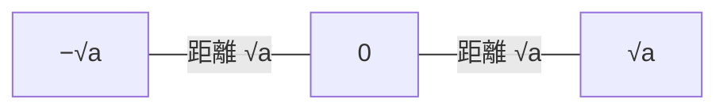
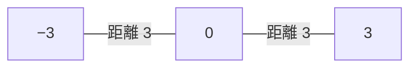

## 前提

本章の前提は、同じ代数カテゴリの章[実数と数の体系](../real-number-system/)である。実数・有理数・無理数・数直線・大小関係の知識を前提とする。

物理学では、長さ・速さ・エネルギーなど、負にならない量の大きさを扱う場面が多い。大きさを正しく定式化するには、平方根と絶対値の正確な理解が欠かせない。本章は実数の上に、平方根と絶対値を自己完結で導入する。

## 学習目標

本章を読むと、次の記号と概念を使えるようになる。

- 平方根の記号 $\sqrt{\ }$ と、平方根の定義
- 平方根の基本性質 $(\sqrt{a})^2 = a$ と恒等式 $\sqrt{a^2} = \lvert a \rvert$
- 平方根の積と商の法則 $\sqrt{a}\sqrt{b} = \sqrt{ab}$、$\dfrac{\sqrt{a}}{\sqrt{b}} = \sqrt{\dfrac{a}{b}}$
- 絶対値の記号 $\lvert\ \rvert$ と、絶対値の定義
- 絶対値の数直線上の意味、すなわち原点からの距離
- 絶対値の積の性質 $\lvert ab \rvert = \lvert a \rvert \lvert b \rvert$
- 三角不等式 $\lvert a + b \rvert \le \lvert a \rvert + \lvert b \rvert$
- 分母の有理化

## 平方根

### 平方根の定義

実数 $a$ に対し、2 乗すると $a$ になる数を、$a$ の**平方根**と呼ぶ。すなわち $x^2 = a$ を満たす $x$ が $a$ の平方根である。

平方根が何個あるかは、$a$ の符号で決まる。理由を順に述べる。

- 実数を 2 乗すると、結果は必ず $0$ 以上になる。$0$ の 2 乗は $0$、$0$ でない実数の 2 乗は正だからである。
- よって $a < 0$ のとき、$x^2 = a$ を満たす実数 $x$ は存在しない。負の数の平方根は実数の範囲には無い。
- $a = 0$ のとき、$x^2 = 0$ を満たす実数は $x = 0$ だけである。$0$ の平方根は $0$ の 1 個である。
- $a > 0$ のとき、$x^2 = a$ を満たす実数は、正の数 1 個と負の数 1 個の、合わせて 2 個ある。2 個は絶対値が等しく符号だけが異なる。

正の数がちょうど 1 個に定まる理由を補う。正の数 $x$ を大きくすると、$x^2$ も大きくなる。すなわち $x^2$ は $x$ について増加する。よって $x^2 = a$ を満たす正の $x$ は、多くても 1 個しかない。さらに $0$ から $x$ を増やすと、$x^2$ は $0$ から限りなく大きくなる。途中でちょうど $a$ になる $x$ が 1 個存在する。負のほうは、正の $x$ の符号を変えた $-x$ が満たす。以上から $a > 0$ の平方根は、正負ちょうど 1 個ずつになる。

$a > 0$ のとき平方根は 2 個ある。2 個のうち正のほうを記号 $\sqrt{a}$ で表し、「ルート $a$」と読む。記号 $\sqrt{\ }$ を**根号**と呼ぶ。負のほうは $-\sqrt{a}$ と表せる。

平方根の正式な定義を、$a \ge 0$ に対してまとめる。

> $a \ge 0$ のとき、$\sqrt{a}$ は次の 2 条件を同時に満たす唯一の実数である。
>
> 1. $(\sqrt{a})^2 = a$
> 2. $\sqrt{a} \ge 0$

記号 $\sqrt{a}$ は、つねに $0$ 以上の数だけを指す。負の数を表すことは無い。例えば $\sqrt{9}$ は $3$ であり、$-3$ ではない。$9$ の平方根は $3$ と $-3$ の 2 個だが、記号 $\sqrt{9}$ が指すのは正のほうの $3$ だけである。

下の数直線は、$\sqrt{a}$ が原点の右側（正の側）にあり、もう一方の平方根 $-\sqrt{a}$ が原点について対称な左側にある関係を表す。

<figcaption>
  $\sqrt{a}$ は原点の右側、$-\sqrt{a}$ は原点について対称な左側にある。両者は原点から等しい距離
  $\sqrt{a}$ にある。
</figcaption>

### 平方根の基本性質

定義の条件 1 から、$a \ge 0$ について次が成り立つ。

$$
(\sqrt{a})^2 = a
$$

具体例として $a = 5$ を考える。$\sqrt{5}$ は「2 乗すると $5$ になる正の数」だから、$(\sqrt{5})^2 = 5$ である。

平方根と絶対値の関係を述べる前に、まず絶対値を定義する。次節で絶対値を導入し、続く節で平方根と絶対値を結ぶ恒等式 $\sqrt{a^2} = \lvert a \rvert$ を導く。

## 絶対値

### 絶対値の定義

実数 $a$ に対し、$a$ の符号を取り去って得る $0$ 以上の数を、$a$ の**絶対値**と呼び、$\lvert a \rvert$ と書く。$\lvert a \rvert$ は「$a$ の絶対値」と読む。絶対値の定義を、符号で場合分けして与える。

$$
\lvert a \rvert =
\begin{cases}
a & (a \ge 0) \\
-a & (a < 0)
\end{cases}
$$

左側の大きな波括弧は、条件ごとに値を場合分けする書き方である。各行の右側に条件を書き、当てはまる行の値を取る。すなわち $a \ge 0$ なら上の行の $a$、$a < 0$ なら下の行の $-a$ が絶対値の値となる。

定義のうち、$a < 0$ の場合に $-a$ とする点に注意する。$a$ が負のとき $-a$ は正になる。例えば $a = -3$ なら $-a = -(-3) = 3$ である。よって $\lvert -3 \rvert = 3$ となる。

具体例を表にまとめる。

| $a$  | 場合分け  | $\lvert a \rvert$ |
| ---- | --------- | ----------------- |
| $5$  | $a \ge 0$ | $5$               |
| $0$  | $a \ge 0$ | $0$               |
| $-2$ | $a < 0$   | $2$               |
| $-7$ | $a < 0$   | $7$               |

### 数直線上の意味

絶対値 $\lvert a \rvert$ は、数直線上で点 $a$ と原点 $0$ との**距離**を表す。距離は向きを問わない量だから、つねに $0$ 以上になる。

下の数直線は、$a = 3$ と $a = -3$ が、ともに原点から距離 $3$ の位置にある関係を表す。$\lvert 3 \rvert = 3$ と $\lvert -3 \rvert = 3$ は、原点からの距離が等しいことに対応する。

<figcaption>
  $\lvert 3 \rvert = \lvert -3 \rvert = 3$ は、点 $3$ と点 $-3$ がともに原点から距離 $3$
  にあることを表す。
</figcaption>

絶対値を距離として捉えると、後の章で扱う絶対値を含む方程式や不等式を、数直線上の距離の問題として読み替えられる。

### 絶対値の基本性質

定義から、絶対値について次の性質が導ける。$a$ を任意の実数とする。

- **非負性**: $\lvert a \rvert \ge 0$ が成り立つ。等号は $a = 0$ のときに限る。
- **符号の対称性**: $\lvert -a \rvert = \lvert a \rvert$ が成り立つ。点 $a$ と点 $-a$ は原点について対称だからである。
- **2 乗との関係**: $\lvert a \rvert^2 = a^2$ が成り立つ。$a \ge 0$ なら $\lvert a \rvert = a$ より $\lvert a \rvert^2 = a^2$ となる。$a < 0$ なら $\lvert a \rvert = -a$ より $\lvert a \rvert^2 = (-a)^2 = a^2$ となる。

## 平方根と絶対値を結ぶ恒等式

**恒等式**とは、文字にどの値を入れても両辺がつねに等しくなる等式である。平方根と絶対値は、次の恒等式で結ばれる。任意の実数 $a$ について成り立つ。

$$
\sqrt{a^2} = \lvert a \rvert
$$

恒等式を、平方根の定義に従って導く。$\sqrt{a^2}$ は「2 乗すると $a^2$ になる $0$ 以上の数」である。よって $\sqrt{a^2}$ を確定するには、$0$ 以上で 2 乗が $a^2$ に等しい数を探せばよい。

候補は $\lvert a \rvert$ である。次の 2 条件を確かめる。

1. **非負である**: 絶対値の非負性より $\lvert a \rvert \ge 0$ が成り立つ。
2. **2 乗が $a^2$ に等しい**: 前節の 2 乗との関係より $\lvert a \rvert^2 = a^2$ が成り立つ。

$\lvert a \rvert$ は 2 条件をともに満たす。平方根は条件を満たす数がただ 1 つに定まるから、$\sqrt{a^2} = \lvert a \rvert$ が成り立つ。

恒等式で注意すべき点は、右辺が $a$ ではなく $\lvert a \rvert$ になることである。符号で場合分けして書くと、関係がはっきりする。

$$
\sqrt{a^2} =
\begin{cases}
a & (a \ge 0) \\
-a & (a < 0)
\end{cases}
$$

具体例で確認する。

- $a = 4$ のとき、$\sqrt{4^2} = \sqrt{16} = 4 = \lvert 4 \rvert$ となる。
- $a = -4$ のとき、$\sqrt{(-4)^2} = \sqrt{16} = 4 = \lvert -4 \rvert$ となる。$\sqrt{(-4)^2}$ は $-4$ ではない点に注意する。

よく見る誤りは $\sqrt{a^2} = a$ と書くことである。$a < 0$ のとき左辺は正、右辺は負となり、両辺が食い違う。正しくは $\sqrt{a^2} = \lvert a \rvert$ である。

## 平方根の積と商

### 積と商の法則

$0$ 以上の数の平方根について、積と商を根号 1 つにまとめられる。$a \ge 0$、$b \ge 0$ とする。商では $b > 0$ とする。

$$
\sqrt{a}\,\sqrt{b} = \sqrt{ab}, \qquad \frac{\sqrt{a}}{\sqrt{b}} = \sqrt{\frac{a}{b}}
$$

積の法則を、平方根の定義から導く。$\sqrt{a}\,\sqrt{b}$ が $\sqrt{ab}$ に等しいことを示すには、$\sqrt{a}\,\sqrt{b}$ が「$0$ 以上で 2 乗が $ab$ になる数」だと確かめればよい。

1. **非負である**: $\sqrt{a} \ge 0$ かつ $\sqrt{b} \ge 0$ より、積 $\sqrt{a}\,\sqrt{b} \ge 0$ が成り立つ。
2. **2 乗が $ab$ に等しい**: $(\sqrt{a}\,\sqrt{b})^2 = (\sqrt{a})^2 (\sqrt{b})^2 = a \cdot b = ab$ が成り立つ。

$\sqrt{a}\,\sqrt{b}$ は 2 条件をともに満たす。平方根の一意性より $\sqrt{a}\,\sqrt{b} = \sqrt{ab}$ が成り立つ。商の法則も同じ筋道で導ける。

積と商の法則は、$a$ と $b$ がともに $0$ 以上のときに限り使える。負の数では成り立たない。例えば $a = -1$、$b = -1$ とすると、$\sqrt{(-1)(-1)} = \sqrt{1} = 1$ となる。負の数の平方根は実数の範囲に無いから、$\sqrt{-1}\,\sqrt{-1}$ は実数として書けない。法則を負の数へ無条件に広げてはいけない。

### 根号の中の簡約

積の法則を使うと、根号の中の数を簡単にできる。$2$ 乗の因数を根号の外へ出せる。例として $\sqrt{12}$ を簡約する。

$$
\sqrt{12} = \sqrt{4 \cdot 3} = \sqrt{4}\,\sqrt{3} = 2\sqrt{3}
$$

途中で $\sqrt{4} = \sqrt{2^2} = \lvert 2 \rvert = 2$ を使った。$2$ は正だから絶対値は $2$ である。

## 絶対値と平方根の積・商

絶対値も、積と商を分けて書ける。$a$、$b$ を任意の実数とする。商では $b \neq 0$ とする。記号 $\neq$ は「等しくない」と読む。$b \neq 0$ は「$b$ は $0$ でない」を表し、$0$ で割る計算を除く条件である。

$$
\lvert ab \rvert = \lvert a \rvert \lvert b \rvert, \qquad \left\lvert \frac{a}{b} \right\rvert = \frac{\lvert a \rvert}{\lvert b \rvert}
$$

積の性質を、恒等式 $\sqrt{a^2} = \lvert a \rvert$ から導く。任意の実数 $t$ について $\lvert t \rvert = \sqrt{t^2}$ が成り立つ点を使う。

$$
\lvert ab \rvert = \sqrt{(ab)^2} = \sqrt{a^2 b^2} = \sqrt{a^2}\,\sqrt{b^2} = \lvert a \rvert \lvert b \rvert
$$

途中で平方根の積の法則 $\sqrt{a^2 b^2} = \sqrt{a^2}\,\sqrt{b^2}$ を使った。$a^2 \ge 0$ かつ $b^2 \ge 0$ だから、法則を適用できる。商の性質も同じ筋道で導ける。

### 三角不等式

絶対値の重要な性質に、**三角不等式**がある。任意の実数 $a$、$b$ について次が成り立つ。

$$
\lvert a + b \rvert \le \lvert a \rvert + \lvert b \rvert
$$

名称は、平面上の三角形で「2 辺の長さの和は残り 1 辺の長さ以上になる」関係に由来する。後の章で扱うベクトルの大きさでも、同じ形の不等式が現れる。

不等式が成り立つ理由を、符号の場合分けで確かめる。

- $a$ と $b$ が同じ符号、または一方が $0$ のとき、$a + b$ の絶対値は $\lvert a \rvert$ と $\lvert b \rvert$ の和にちょうど等しい。等号が成り立つ。
- $a$ と $b$ が異なる符号のとき、$a + b$ では正と負が打ち消し合う。打ち消しのぶん $\lvert a + b \rvert$ は小さくなり、$\lvert a \rvert + \lvert b \rvert$ より小さくなる。不等号が成り立つ。

具体例で確かめる。

| $a$  | $b$  | $\lvert a + b \rvert$ | $\lvert a \rvert + \lvert b \rvert$ | 関係 |
| ---- | ---- | --------------------- | ----------------------------------- | ---- |
| $3$  | $2$  | $5$                   | $5$                                 | $=$  |
| $3$  | $-2$ | $1$                   | $5$                                 | $<$  |
| $-3$ | $-2$ | $5$                   | $5$                                 | $=$  |

表のとおり、つねに $\lvert a + b \rvert \le \lvert a \rvert + \lvert b \rvert$ が成り立つ。等号は $a$ と $b$ が同じ符号、または一方が $0$ のときに成り立つ。

## 分母の有理化

### 有理化とは

分母に根号を含む分数を、分母に根号を含まない形へ変形する操作を**有理化**と呼ぶ。値は変えず、分母から根号を取り除く。有理化すると、分数の値の見積もりや、複数の分数の比較がしやすくなる。

### 分母が単項の場合

分母が $\sqrt{a}$ ひとつのときは、分子と分母に同じ $\sqrt{a}$ を掛ける。$a > 0$ とする。

$$
\frac{1}{\sqrt{a}} = \frac{1 \cdot \sqrt{a}}{\sqrt{a} \cdot \sqrt{a}} = \frac{\sqrt{a}}{a}
$$

分母は $\sqrt{a}\,\sqrt{a} = (\sqrt{a})^2 = a$ となり、根号が消える。分子と分母に同じ数を掛けているから、分数の値は変わらない。

具体例として $\dfrac{1}{\sqrt{2}}$ を有理化する。

$$
\frac{1}{\sqrt{2}} = \frac{\sqrt{2}}{(\sqrt{2})^2} = \frac{\sqrt{2}}{2}
$$

### 分母が 2 項の場合

分母が $\sqrt{a} + \sqrt{b}$ のように 2 項のときは、**共役**を使う。$\sqrt{a} + \sqrt{b}$ の共役とは、中央の符号を反転した $\sqrt{a} - \sqrt{b}$ である。分子と分母に共役を掛ける。

共役を使う根拠は、$(x + y)(x - y) = x^2 - y^2$ という等式である。等式は、分配法則を 2 回使って次のように確かめられる。分配法則とは、$p(q + r) = pq + pr$ のように、括弧の外の数を各項へ配る計算規則である。

$$
(x + y)(x - y) = x(x - y) + y(x - y) = x^2 - xy + xy - y^2 = x^2 - y^2
$$

途中の $-xy$ と $+xy$ が打ち消し合い、結果は $x^2 - y^2$ になる。等式で $x = \sqrt{a}$、$y = \sqrt{b}$ とすると、根号を含む 2 項の積から根号が消える。

$$
(\sqrt{a} + \sqrt{b})(\sqrt{a} - \sqrt{b}) = (\sqrt{a})^2 - (\sqrt{b})^2 = a - b
$$

$a \ge 0$、$b \ge 0$、$a \neq b$ とする。$a \neq b$ は分母 $a - b$ が $0$ にならない条件である。$\dfrac{1}{\sqrt{a} + \sqrt{b}}$ を有理化する。

$$
\frac{1}{\sqrt{a} + \sqrt{b}}
= \frac{\sqrt{a} - \sqrt{b}}{(\sqrt{a} + \sqrt{b})(\sqrt{a} - \sqrt{b})}
= \frac{\sqrt{a} - \sqrt{b}}{a - b}
$$

分母 $a - b$ には根号が含まれない。有理化が完了する。

具体例として $\dfrac{1}{\sqrt{5} + \sqrt{3}}$ を有理化する。共役 $\sqrt{5} - \sqrt{3}$ を分子と分母に掛ける。

$$
\frac{1}{\sqrt{5} + \sqrt{3}}
= \frac{\sqrt{5} - \sqrt{3}}{(\sqrt{5})^2 - (\sqrt{3})^2}
= \frac{\sqrt{5} - \sqrt{3}}{5 - 3}
= \frac{\sqrt{5} - \sqrt{3}}{2}
$$

## 例題

### 例題 1

次の値を、根号を使わない形へ簡単にせよ。

$$
\sqrt{(-6)^2}
$$

**解法.** 恒等式 $\sqrt{a^2} = \lvert a \rvert$ を $a = -6$ に適用する。

$$
\sqrt{(-6)^2} = \lvert -6 \rvert = 6
$$

途中を $-6$ と答えてはいけない。$\sqrt{\ }$ はつねに $0$ 以上の値を指すからである。

### 例題 2

$\sqrt{50}$ を、根号の中をできるだけ小さい整数にする形へ簡約せよ。

**解法.** $50$ を $2$ 乗の因数と残りに分ける。$50 = 25 \cdot 2 = 5^2 \cdot 2$ である。積の法則を使う。

$$
\sqrt{50} = \sqrt{5^2 \cdot 2} = \sqrt{5^2}\,\sqrt{2} = 5\sqrt{2}
$$

$\sqrt{5^2} = \lvert 5 \rvert = 5$ を使った。

### 例題 3

$\dfrac{3}{\sqrt{7} - \sqrt{2}}$ を有理化せよ。

**解法.** 分母 $\sqrt{7} - \sqrt{2}$ の共役は $\sqrt{7} + \sqrt{2}$ である。分子と分母に共役を掛ける。

$$
\frac{3}{\sqrt{7} - \sqrt{2}}
= \frac{3(\sqrt{7} + \sqrt{2})}{(\sqrt{7} - \sqrt{2})(\sqrt{7} + \sqrt{2})}
$$

分母を和と差の積の公式で計算する。

$$
(\sqrt{7} - \sqrt{2})(\sqrt{7} + \sqrt{2}) = (\sqrt{7})^2 - (\sqrt{2})^2 = 7 - 2 = 5
$$

よって次の形になる。

$$
\frac{3}{\sqrt{7} - \sqrt{2}} = \frac{3(\sqrt{7} + \sqrt{2})}{5}
$$

## 演習問題

問題ごとに解答を畳んである。「解答を表示」を開くと確認できる。

### 問題 1

次の値を、根号を使わない形へ簡単にせよ。

$$
\sqrt{(-9)^2}, \qquad \sqrt{(2 - 5)^2}
$$

解答を表示

恒等式 $\sqrt{a^2} = \lvert a \rvert$ を使う。

1 つ目は $a = -9$ である。

$$
\sqrt{(-9)^2} = \lvert -9 \rvert = 9
$$

2 つ目は中身を先に計算する。$2 - 5 = -3$ である。

$$
\sqrt{(2 - 5)^2} = \sqrt{(-3)^2} = \lvert -3 \rvert = 3
$$

### 問題 2

$\sqrt{18}$ と $\sqrt{75}$ を、それぞれ根号の中をできるだけ小さい整数にする形へ簡約せよ。

解答を表示

$2$ 乗の因数を根号の外へ出す。

$\sqrt{18}$ は $18 = 9 \cdot 2 = 3^2 \cdot 2$ と分ける。

$$
\sqrt{18} = \sqrt{3^2 \cdot 2} = 3\sqrt{2}
$$

$\sqrt{75}$ は $75 = 25 \cdot 3 = 5^2 \cdot 3$ と分ける。

$$
\sqrt{75} = \sqrt{5^2 \cdot 3} = 5\sqrt{3}
$$

### 問題 3

$\dfrac{1}{\sqrt{3}}$ と $\dfrac{4}{\sqrt{8}}$ を有理化せよ。

解答を表示

$\dfrac{1}{\sqrt{3}}$ は分子と分母に $\sqrt{3}$ を掛ける。

$$
\frac{1}{\sqrt{3}} = \frac{\sqrt{3}}{(\sqrt{3})^2} = \frac{\sqrt{3}}{3}
$$

$\dfrac{4}{\sqrt{8}}$ は、まず分母を簡約する。$\sqrt{8} = \sqrt{2^2 \cdot 2} = 2\sqrt{2}$ である。

$$
\frac{4}{\sqrt{8}} = \frac{4}{2\sqrt{2}} = \frac{2}{\sqrt{2}}
$$

分子と分母に $\sqrt{2}$ を掛ける。

$$
\frac{2}{\sqrt{2}} = \frac{2\sqrt{2}}{(\sqrt{2})^2} = \frac{2\sqrt{2}}{2} = \sqrt{2}
$$

### 問題 4

$\dfrac{1}{\sqrt{6} + \sqrt{5}}$ を有理化せよ。

解答を表示

分母 $\sqrt{6} + \sqrt{5}$ の共役 $\sqrt{6} - \sqrt{5}$ を、分子と分母に掛ける。

$$
\frac{1}{\sqrt{6} + \sqrt{5}}
= \frac{\sqrt{6} - \sqrt{5}}{(\sqrt{6} + \sqrt{5})(\sqrt{6} - \sqrt{5})}
$$

分母を和と差の積の公式で計算する。

$$
(\sqrt{6} + \sqrt{5})(\sqrt{6} - \sqrt{5}) = (\sqrt{6})^2 - (\sqrt{5})^2 = 6 - 5 = 1
$$

よって有理化の結果は次のとおりである。

$$
\frac{1}{\sqrt{6} + \sqrt{5}} = \sqrt{6} - \sqrt{5}
$$

### 問題 5

$a = -4$、$b = 1$ のとき、三角不等式 $\lvert a + b \rvert \le \lvert a \rvert + \lvert b \rvert$ の両辺の値を求め、不等式が成り立つことを確かめよ。

解答を表示

左辺を計算する。$a + b = -4 + 1 = -3$ である。

$$
\lvert a + b \rvert = \lvert -3 \rvert = 3
$$

右辺を計算する。

$$
\lvert a \rvert + \lvert b \rvert = \lvert -4 \rvert + \lvert 1 \rvert = 4 + 1 = 5
$$

$3 \le 5$ より、不等式が成り立つ。$a$ と $b$ は符号が異なり、正と負が打ち消し合うため、左辺が右辺より小さくなる。

## まとめ

本章は、実数の上に平方根と絶対値を導入した。要点を振り返る。

- $a \ge 0$ のとき、$\sqrt{a}$ は「2 乗すると $a$ になる $0$ 以上の数」としてただ 1 つに定まる。$\sqrt{a} \ge 0$ である。
- 絶対値 $\lvert a \rvert$ は、$a$ の符号を取り去った $0$ 以上の数であり、数直線上では原点からの距離を表す。
- 平方根と絶対値は恒等式 $\sqrt{a^2} = \lvert a \rvert$ で結ばれる。$\sqrt{a^2} = a$ は誤りである。
- $a \ge 0$、$b \ge 0$ のとき、平方根の積と商は $\sqrt{a}\,\sqrt{b} = \sqrt{ab}$、$\dfrac{\sqrt{a}}{\sqrt{b}} = \sqrt{\dfrac{a}{b}}$ とまとめられる。
- 絶対値は積の性質 $\lvert ab \rvert = \lvert a \rvert \lvert b \rvert$ を満たす。
- 絶対値は三角不等式 $\lvert a + b \rvert \le \lvert a \rvert + \lvert b \rvert$ を満たす。
- 分母の根号は、単項なら同じ根号を、2 項なら共役を掛けて取り除ける。

次の章[指数法則](../laws-of-exponents/)では、$a^m a^n = a^{m+n}$ や $(a^m)^n = a^{mn}$ などの指数法則を扱う。指数法則を平方根へ広げると、$\sqrt{a}$ を $a^{1/2}$ と書く累乗根の見方へつながる。累乗根と有理数指数は、指数法則の後の章で扱う。

平方根と絶対値をさらに学びたい読者に向けて、一次資料を脚注で挙げる[^takagi][^courant]。

[^takagi]: 高木貞治『新式算術講義』筑摩書房、2008 年（原著 1904 年）。実数と数の演算を基礎から論じた、日本語の古典的な数学書である。

[^courant]: R. Courant and H. Robbins, _What Is Mathematics?_, Oxford University Press, 1996. 平方根・無理数・絶対値を含む数の概念を、直観と論理の両面から解説した古典的な入門書である。
