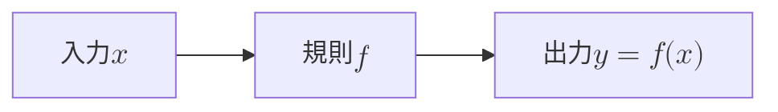
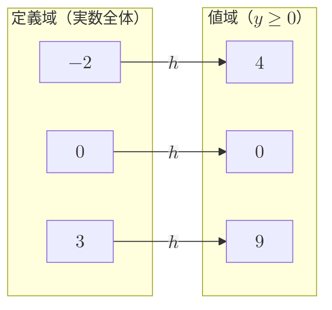

import FunctionGraph from "../../../../components/FunctionGraph";

## 前提

本章の前提は、次の 2 つである。

- [実数と数の体系](../../algebra/real-number-system/)：実数 $\mathbb{R}$ の記号、数直線、大小関係を使う。
- [前提とする知識](../../../prerequisites/knowledge/)：座標平面と点の座標 $(x, y)$ の扱いを使う。

初等関数カテゴリの最初の章である。先行して学ぶ初等関数の章は無い。

物理学は、量どうしの対応を数式で表す。落下する物体の位置は、時刻が決まれば 1 つに定まる。ばねを引く力は、伸びが決まれば 1 つに定まる。1 つの量が決まると別の量が 1 つに定まる対応を、数学では**関数**と呼ぶ。本章は、関数とそのグラフを前提の章だけから自己完結で導入する。

## 学習目標

本章を読むと、次の概念と記号を使えるようになる。

- 関数の定義：1 つの入力に 1 つの出力を対応させる規則
- 関数の記号 $f(x)$ と、入力・出力・対応の読み方
- **定義域**（入力として許す値の範囲）と**値域**（出力として現れる値の範囲）
- 座標平面と、グラフ $y = f(x)$ の意味
- グラフの平行移動：$y = f(x - p) + q$ が、$x$ 方向と $y$ 方向にそれぞれ $p$・$q$ だけ平行移動したグラフになること
- 平行移動が点の移動から従う理由

## 関数とは何か

### 対応の規則としての関数

**関数**とは、1 つの入力に対して 1 つの出力をただ 1 つ定める規則である。入力に使う値を**変数**と呼び、ふつう $x$ で表す。出力に使う値を $y$ で表す。

関数の核心は、次の 2 点にある。

- 入力 $x$ を 1 つ決めると、出力 $y$ がただ 1 つ定まる。
- 同じ入力に対して、出力が 2 つ以上現れることは無い。

具体例を挙げる。「実数 $x$ に対し、$2$ 倍して $1$ を足す」という規則を考える。入力 $3$ に対して出力は $2 \times 3 + 1 = 7$ である。入力を 1 つ決めれば出力が 1 つ定まるため、規則は関数である。

一方、「正の実数 $x$ に対し、$2$ 乗すると $x$ になる数」という規則は関数ではない。入力 $4$ に対して $2$ と $-2$ の 2 つが当てはまり、出力が 1 つに定まらないからである。

入力から出力への対応を、概念図で表す。

図は、入力 $x$ が規則 $f$ を通って出力 $y$ に変わる流れを表す。規則 $f$ は、入力を出力へ変える「箱」と捉えてよい。

### 関数の記号 f(x)

関数を表す規則に名前を付ける。名前にはふつう $f$ を使う。規則 $f$ が入力 $x$ に対して定める出力を、記号 $f(x)$ で表す。$f(x)$ は「エフ・エックス」と読む。

例として、「$2$ 倍して $1$ を足す」規則を $f$ と名付けると、次のように書く。

$$
f(x) = 2x + 1
$$

記号 $f(x)$ は、$f$ と $x$ の掛け算ではない。$f$ という規則に入力 $x$ を与えた結果を表す 1 つのまとまりである。入力に具体的な値を代入すると、出力が計算できる。

$$
f(3) = 2 \times 3 + 1 = 7, \qquad f(0) = 2 \times 0 + 1 = 1, \qquad f(-2) = 2 \times (-2) + 1 = -3
$$

出力 $y$ が入力 $x$ で定まることを、$y = f(x)$ と書く。$y$ は $x$ に応じて変わるため、$y$ を**従属変数**、$x$ を**独立変数**と呼ぶ。独立変数は自由に選べ、従属変数は独立変数に従って定まる。

規則の名前は $f$ に限らない。同じ場面で複数の関数を扱うときは、$g$・$h$ などを使って区別する。

## 定義域と値域

### 定義域

関数の入力に使ってよい値の範囲を、あらかじめ決める必要がある。入力として許す値全体の集合を、関数の**定義域**と呼ぶ。

例として $f(x) = 2x + 1$ を考える。任意の実数を入力してよいため、定義域は実数全体 $\mathbb{R}$ である。

入力できない値があると、定義域は実数全体より狭くなる。例として $g(x) = \dfrac{1}{x}$ を考える。$0$ で割る操作は定義しないため、$x = 0$ は入力できない。定義域は「$0$ を除く実数全体」である。

> 定義域の決め方には、次の 2 通りがある。
>
> - 規則 $f(x)$ の計算が成り立つ最大の範囲を、定義域として採る。
> - 問題の都合で、入力する範囲をあらかじめ限定する。

物理では、後者の限定がよく起きる。例として、時刻 $t$ から物体の位置を定める関数を考える。観測を始めた時刻より前を扱わないなら、定義域を $t \ge 0$ に限定する。

### 値域

定義域のすべての入力に対して出力 $f(x)$ を集めると、出力の値全体の集合ができる。出力として現れる値全体の集合を、関数の**値域**と呼ぶ。

例として $f(x) = 2x + 1$ を考える。定義域は実数全体 $\mathbb{R}$ である。入力 $x$ が実数全体を動くと、出力 $2x + 1$ も実数全体を動く。よって値域は実数全体 $\mathbb{R}$ である。

別の例として $h(x) = x^2$ を考える。定義域は実数全体 $\mathbb{R}$ である。$2$ 乗した値は負にならないため、出力は $0$ 以上の実数に限られる。よって値域は「$0$ 以上の実数全体」、すなわち $y \ge 0$ である。

定義域と値域の対応を、入力の集合から出力の集合への対応として図で表す。$h(x) = x^2$ の例で示す。

図は、定義域の各入力が、規則 $h$ を通って値域の出力へ移る様子を表す。入力 $-2$ と入力 $2$ はともに出力 $4$ へ移るが、関数の定義には反しない。「1 つの入力に出力が 1 つ」が条件であり、「異なる入力が同じ出力をもつ」ことは許すからである。

## 座標平面とグラフ

### 座標平面

関数のふるまいは、目で見ると把握しやすい。見える形にする道具が**座標平面**である。座標平面は、前提とする知識で扱った平面上の点の位置を、2 本の数直線で表す仕組みである。

座標平面の約束を述べる。

- 横向きの数直線を $x$ 軸、縦向きの数直線を $y$ 軸と呼ぶ。
- 2 本の軸が交わる点を**原点**と呼び、$x$ 座標・$y$ 座標をともに $0$ とする。
- 平面上の点を、$x$ 座標と $y$ 座標の組 $(x, y)$ で表す。

点 $(x, y)$ は、原点から $x$ 軸方向に $x$、$y$ 軸方向に $y$ だけ進んだ位置を指す。$x$ や $y$ が負なら、軸の負の向きへ進む。代表的な 2 点を座標平面に置くと、次の図になる。

<figure>
  <FunctionGraph
    xMin={-3}
    xMax={4}
    yMin={-3}
    yMax={4}
    points={[
      { x: 3, y: 2, label: "(3,2)" },
      { x: -2, y: -1, label: "(-2,-1)", highlight: true },
    ]}
    ariaLabel="座標平面。横向きの x 軸と縦向きの y 軸が原点で交わる。点 (3,2) が右上、点 (−2,−1) が左下にある。"
  />
  <figcaption>
    座標平面と 2 点の位置である。点 $(3, 2)$ は、$x$ 座標 $3$・$y$ 座標 $2$ をもち、原点の右上に
    ある。点 $(-2, -1)$ は、座標がともに負であり、原点から左下へ進んだ位置にある。
  </figcaption>
</figure>

### グラフ y=f(x) の意味

関数 $f$ のグラフを定める。

**グラフ**とは、$y = f(x)$ を満たす点 $(x, y)$ をすべて集めた、座標平面上の図形である。

定義を細かく読む。入力 $x$ を 1 つ決めると、出力 $f(x)$ が 1 つ定まる。$x$ を横座標、$f(x)$ を縦座標とした点 $(x, f(x))$ を平面に打つ。定義域の $x$ をすべて動かして点を打つと、点の集まりが 1 本の曲線や直線を描く。描かれた図形がグラフである。

例として $f(x) = 2x + 1$ のグラフを考える。いくつかの入力に対する点を表にまとめる。

| 入力 $x$ | 出力 $f(x) = 2x + 1$ | 点 $(x, f(x))$ |
| -------- | -------------------- | -------------- |
| $-1$     | $-1$                 | $(-1, -1)$     |
| $0$      | $1$                  | $(0, 1)$       |
| $1$      | $3$                  | $(1, 3)$       |
| $2$      | $5$                  | $(2, 5)$       |

表の点を座標平面に打ち、定義域の他の $x$ も連続的に動かすと、点の集まりは 1 本の直線になる。

<figure>
  <FunctionGraph
    xMin={-3}
    xMax={3}
    yMin={-3}
    yMax={5}
    curves={[{ fn: (x) => 2 * x + 1, label: "y=f(x)=2x+1" }]}
    points={[
      { x: -1, y: -1, label: "(-1,-1)" },
      { x: 0, y: 1, label: "(0,1)" },
      { x: 1, y: 3, label: "(1,3)" },
    ]}
    ariaLabel="関数 y=2x+1 のグラフ。右上がりの直線で、点 (−1,−1)・(0,1)・(1,3) を通る。"
  />
  <figcaption>
    関数 $f(x) = 2x + 1$ のグラフである。表で求めた点 $(-1, -1)$・$(0, 1)$・$(1, 3)$ が、いずれも 1
    本の直線の上に並ぶ。直線は、定義域のすべての入力に対する点 $(x, f(x))$ を集めた図形である。
  </figcaption>
</figure>

グラフは、関数の性質を目で読み取る助けになる。

- グラフの横位置 $x$ は入力を、縦位置 $y$ は出力を表す。
- ある入力 $x = a$ での出力 $f(a)$ は、グラフ上で $x = a$ の点の高さに当たる。
- 定義域はグラフが横へ広がる範囲、値域はグラフが縦へ広がる範囲に当たる。

### 関数のグラフが満たす条件

すべての曲線がグラフになるとは限らない。関数の定義「1 つの入力に出力が 1 つ」を、グラフは次の形で反映する。

> 定義域内の縦線 $x = a$ は、関数のグラフとちょうど 1 点で交わる。

理由を述べる。入力 $x = a$ に対して出力 $f(a)$ は 1 つだから、グラフ上で $x = a$ の点は $(a, f(a))$ ただ 1 つである。縦線が 2 点以上で交わる図形は、1 つの入力に出力が 2 つ以上あることを意味し、関数のグラフではない。縦線との交わりで関数かどうかを見分ける方法を、縦線判定と呼ぶ。

## グラフの平行移動

### 平行移動とは

座標平面上の図形を、形と向きを保ったまま、ずらして動かす操作を**平行移動**と呼ぶ。平行移動では、図形の回転と拡大をしない。すべての点を同じ向きに同じ距離だけずらす。

関数のグラフを平行移動すると、別の関数のグラフになる。元の関数 $y = f(x)$ のグラフを、$x$ 方向と $y$ 方向にそれぞれ $p$・$q$ だけ平行移動した結果が、どの関数のグラフになるかを調べる。本節の目標は、次の関係を導くことである。

> $y = f(x)$ のグラフを、$x$ 方向に $p$・$y$ 方向に $q$ だけ平行移動すると、$y = f(x - p) + q$ のグラフになる。

### なぜ x - p と +q になるのか

平行移動の式を、点の移動から導く。$x$ 軸の正の向きを右、$y$ 軸の正の向きを上とする。

まず、点 1 つの移動を考える。元のグラフ上の点を $(s, t)$ とする。点 $(s, t)$ は $t = f(s)$ を満たす。点を $x$ 方向と $y$ 方向にそれぞれ $p$・$q$ だけ平行移動すると、移動後の点 $(X, Y)$ の座標は次のとおりである。

$$
X = s + p, \qquad Y = t + q
$$

移動後の点 $(X, Y)$ が満たす関係を求める。$s$ と $t$ を、移動後の座標 $X$・$Y$ で表す。上の 2 式を $s$・$t$ について解く。

$$
s = X - p, \qquad t = Y - q
$$

元の点が満たす関係 $t = f(s)$ に代入する。

$$
Y - q = f(X - p)
$$

$q$ を右辺へ移す。

$$
Y = f(X - p) + q
$$

移動後の点 $(X, Y)$ は、関係 $Y = f(X - p) + q$ を満たす。$X$・$Y$ を改めて $x$・$y$ と書き直すと、移動後のグラフは次の関数のグラフである。

$$
y = f(x - p) + q
$$

以上で、平行移動の式が導けた。

### 符号の向きを理解する

導出から、符号の向きが読み取れる。

- $x$ 方向の移動量 $p$ は、$x$ から**引く**形 $f(x - p)$ で現れる。
- $y$ 方向の移動量 $q$ は、関数全体に**足す**形 $f(x) + q$ で現れる。

$y$ 方向は素直に「足す」のに対し、$x$ 方向は「引く」点に注意が要る。理由を直観で述べる。移動後のグラフで同じ高さを出すには、移動前より入力を $p$ だけ戻して規則 $f$ に与える必要がある。移動前と同じ計算 $f$ を再現するため、$f$ へ渡す前に $x$ から $p$ を引いて打ち消す。打ち消しが、$x - p$ という引き算の形に現れる。

### 平行移動の例

$f(x) = x^2$ のグラフを、$x$ 方向と $y$ 方向にそれぞれ $2$・$1$ だけ平行移動する。移動後のグラフは、式 $y = f(x - p) + q$ に $p = 2$・$q = 1$ を代入して得られる。

$$
y = f(x - 2) + 1 = (x - 2)^2 + 1
$$

元のグラフ $y = x^2$ と、移動後のグラフ $y = (x-2)^2 + 1$ を重ねて図示する。

<figure>
  <FunctionGraph
    xMin={-3}
    xMax={5}
    yMin={-1}
    yMax={7}
    curves={[
      { fn: (x) => x * x, label: "y=x^2", dashed: true, labelX: -1.7 },
      { fn: (x) => (x - 2) * (x - 2) + 1, label: "y=(x-2)^2+1", color: "#f59e0b", labelX: 3.6 },
    ]}
    points={[
      { x: 0, y: 0, label: "(0,0)" },
      { x: 2, y: 1, label: "(2,1)", highlight: true },
    ]}
    ariaLabel="放物線 y=x^2（破線）と、それを x 方向に 2・y 方向に 1 だけ平行移動した放物線 y=(x−2)^2+1（実線）を重ねた図。最も低い点が原点 (0,0) から (2,1) へ移る。"
  />
  <figcaption>
    破線が元のグラフ $y = x^2$、実線が移動後のグラフ $y = (x - 2)^2 + 1$
    である。元のグラフの最も低い点 $(0, 0)$ は、移動後に $(2, 1)$ へ移る。移動量は $x$ 方向 $2$・$y$
    方向 $1$ であり、グラフ全体が同じ向きに同じ距離だけ動く。
  </figcaption>
</figure>

図のとおり、元のグラフ上のすべての点が、$x$ 方向と $y$ 方向にそれぞれ $2$・$1$ だけそろって動く。最も低い点 $(0, 0)$ が $(2, 1)$ へ移る動きが、移動の向きと距離を代表する。

## 物理学とのつながり

関数は、物理量どうしの対応を表す基本の道具である。

- **時間の関数としての位置**：時刻 $t$ を入力、位置 $x$ を出力とすると、運動は関数 $x = x(t)$ で表せる。時刻が決まれば位置が 1 つに定まる。
- **力と伸びの対応**：ばねの伸び $u$ を入力、力 $F$ を出力とすると、フックの法則は関数 $F = ku$（$k$ は定数）で表せる。物理では入力に使う文字を場面ごとに選ぶ。位置の例では入力が時刻 $t$、伸びの例では入力が伸び $u$ である。

グラフの平行移動も物理に現れる。観測を始める時刻の基準をずらすと、時間の関数のグラフは $x$ 方向に平行移動する。位置の基準をずらすと、$y$ 方向に平行移動する。基準の取り替えが、本章で導いた $y = f(x - p) + q$ の形に対応する。具体的な運動の関数は、後続の物理カテゴリの章で扱う。

## 例題

### 例題 1

関数 $f(x) = x^2 - 3$ について、$f(0)$・$f(2)$・$f(-1)$ を求めよ。

**解法.** 入力を規則 $f(x) = x^2 - 3$ に代入する。

$$
f(0) = 0^2 - 3 = -3, \qquad f(2) = 2^2 - 3 = 1, \qquad f(-1) = (-1)^2 - 3 = -2
$$

### 例題 2

関数 $g(x) = \dfrac{1}{x - 1}$ の定義域を求めよ。

**解法.** $0$ で割る操作は定義しないため、分母 $x - 1$ が $0$ になる入力を除く。$x - 1 = 0$ となるのは $x = 1$ のときである。よって定義域は「$1$ を除く実数全体」である。

### 例題 3

関数 $h(x) = x^2 + 2$ の値域を求めよ。定義域は実数全体とする。

**解法.** $x^2$ は $0$ 以上の値を取り、最小値 $0$ は $x = 0$ のとき実現する。両辺に $2$ を足すと、$x^2 + 2$ の最小値は $0 + 2 = 2$ である。$x^2$ はいくらでも大きくなれるため、$x^2 + 2$ もいくらでも大きくなれる。よって値域は $y \ge 2$ である。

### 例題 4

$f(x) = x^2$ のグラフを、$x$ 方向と $y$ 方向にそれぞれ $-3$・$2$ だけ平行移動した関数を求めよ。

**解法.** 平行移動の式 $y = f(x - p) + q$ に、$p = -3$・$q = 2$ を代入する。$x$ 方向の移動量 $p = -3$ は $x$ から引く形で入るため、$x - (-3) = x + 3$ となる。

$$
y = f(x - (-3)) + 2 = (x + 3)^2 + 2
$$

## 演習問題

問題ごとに解答を畳んである。「解答を表示」を開くと確認できる。

### 問題 1

関数 $f(x) = 3x - 5$ について、$f(0)$・$f(2)$・$f(-1)$ を求めよ。

解答を表示

入力を規則 $f(x) = 3x - 5$ に代入する。

$$
f(0) = 3 \times 0 - 5 = -5, \qquad f(2) = 3 \times 2 - 5 = 1, \qquad f(-1) = 3 \times (-1) - 5 = -8
$$

### 問題 2

関数 $g(x) = \dfrac{1}{x + 2}$ の定義域を求めよ。

解答を表示

分母 $x + 2$ が $0$ になる入力を除く。$x + 2 = 0$ となるのは $x = -2$ のときである。

よって定義域は「$-2$ を除く実数全体」である。

### 問題 3

関数 $h(x) = -x^2 + 4$ の値域を求めよ。定義域は実数全体とする。

解答を表示

$x^2$ は $0$ 以上の値を取り、最小値 $0$ は $x = 0$ のとき実現する。

$-x^2$ は符号が逆になるため、$0$ 以下の値を取り、最大値 $0$ を $x = 0$ で取る。両辺に $4$ を足すと、$-x^2 + 4$ の最大値は $0 + 4 = 4$ である。$-x^2$ はいくらでも小さくなれるため、$-x^2 + 4$ もいくらでも小さくなれる。

よって値域は $y \le 4$ である。

### 問題 4

$f(x) = x^2$ のグラフを、$x$ 方向と $y$ 方向にそれぞれ $1$・$-3$ だけ平行移動した関数を求めよ。

解答を表示

平行移動の式 $y = f(x - p) + q$ に、$p = 1$・$q = -3$ を代入する。

$$
y = f(x - 1) + (-3) = (x - 1)^2 - 3
$$

### 問題 5

ある図形が関数のグラフであるかどうかは、縦線判定で見分けられる。次の 2 つの図形のうち、関数のグラフになるものはどちらか。理由とともに答えよ。

1. 原点を中心とする半径 $1$ の円
2. 直線 $y = 2x$

解答を表示

縦線判定を使う。定義域内の縦線 $x = a$ が、図形とちょうど 1 点で交われば関数のグラフである。

1. 円は、たとえば縦線 $x = 0$ と上下の 2 点 $(0, 1)$・$(0, -1)$ で交わる。1 つの入力 $x = 0$ に出力が 2 つあるため、関数のグラフではない。
2. 直線 $y = 2x$ は、どの縦線 $x = a$ ともちょうど 1 点 $(a, 2a)$ で交わる。1 つの入力に出力が 1 つだから、関数のグラフである。

よって関数のグラフになるのは 2 の直線 $y = 2x$ である。

## まとめ

本章は、関数とグラフの概念を、前提の章だけから自己完結で導入した。要点を振り返る。

- **関数**は、1 つの入力に 1 つの出力をただ 1 つ定める規則である。規則 $f$ が入力 $x$ に定める出力を $f(x)$ と書く。
- **定義域**は入力として許す値の範囲、**値域**は出力として現れる値の範囲である。
- **グラフ**は、$y = f(x)$ を満たす点 $(x, y)$ を座標平面に集めた図形である。定義域内の縦線とちょうど 1 点で交わる。
- グラフの平行移動は、$y = f(x)$ のグラフを $x$ 方向と $y$ 方向にそれぞれ $p$・$q$ だけずらすと $y = f(x - p) + q$ になる。$x$ 方向は引く形、$y$ 方向は足す形で現れる。
- 平行移動の式は、すべての点が同じ向きに同じ距離だけ動く点の移動から導ける。

次の章[合成関数と逆関数](../composite-and-inverse-functions/)では、関数を 2 つ続けて適用する合成 $g \circ f$ と、入力と出力を入れ替える逆関数 $f^{-1}$ を扱う。本章で定めた「入力に出力を 1 つ定める規則」としての関数が、合成と逆関数の土台になる。

## 参考文献

関数とグラフの扱いをさらに学ぶための一次資料を挙げる。

- 小平邦彦『解析入門 I』岩波書店、2003 年。関数の概念とグラフを基礎から丁寧に述べた入門書である。定義域・値域の扱いを体系的に学べる。
- M. Spivak, _Calculus_（4th ed.）Publish or Perish、2008 年。関数を厳密に定義し、グラフと平行移動を解析の土台として展開した標準的な教科書である。
