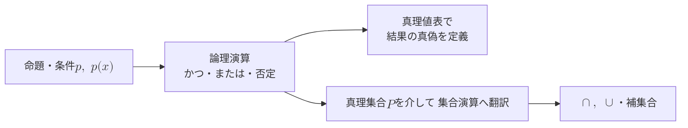

import VennDiagram from "../../../../components/VennDiagram";

## 前提

本章の前提は、最初の章[前提とする知識](../../../prerequisites/knowledge/)、および先行する章[集合と要素](../sets-and-elements/)である。

先行する章で導入した集合の記法を、本章でそのまま使う。

- 所属 $\in$ と非所属 $\notin$
- 部分集合 $\subset$
- 共通部分 $\cap$ と和集合 $\cup$
- 補集合 $\overline{A}$
- 空集合 $\varnothing$

物理学の論証は、真偽の定まる主張を論理でつないで進む。本章は論証の言葉として、命題と条件を導入する。

## 学習目標

本章を読むと、次の記号と概念を使えるようになる。

- 真偽が一意に定まる文、すなわち命題と、命題を表す文字 $p$・$q$・$r$
- 変数を含み変数の値で真偽が決まる文、すなわち条件と、条件に対応する真理集合
- 論理演算「かつ」・「または」・「否定」と、各演算を定義する真理値表
- 論理演算と集合演算の対応、すなわち「かつ」$\leftrightarrow \cap$、「または」$\leftrightarrow \cup$、「否定」$\leftrightarrow$ 補集合
- 両辺が常に同じ真偽を取ることを表す論理的同値の記号 $\equiv$
- 否定と「かつ」「または」を結ぶド・モルガンの法則
- すべてを表す全称記号 $\forall$ と、存在を表す存在記号 $\exists$、および全称命題と存在命題の否定

## 命題とは何か

**命題**とは、真か偽かが一意に定まる文である。真とは内容が正しいこと、偽とは内容が正しくないことを指す。

命題かどうかは、真偽が一意に定まるかで判定する。次の例を比べる。

- 「$2$ は偶数である」は命題である。内容は正しく、真である。
- 「$3$ は偶数である」は命題である。内容は正しくなく、偽である。
- 「$5$ は大きい数である」は命題ではない。何を大きいとするかが人により異なり、真偽が定まらない。

真偽が定まらない文は、本章では命題として扱わない。

命題は普通、$p$・$q$・$r$ のような小文字で表す。例えば命題「$2$ は偶数である」を $p$ と置く。$p$ は真である。

命題の真偽を表す値を**真理値**と呼ぶ。真理値は真と偽の 2 つだけである。本章では真を $\text{T}$、偽を $\text{F}$ と書く。$\text{T}$ は true、$\text{F}$ は false の頭文字である。

## 条件と真理集合

### 条件とは何か

変数を含み、変数の値により真偽が決まる文を**条件**と呼ぶ。

例として、文「$x$ は偶数である」を考える。文の真偽は変数 $x$ の値で決まる。

- $x = 2$ のとき、文は真である。
- $x = 3$ のとき、文は偽である。

変数を含むため、文だけでは真偽が定まらない。変数の値を決めて初めて真偽が定まる。変数 $x$ についての条件を、$p(x)$・$q(x)$ のように書く。

条件は、変数の動く範囲をあらかじめ決めて考える。変数の動く範囲を**全体集合**と呼び、$U$ で表す。先行する章では、補集合を定める土台として全体 $U$ を固定した。本章では同じ $U$ を、変数 $x$ の動く範囲として使う。いずれも「考える全体を 1 つに固定する」点で役割は共通する。

### 真理集合

条件 $p(x)$ を真にする要素を、全体集合 $U$ の中から集める。集めた集合を、条件 $p(x)$ の**真理集合**と呼ぶ。本章では真理集合を $P$ と書く。

$$
P = \{\, x \mid x \in U \text{ かつ } p(x) \text{ が真} \,\}
$$

定義式は、先行する章で導入した内包的記法による。縦棒 $\mid$ の左に要素を表す文字を置き、右に要素が満たす条件を書く。真理集合 $P$ は、$U$ の要素のうち $p(x)$ を真にするものをすべて集めた集合である。

例として、条件 $p(x)$ を「$x$ は偶数である」とし、全体集合を次のように置く。

$$
U = \{1, 2, 3, 4, 5, 6\}
$$

$p(x)$ を真にする要素は $2$・$4$・$6$ である。よって真理集合 $P$ は次のとおりである。

$$
P = \{2, 4, 6\}
$$

条件は真理集合を通じて集合と対応する。対応により、条件の論理演算は集合の演算へ翻訳できる。翻訳の規則を以降の節で導く。

## 論理演算

命題や条件を組み合わせて、新しい命題や条件を作る操作を**論理演算**と呼ぶ。基本の論理演算は「かつ」・「または」・「否定」の 3 つである。

各論理演算は、もとの命題の真理値から結果の真理値を定める。真理値の対応を一覧にした表を**真理値表**と呼ぶ。真理値表は、命題が取りうる真理値の組み合わせをすべて並べる。

### 否定

命題 $p$ に対し、「$p$ でない」という命題を $p$ の**否定**と呼ぶ。否定を $\lnot p$ と書く。$\lnot p$ は「$p$ でない」と読む。

$\lnot p$ の真偽は、$p$ の真偽を反転させる。$p$ が真なら $\lnot p$ は偽、$p$ が偽なら $\lnot p$ は真である。

| $p$        | $\lnot p$  |
| ---------- | ---------- |
| $\text{T}$ | $\text{F}$ |
| $\text{F}$ | $\text{T}$ |

例として、命題 $p$ を「$2$ は偶数である」とする。$p$ は真である。否定 $\lnot p$ は「$2$ は偶数でない」であり、偽である。

### かつ

2 つの命題 $p$ と $q$ に対し、「$p$ かつ $q$」という命題を $p$ と $q$ の**連言**と呼ぶ。連言を $p \land q$ と書く。$p \land q$ は「$p$ かつ $q$」と読む。

$p \land q$ は、$p$ と $q$ の両方が真のときに限り真である。一方でも偽なら、$p \land q$ は偽である。

| $p$        | $q$        | $p \land q$ |
| ---------- | ---------- | ----------- |
| $\text{T}$ | $\text{T}$ | $\text{T}$  |
| $\text{T}$ | $\text{F}$ | $\text{F}$  |
| $\text{F}$ | $\text{T}$ | $\text{F}$  |
| $\text{F}$ | $\text{F}$ | $\text{F}$  |

### または

2 つの命題 $p$ と $q$ に対し、「$p$ または $q$」という命題を $p$ と $q$ の**選言**と呼ぶ。選言を $p \lor q$ と書く。$p \lor q$ は「$p$ または $q$」と読む。

$p \lor q$ は、$p$ と $q$ の少なくとも一方が真のとき真である。両方が偽のときに限り偽である。

| $p$        | $q$        | $p \lor q$ |
| ---------- | ---------- | ---------- |
| $\text{T}$ | $\text{T}$ | $\text{T}$ |
| $\text{T}$ | $\text{F}$ | $\text{T}$ |
| $\text{F}$ | $\text{T}$ | $\text{T}$ |
| $\text{F}$ | $\text{F}$ | $\text{F}$ |

数学の選言は、両方が成り立つ場合を含む点に注意する。日常語では、片方だけが成り立つ意味で使う場合がある。表の 1 行目が示すとおり、$p$ と $q$ が両方真でも $p \lor q$ は真である[^inclusive-or]。

## 論理演算と集合演算の対応

条件 $p(x)$ は、変数 $x$ に 1 つの値を代入すると命題になる。代入した各 $x$ について、論理演算の真偽は真理値表で定まる。よって条件の論理演算は、各 $x$ ごとに命題の論理演算へ帰着する。

論理演算は、条件の真理集合を通じて集合演算と対応する。条件 $p(x)$ の真理集合を $P$、条件 $q(x)$ の真理集合を $Q$ とする。3 つの論理演算を順に翻訳する。

### 否定と補集合

条件 $\lnot p(x)$ を真にする要素は、$p(x)$ を偽にする要素である。$p(x)$ を偽にする要素は、真理集合 $P$ に属さない $U$ の要素、すなわち補集合 $\overline{P}$ の要素である。よって $\lnot p(x)$ の真理集合は $\overline{P}$ である。

$$
\lnot p(x) \text{ の真理集合} = \overline{P}
$$

### かつと共通部分

条件 $p(x) \land q(x)$ を真にする要素は、$p(x)$ と $q(x)$ の両方を真にする要素である。両方を真にする要素は、$P$ と $Q$ の両方に属する要素、すなわち共通部分 $P \cap Q$ の要素である。

$$
p(x) \land q(x) \text{ の真理集合} = P \cap Q
$$

### またはと和集合

条件 $p(x) \lor q(x)$ を真にする要素は、$p(x)$ と $q(x)$ の少なくとも片方を真にする要素である。片方でも真にする要素は、$P$ と $Q$ の少なくとも片方に属する要素、すなわち和集合 $P \cup Q$ の要素である。

$$
p(x) \lor q(x) \text{ の真理集合} = P \cup Q
$$

### 対応のまとめ

3 つの論理演算と集合演算の対応を表にまとめる。

| 論理演算 | 記号        | 真理集合       | 集合演算        |
| -------- | ----------- | -------------- | --------------- |
| 否定     | $\lnot p$   | $\overline{P}$ | 補集合          |
| かつ     | $p \land q$ | $P \cap Q$     | 共通部分 $\cap$ |
| または   | $p \lor q$  | $P \cup Q$     | 和集合 $\cup$   |

先行する章「集合と要素」のまとめは、共通部分が「かつ」に、和集合が「または」に、補集合が「否定」に対応すると予告した。本節の翻訳は予告した対応を真理集合の言葉で確かめたものである。

3 つの対応を、真理集合 $P$・$Q$ のベン図で確かめる。各図は、先行する章「集合と要素」の集合演算の図と同じ形である。違いは、円のラベルを真理集合 $P$・$Q$ に置き換えた点だけである。

<figure>
  <VennDiagram
    variant="intersection"
    labels={{ a: "P", b: "Q" }}
    ariaLabel="真理集合 P と真理集合 Q を 2 つの円で表し、2 円が重なる中央の領域を塗ったベン図。塗った領域が P∩Q を表す。"
  />
  <figcaption>連言 $p \land q$ の真理集合は、共通部分 $P \cap Q$ である。</figcaption>
</figure>

<figure>
  <VennDiagram
    variant="union"
    labels={{ a: "P", b: "Q" }}
    ariaLabel="真理集合 P と真理集合 Q を 2 つの円で表し、2 円が覆う領域全体を塗ったベン図。塗った領域が P∪Q を表す。"
  />
  <figcaption>選言 $p \lor q$ の真理集合は、和集合 $P \cup Q$ である。</figcaption>
</figure>

<figure>
  <VennDiagram
    variant="complement"
    labels={{ a: "P", b: "Q" }}
    ariaLabel="長方形 U の中に円 P を描き、円 P の外側全体を塗ったベン図。塗った領域が P の補集合を表す。"
  />
  <figcaption>否定 $\lnot p$ の真理集合は、補集合 $\overline{P}$ である。</figcaption>
</figure>

下の図は、命題と条件から論理演算を経て集合演算へ至る対応の流れを示す。

## ド・モルガンの法則

否定は「かつ」「または」と特定の関係で結びつく。関係を**ド・モルガンの法則**と呼ぶ。

論理演算でのド・モルガンの法則は、次の 2 つの式で表す。

$$
\lnot(p \land q) \equiv \lnot p \lor \lnot q
$$

$$
\lnot(p \lor q) \equiv \lnot p \land \lnot q
$$

記号 $\equiv$ は、両辺がすべての場合で同じ真偽を取ることを表す。$p \equiv q$ は「$p$ と $q$ は論理的に同値である」と読む。命題どうしなら、真理値表のすべての行で真偽が一致することを指す。

記号 $\equiv$ は、変数を含む式にも使う。後の全称・存在の否定では、両辺が常に同じ真偽を取る意味で $\equiv$ を使う。

ド・モルガンの法則を言葉で言い換える。

- 「$p$ かつ $q$」の否定は、「$p$ でない、または $q$ でない」と一致する。
- 「$p$ または $q$」の否定は、「$p$ でない、かつ $q$ でない」と一致する。

第 1 の式を真理値表で確かめる。$p$ と $q$ の真理値の 4 通りについて、両辺を計算する。

| $p$        | $q$        | $p \land q$ | $\lnot(p \land q)$ | $\lnot p$  | $\lnot q$  | $\lnot p \lor \lnot q$ |
| ---------- | ---------- | ----------- | ------------------ | ---------- | ---------- | ---------------------- |
| $\text{T}$ | $\text{T}$ | $\text{T}$  | $\text{F}$         | $\text{F}$ | $\text{F}$ | $\text{F}$             |
| $\text{T}$ | $\text{F}$ | $\text{F}$  | $\text{T}$         | $\text{F}$ | $\text{T}$ | $\text{T}$             |
| $\text{F}$ | $\text{T}$ | $\text{F}$  | $\text{T}$         | $\text{T}$ | $\text{F}$ | $\text{T}$             |
| $\text{F}$ | $\text{F}$ | $\text{F}$  | $\text{T}$         | $\text{T}$ | $\text{T}$ | $\text{T}$             |

列 $\lnot(p \land q)$ と列 $\lnot p \lor \lnot q$ は、4 行すべてで一致する。よって第 1 の式が成り立つ。第 2 の式も同様に真理値表で確かめられる。第 2 の式の確認は、本章の演習問題 2 で扱う。

ド・モルガンの法則は、集合のド・モルガンの法則と対応する。条件 $p(x)$・$q(x)$ の真理集合を $P$・$Q$ とすると、対応は次のとおりである。

$$
\overline{P \cap Q} = \overline{P} \cup \overline{Q}, \qquad \overline{P \cup Q} = \overline{P} \cap \overline{Q}
$$

論理版の式と集合版の式は、論理演算と集合演算の対応で互いに翻訳できる。$\lnot$ は補集合、$\land$ は $\cap$、$\lor$ は $\cup$ に対応する[^demorgan-set]。

## 全称と存在

条件 $p(x)$ から命題を作る方法は、論理演算のほかにもう 1 つある。変数 $x$ の動く範囲全体に目を向け、「すべて」または「ある」と述べる方法である。

### 全称命題

全体集合 $U$ のすべての要素 $x$ について $p(x)$ が真であるという主張を、**全称命題**と呼ぶ。「すべての」を表す記号 $\forall$ を使い、次のように書く。

$$
\forall x \in U,\ p(x)
$$

記号 $\forall$ を**全称記号**と呼ぶ。「すべての $x$ について」と読む。

全称命題は、例外が 1 つも無いとき真である。$p(x)$ を偽にする要素が 1 つでもあれば偽である。

例として、$U = \{2, 4, 6\}$ とし、$p(x)$ を「$x$ は偶数である」とする。$U$ の要素 $2$・$4$・$6$ はすべて偶数である。よって全称命題「$\forall x \in U,\ p(x)$」は真である。

全称命題が真であることを、真理集合 $P$ のベン図で表す。全称命題が真とは、$U$ の全要素が $p(x)$ を真にすること、すなわち真理集合 $P$ が全体集合 $U$ と一致することである。

<figure>
  <VennDiagram
    variant="universal"
    labels={{ a: "P" }}
    ariaLabel="長方形 U の内部全体を塗ったベン図。真理集合 P が U 全体と一致し、P=U を表す。"
  />
  <figcaption>
    全称命題が真であるとき、真理集合 $P$ は全体集合 $U$ と一致する。すなわち $P = U$ である。
  </figcaption>
</figure>

### 存在命題

全体集合 $U$ の中に $p(x)$ を真にする要素が少なくとも 1 つあるという主張を、**存在命題**と呼ぶ。「ある」を表す記号 $\exists$ を使い、次のように書く。

$$
\exists x \in U,\ p(x)
$$

記号 $\exists$ を**存在記号**と呼ぶ。「ある $x$ が存在して」と読む。

存在命題は、$p(x)$ を真にする要素が 1 つでもあれば真である。$p(x)$ を真にする要素が 1 つも無いとき偽である。

例として、$U = \{1, 2, 3\}$ とし、$p(x)$ を「$x$ は偶数である」とする。$U$ の要素 $2$ は偶数である。よって存在命題「$\exists x \in U,\ p(x)$」は真である。

存在命題が真であることを、真理集合 $P$ のベン図で表す。存在命題が真とは、$p(x)$ を真にする要素が少なくとも 1 つあること、すなわち真理集合 $P$ が空でないことである。$P$ が空でないことを $P \neq \varnothing$ と書く。記号 $\neq$ は「等しくない」を表し、$P \neq \varnothing$ は「$P$ は空集合と等しくない」と読む。図の点が、$P$ に属する要素を 1 つ表す。

<figure>
  <VennDiagram
    variant="nonempty"
    labels={{ a: "P" }}
    ariaLabel="長方形 U の中に円 P を描き、円の内部に点を 1 つ打ったベン図。真理集合 P が空でなく、P≠∅ を表す。"
  />
  <figcaption>
    存在命題が真であるとき、真理集合 $P$ は空でない。すなわち $P \neq \varnothing$ である。
  </figcaption>
</figure>

### 全称命題と存在命題の否定

全称命題と存在命題の否定は、$\forall$ と $\exists$ を入れ替える形で表せる。否定の規則は次の 2 つである。

$$
\lnot\,(\forall x \in U,\ p(x)) \equiv \exists x \in U,\ \lnot p(x)
$$

$$
\lnot\,(\exists x \in U,\ p(x)) \equiv \forall x \in U,\ \lnot p(x)
$$

規則を言葉で言い換える。

- 「すべての $x$ で $p(x)$」の否定は、「ある $x$ で $p(x)$ でない」である。
- 「ある $x$ で $p(x)$」の否定は、「すべての $x$ で $p(x)$ でない」である。

第 1 の規則の理由を述べる。全称命題「すべての $x$ で $p(x)$」が偽になるのは、$p(x)$ を偽にする要素が少なくとも 1 つあるときである。$p(x)$ を偽にするとは $\lnot p(x)$ が真であることである。よって全称命題の否定は「ある $x$ で $\lnot p(x)$」となる。

第 2 の規則の理由を述べる。存在命題「ある $x$ で $p(x)$」が偽になるのは、$p(x)$ を真にする要素が 1 つも無いときである。$p(x)$ を真にする要素が無いとは、すべての $x$ で $p(x)$ が偽、すなわち $\lnot p(x)$ が真であることである。よって存在命題の否定は「すべての $x$ で $\lnot p(x)$」となる。

否定の規則を、真理集合の言葉でも確かめられる。$p(x)$ の真理集合を $P$ とする。$\lnot p(x)$ の真理集合は補集合 $\overline{P}$ である。真理集合を使うと、全称命題と存在命題の真偽は次のように言い換えられる。

- 全称命題「すべての $x$ で $p(x)$」が真であるとは、$U$ の全要素が $P$ に属すること、すなわち $P = U$ である。
- 存在命題「ある $x$ で $p(x)$」が真であるとは、$P$ が空でないこと、すなわち $P \neq \varnothing$ である。

#### 第 1 の規則を真理集合で確かめる

第 1 の否定規則を真理集合で確かめる。言い換えを順にたどる。

- 全称命題の否定は、$P = U$ が成り立たないこと、つまり $P \neq U$ である。
- $P \neq U$ は、$U$ のうち $P$ に属さない要素が存在すること、すなわち $\overline{P} \neq \varnothing$ と同じである。
- $\overline{P}$ は $\lnot p(x)$ の真理集合である。よって $\overline{P} \neq \varnothing$ は存在命題「ある $x$ で $\lnot p(x)$」に当たる。

以上より、全称命題の否定は存在命題「$\exists x \in U,\ \lnot p(x)$」と一致する。

#### 第 2 の規則を真理集合で確かめる

第 2 の否定規則も、同様に真理集合で確かめられる。

- 存在命題の否定は、$P \neq \varnothing$ が成り立たないこと、つまり $P = \varnothing$ である。
- $P = \varnothing$ は、$U$ の全要素が $P$ に属さないこと、すなわち $\overline{P} = U$ と同じである。
- $\overline{P} = U$ は、全称命題「すべての $x$ で $\lnot p(x)$」に当たる。

以上より、存在命題の否定は全称命題「$\forall x \in U,\ \lnot p(x)$」と一致する。

## 例題

### 例題 1

全体集合を次のように置く。

$$
U = \{1, 2, 3, 4, 5, 6\}
$$

条件 $p(x)$ を「$x$ は偶数である」、条件 $q(x)$ を「$x$ は $3$ の倍数である」とする。条件 $p(x) \land q(x)$ の真理集合を求める。

**解法.** まず各条件の真理集合を求める。$p(x)$ を真にする要素は偶数 $2$・$4$・$6$ である。$q(x)$ を真にする要素は $3$ の倍数 $3$・$6$ である。

$$
P = \{2, 4, 6\}, \qquad Q = \{3, 6\}
$$

条件 $p(x) \land q(x)$ の真理集合は、共通部分 $P \cap Q$ である。$P$ と $Q$ の両方に属する要素は $6$ である。

$$
P \cap Q = \{6\}
$$

### 例題 2

例題 1 と同じ全体集合と条件を使う。条件 $p(x) \lor q(x)$ の真理集合を求める。

**解法.** 条件 $p(x) \lor q(x)$ の真理集合は、和集合 $P \cup Q$ である。$P = \{2, 4, 6\}$ と $Q = \{3, 6\}$ の少なくとも一方に属する要素を集める。$6$ は両方に属するが、重ねて数えない。

$$
P \cup Q = \{2, 3, 4, 6\}
$$

### 例題 3

命題「$\forall x \in U,\ x \text{ は偶数である}$」を考える。全体集合は $U = \{2, 4, 5, 6\}$ とする。命題の真偽を判定し、否定を述べる。

**解法.** 全称命題は、例外が 1 つでもあれば偽である。$U$ の要素 $5$ は偶数でない。よって命題は偽である。

否定は、全称を存在に入れ替えて作る。

$$
\lnot\,(\forall x \in U,\ x \text{ は偶数}) \equiv \exists x \in U,\ x \text{ は偶数でない}
$$

否定の命題「ある $x \in U$ が偶数でない」は、要素 $5$ が偶数でないため真である。もとの命題が偽で、否定が真である。両者の真偽は反転しており、否定の規則と整合する。

## 演習問題

問題ごとに解答を畳んである。「解答を表示」を開くと確認できる。

### 問題 1

全体集合を次のように置く。

$$
U = \{1, 2, 3, 4, 5, 6, 7, 8, 9, 10\}
$$

条件 $p(x)$ を「$x$ は $4$ 以下である」、条件 $q(x)$ を「$x$ は奇数である」とする。条件 $p(x) \land q(x)$ の真理集合を求めよ。

解答を表示

各条件の真理集合を求める。$p(x)$ を真にする要素は $4$ 以下の $1$・$2$・$3$・$4$ である。$q(x)$ を真にする要素は奇数 $1$・$3$・$5$・$7$・$9$ である。

$$
P = \{1, 2, 3, 4\}, \qquad Q = \{1, 3, 5, 7, 9\}
$$

条件 $p(x) \land q(x)$ の真理集合は共通部分 $P \cap Q$ である。両方に属する要素は $1$ と $3$ である。

$$
P \cap Q = \{1, 3\}
$$

### 問題 2

命題 $p$ と $q$ について、$\lnot(p \lor q)$ の真理値表を作り、$\lnot p \land \lnot q$ の真理値表と一致することを確かめよ。

解答を表示

$p$ と $q$ の真理値の 4 通りについて、両辺を計算する。

| $p$        | $q$        | $p \lor q$ | $\lnot(p \lor q)$ | $\lnot p$  | $\lnot q$  | $\lnot p \land \lnot q$ |
| ---------- | ---------- | ---------- | ----------------- | ---------- | ---------- | ----------------------- |
| $\text{T}$ | $\text{T}$ | $\text{T}$ | $\text{F}$        | $\text{F}$ | $\text{F}$ | $\text{F}$              |
| $\text{T}$ | $\text{F}$ | $\text{T}$ | $\text{F}$        | $\text{F}$ | $\text{T}$ | $\text{F}$              |
| $\text{F}$ | $\text{T}$ | $\text{T}$ | $\text{F}$        | $\text{T}$ | $\text{F}$ | $\text{F}$              |
| $\text{F}$ | $\text{F}$ | $\text{F}$ | $\text{T}$        | $\text{T}$ | $\text{T}$ | $\text{T}$              |

列 $\lnot(p \lor q)$ と列 $\lnot p \land \lnot q$ は、4 行すべてで一致する。よって $\lnot(p \lor q) \equiv \lnot p \land \lnot q$ が成り立つ。第 2 のド・モルガンの法則の確認である。

### 問題 3

全体集合を次のように置く。

$$
U = \{1, 2, 3, 4, 5\}
$$

次の命題の真偽を判定せよ。

$$
\forall x \in U,\ x \le 5
$$

解答を表示

全称命題は、$U$ の全要素が条件を満たすとき真である。$U$ の要素 $1$・$2$・$3$・$4$・$5$ はすべて $5$ 以下である。例外は 1 つも無い。よって命題は真である。

### 問題 4

全体集合を次のように置く。

$$
U = \{1, 2, 3, 4, 5\}
$$

次の存在命題の否定を述べ、否定の真偽を判定せよ。

$$
\exists x \in U,\ x > 4
$$

解答を表示

存在命題の否定は、存在を全称に入れ替えて作る。

$$
\lnot\,(\exists x \in U,\ x > 4) \equiv \forall x \in U,\ x \le 4
$$

否定の命題「すべての $x \in U$ で $x \le 4$」を判定する。$U$ の要素 $5$ は $4$ より大きく、$x \le 4$ を満たさない。例外が 1 つあるため、否定の命題は偽である。

参考に、もとの存在命題の真偽も確かめる。$U$ の要素 $5$ は $5 > 4$ を満たす。よって、もとの存在命題は真である。もとの命題が真で否定が偽であり、両者の真偽は反転している。

## まとめ

本章は、論証の言葉として命題と条件を導入した。要点を振り返る。

- 命題は真偽が一意に定まる文である。命題は $p$・$q$・$r$ で表す。真理値は真 $\text{T}$ と偽 $\text{F}$ の 2 つである。
- 条件は変数を含み、変数の値で真偽が決まる文である。条件は真理集合を通じて集合と対応する。
- 論理演算「かつ」$p \land q$・「または」$p \lor q$・「否定」$\lnot p$ は、真理値表で定義する。
- 論理演算は集合演算と対応する。「かつ」は共通部分 $\cap$、「または」は和集合 $\cup$、「否定」は補集合に対応する。
- 両辺が常に同じ真偽を取ることは、論理的同値の記号 $\equiv$ で表す。$p \equiv q$ は「$p$ と $q$ は論理的に同値である」と読む。
- ド・モルガンの法則は、否定と「かつ」「または」を結ぶ。論理版と集合版は互いに翻訳できる。
- 全称記号 $\forall$ は「すべての」、存在記号 $\exists$ は「ある」を表す。否定は $\forall$ と $\exists$ を入れ替える。

本章は命題と条件の基礎を自己完結して扱う。

次の章[必要条件と十分条件](../necessary-and-sufficient-conditions/)では、含意 $p \Rightarrow q$ と同値 $p \Leftrightarrow q$ を扱う。含意は「$p$ ならば $q$」という命題であり、必要条件・十分条件・必要十分条件を定める土台となる。本章で導入した真理集合と論理演算は、含意の理解に直結する。

## 参考文献

命題と論理をさらに学ぶための一次資料を挙げる。

- 前原昭二『数学基礎論入門』朝倉書店、1977 年。命題論理と述語論理を基礎から展開した、日本語の標準的な入門書である。
- H. B. Enderton, _A Mathematical Introduction to Logic_ (2nd ed.), Academic Press, 2001. 数理論理学の標準的な入門書である。

[^inclusive-or]: 数学の選言は、両方が成り立つ場合を含む論理和であり、包含的論理和と呼ぶ。日常語の「または」が片方だけを指す意味は、排他的論理和と呼んで区別する。排他的論理和は $(p \lor q) \land \lnot(p \land q)$ で表せる。

[^demorgan-set]: 集合版のド・モルガンの法則 $\overline{P \cap Q} = \overline{P} \cup \overline{Q}$ は、先行する章[集合と要素](../sets-and-elements/)でベン図により確かめられる。論理版と集合版が対応する根拠は、条件の論理演算が真理集合の集合演算へ翻訳される点にある。
