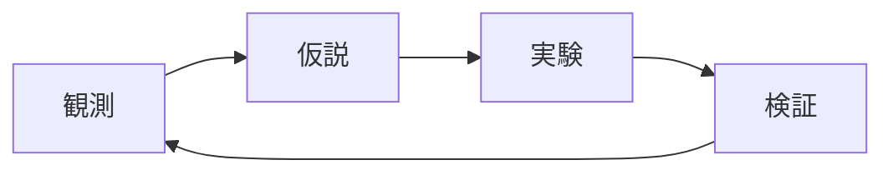

import FunctionPlot from '../../components/FunctionPlot';
import InteractivePlot from '../../components/InteractivePlot';
import VectorFieldPlot from '../../components/VectorFieldPlot';

このページは導入した各種表現の動作確認を兼ねたサンプルです。

## 数式 (KaTeX)

インラインの数式: 質量とエネルギーの関係は $E = mc^2$ で表される。

ブロックの数式:

$$
\int_{-\infty}^{\infty} e^{-x^2} \, dx = \sqrt{\pi}
$$

行列:

$$
\begin{pmatrix} a & b \\ c & d \end{pmatrix}
$$

## 概念図 (Mermaid)

## 関数グラフ (Mafs)

静的な関数プロット ($y = \sin x$):

<FunctionPlot client:visible />

### スライダーで操作する例

スライダーを動かすと振幅が変化します:

<InteractivePlot client:visible />

### ベクトル場とドラッグ可能な点

点をドラッグして動かせます:

<VectorFieldPlot client:visible />
